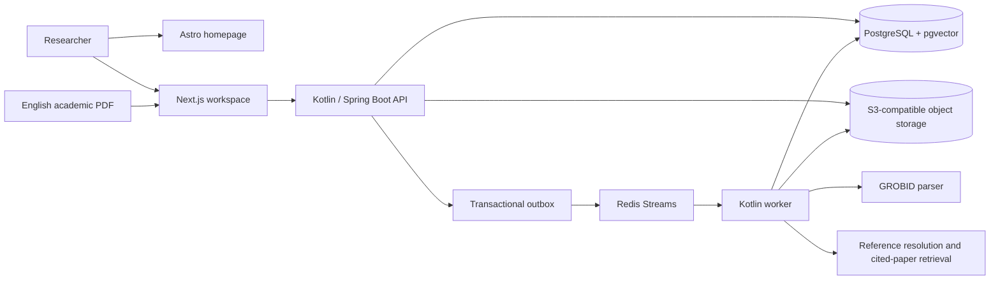

# Paper T-Rail

**A traceable paper trail from claim to cited evidence.**

Paper T-Rail helps researchers inspect whether claims in an academic paper are supported by the works they cite. It connects a claim to its citation, the cited paper, and candidate evidence passages so researchers can review the source path themselves.

The Evidence Coverage Report is a triage aid, not a truth certificate, paper grade, or assessment of the whole paper. AI judgements and aggregated statuses are uncalibrated and should be reviewed by a researcher.

## Navigate

- [What it does](#what-it-does)
- [Run locally](#run-locally)
- [Architecture](#architecture)
- [Develop and contribute](#develop-and-contribute)
- [Detailed documentation](#detailed-documentation)

## What it does

1. Accepts an English, text-based academic PDF.
2. Extracts its sections, citation contexts, bibliography entries, and citation-backed Atomic Claims.
3. Resolves references and finds accessible cited-paper passages for each claim and cited reference.
4. Presents the source, evidence, and provenance for researcher review. Human Reviews are recorded separately and do not rewrite machine results.

Scanned PDFs, OCR, and non-English analysis are outside the current product scope. Re-analysis creates a new, immutable Analysis Run with its own configuration and provenance.

## Run locally

You need Git, [`mise`](https://mise.jdx.dev/), and Docker Compose or a compatible Podman Compose setup. The pinned Java, Gradle, Node.js, and pnpm versions are in [`mise.toml`](mise.toml).

From the repository root:

```sh
cp .env.example .env  # optional; use .env for local overrides
make local
```

`make local` first checks and installs the pinned development tools with `mise install`, then rechecks and installs dependencies for the selected host frontends with `pnpm install --frozen-lockfile`. No manual dependency installation is needed, even in a fresh worktree. Setup must succeed before any services start. It then runs the API and worker with their dependencies in containers, and the Next.js workspace and Astro homepage on the host. It applies database migrations and uses local-only defaults when `.env` is absent. If a selected frontend from this worktree is already listening on its configured port, the command reuses it; a different app already using that port produces a clear error.

| Service | URL |
| --- | --- |
| Homepage | <http://127.0.0.1:4321> |
| Research workspace | <http://127.0.0.1:3000> |
| API health | <http://127.0.0.1:8080/api/v1/health> |
| Swagger UI | <http://127.0.0.1:8080/swagger-ui/index.html> |
| Scalar API reference | <http://127.0.0.1:8080/scalar> |
| S3-compatible object storage | <http://127.0.0.1:9000> |

The local `object-storage` Compose service stores data in the `object_storage_data` volume and provisions `S3_BUCKET` at startup. For another S3-compatible service, provision that bucket before startup and configure `S3_ENDPOINT` for API/worker access and, when needed, `S3_PUBLIC_ENDPOINT` for browser-fetched presigned URLs, plus the region, credentials, and path-style setting it requires. Compose derives the default public endpoint from `S3_ENDPOINT` or `S3_HOST_PORT` when `S3_PUBLIC_ENDPOINT` is unset. If an existing `.env` explicitly sets that value, update or remove it when changing the endpoint or host port.

The API currently uses static access/secret credentials; other provider-specific identity modes are not configured. Application credentials do not need bucket-list or bucket-create permissions. A compatible service must support SigV4 presigned GETs with response-header overrides, user metadata, object stat/HEAD, and delete.

Any pre-migration object-storage volume is left untouched and is not imported automatically because the on-disk formats differ. `make clean` removes the active Compose volumes but leaves that legacy volume in place for deliberate migration or cleanup.

The default local setup runs Ollama and the optional Laya sidecar. First startup downloads the Ollama embedding model and about 1.7 GB of pinned Laya model artifacts. New runs prefer Jev only when its server-side key is configured; every Jev run still requires explicit per-run consent, and an unavailable Jev default resolves to mock. Laya remains an explicit local alternative. To skip Laya, set `LAYA_ENABLED=false` in `.env`. See [Laya evaluation](docs/laya-evaluation.md) for its configuration and limits.

### Choose services

```sh
make local                    # API, worker, web, and homepage
make local api web            # API and web; no worker
make local web                # web only; requires a running API
make local web homepage       # both frontends; web still requires a running API
make dev                      # full application in Compose
make dev-stop web homepage    # stop selected containers, if present
```

The host-run frontends stop when you press Ctrl+C. `make dev-stop` stops containers but preserves data. `make infra-down` stops the Compose stack and also preserves data. `make clean` deletes the active Compose volumes, including uploaded papers and analysis data.

## Architecture

The API accepts work and records an immutable Analysis Run. A transactional outbox and Redis Streams hand off long-running processing to the worker. The worker parses the source, resolves references, retrieves candidate passages from the exact cited-paper assets, and persists results with provenance. The workspace reads those results through the API.



| Area | Source location | Responsibility |
| --- | --- | --- |
| API and worker | `api/src/main/kotlin/com/papertrail/api/` | Kotlin/Spring Boot modular monolith; feature code is grouped by domain capability. API and worker use the same application with different roles. |
| Database | `api/db/` | Sqitch schema changes and database functions. |
| Web workspace | `web/app/`, `web/features/` | Next.js routes, same-origin API proxy, and feature-specific UI and data behavior. |
| Homepage | `homepage/src/` | Astro product site. |
| Shared design | `packages/design-system/` | Color and typography tokens shared by the web app and homepage. |
| Local services | `infra/docker-compose.yml`, `infra/laya/` | Databases, object storage, GROBID, Ollama, and the optional local Laya sidecar. |
| Local workflows | `Makefile`, `mise.toml` | Service startup, migrations, checks, and pinned development tools. |

For the full architecture and request/data flows, see [High-Level Architecture](docs/paper-t-rail-tech-design.md#7-high-level-architecture), [Backend Package Structure](docs/paper-t-rail-tech-design.md#37-suggested-backend-package-structure), and [Repository Layout](docs/paper-t-rail-tech-design.md#38-repository-layout).

## Develop and contribute

### Run checks

```sh
make validate       # local startup, API, Laya, and web tests, lint, typecheck, and web build
make homepage-build # Astro production build
```

`make validate` uses a Docker-compatible runtime for API integration tests. For targeted checks, use `make test-local`, `make test-api`, `make test-laya`, `make test-web`, `make lint-web`, `make typecheck-web`, or `make build-web`.

For a real-browser PDF highlight check, open Paper Review and select **Show in PDF** in an isolated Chromium `agent-browser` session, then run the following with that session's name. It checks text geometry against the original PDF, without mocked layout or logging document text:

```sh
AGENT_BROWSER_ENGINE=chrome agent-browser --session <session> eval --stdin < web/test/pdf-text-layer.browser.js
```

### Contribution path

1. Check [GitHub Issues](https://github.com/arrokh/paper-t-rail/issues) for existing specs and work.
2. Read [`CONTEXT.md`](CONTEXT.md) for product vocabulary, then the relevant [architecture decision records](docs/adr/).
3. Follow the root [`AGENTS.md`](AGENTS.md), [`docs/agents/coding-principles.md`](docs/agents/coding-principles.md), and the service guide for files you change: [`api/AGENTS.md`](api/AGENTS.md), [`web/AGENTS.md`](web/AGENTS.md), or [`homepage/AGENTS.md`](homepage/AGENTS.md).
4. Run the targeted checks for your changes; run `make validate` for broader changes.

Keep the product boundaries intact: retrieved passages are candidates for review; Analysis Runs preserve their original configuration and results; external providers require the documented enablement and per-run consent; and outputs must remain labeled uncalibrated.

### Local data and network boundary

The workspace has no researcher authentication. Keep the local services on loopback or a trusted private network; do not expose them to an untrusted network. Uploaded PDFs and analysis data persist in local volumes until explicitly deleted. Deletion cannot retract content already sent to an external provider.

## Detailed documentation

| Read this | For |
| --- | --- |
| [`docs/paper-t-rail-tech-design.md`](docs/paper-t-rail-tech-design.md) | Full system design, API, repository layout, observability, security, and testing strategy. |
| [`docs/adr/`](docs/adr/) | Architecture and product decisions, including their current status. |
| [`docs/agents/provider-matrix.md`](docs/agents/provider-matrix.md) | Provider boundaries, retention, and safe defaults. |
| [`docs/laya-evaluation.md`](docs/laya-evaluation.md) | Pinned local model, configuration, failure behavior, and evaluation evidence. |
| [`docs/benchmarks/v1-runtime-matrix.md`](docs/benchmarks/v1-runtime-matrix.md) | Runtime limits, measurements, and reproduction steps. |
| [`docs/ui-design-system.md`](docs/ui-design-system.md) | Shared interface tokens, accessibility, and UI conventions. |
| [`CONTEXT.md`](CONTEXT.md) | Domain terms used across the product and codebase. |
