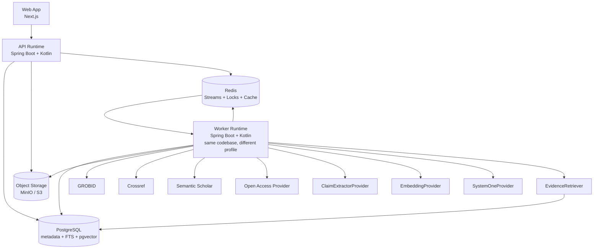
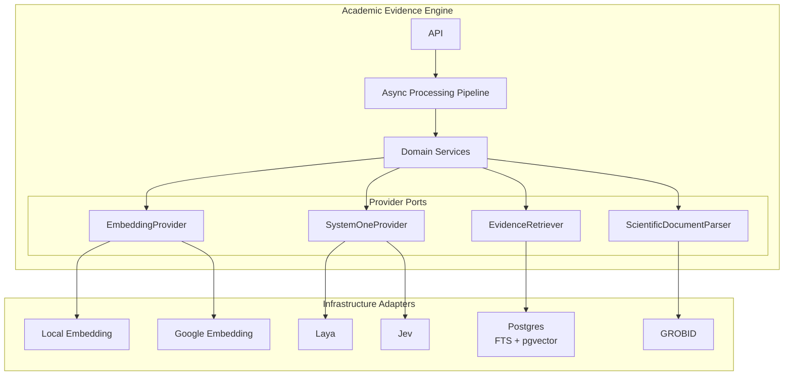
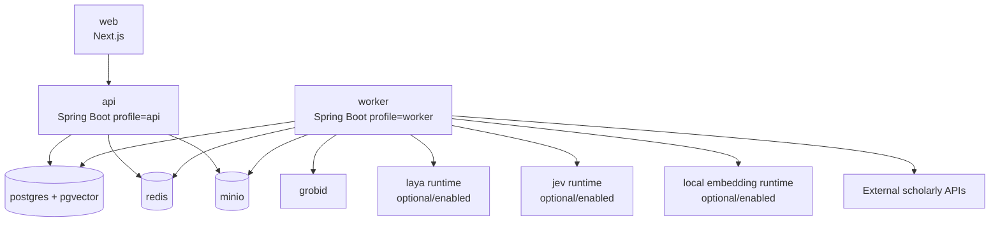
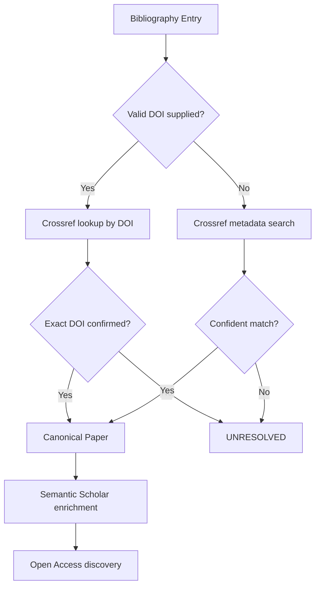
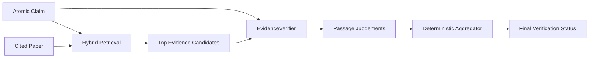
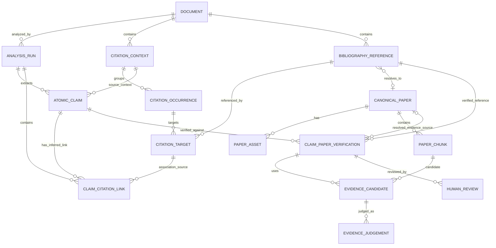
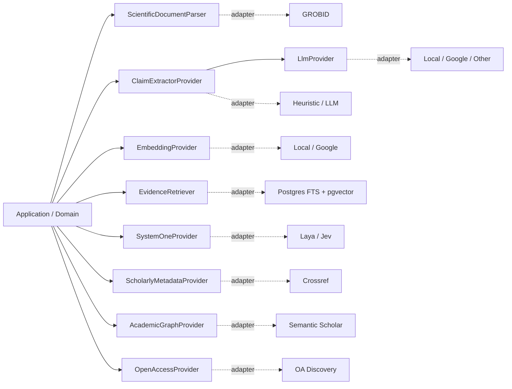

# Paper T-Rail
## Academic Evidence Engine — Technical Design & Coding-Agent Handoff

> **Paper T-Rail — Keeping research on a traceable evidence track.**

### Project philosophy

Research moves forward like a train: each paper carries ideas toward the next station. **Paper T-Rail** helps ensure that journey runs on solid tracks by tracing claims through citations to the source evidence they rely on.

The name intentionally combines two meanings:

- **Paper trail** — the traceable chain from a claim to its citation, source, and evidence.
- **T-Rail / Traceable Rail** — a reliable track that keeps research moving forward on a solid evidence foundation.

```text
Claim
  ═══════════════════════════════════╗
                                     ║
Citation ━━━━━ Source ━━━━━ Evidence ╬━━━► Next Station
                                     ║
  ═══════════════════════════════════╝
```

The system is described technically as an **Academic Evidence Engine**; **Paper T-Rail** is the project/product name.

**Status:** V1 design baseline  
**Primary goal:** Build an asynchronous, traceable academic citation-evidence verification system that audits citation-backed claims in an uploaded English, text-based academic PDF.  
**Architecture style:** Modular monolith backend + separate web app, event-driven async workers, pluggable AI/provider ports.  
**Primary backend stack:** Spring Boot + Kotlin  
**Web stack:** Next.js  
**Async backbone:** Redis Streams  
**Primary data store:** PostgreSQL + pgvector  
**Database migrations:** Sqitch  
**Object storage:** MinIO locally, S3-compatible in production  
**Scientific PDF parsing:** GROBID  

---

# 1. Executive Summary

**Paper T-Rail** accepts an English, text-based academic PDF and produces an **Evidence Coverage Report** answering:

- Which citation-backed atomic claims are supported by their cited sources?
- Which are only partially supported?
- Which are contradicted?
- Which cannot be verified because evidence is insufficient or inaccessible?
- Which references cannot be resolved?
- Which reference types are outside V1 support?

The key verification unit is:

```text
Atomic Claim
×
Cited Paper
×
Candidate Evidence Passage
```

The system is intentionally **not** a generic LLM reviewer. It is an evidence-processing pipeline with explicit provenance. The primary V1 user is a researcher auditing their own draft. The Evidence Coverage Report is a triage aid that points to evidence and gaps; it is not a certification of truth, an academic grade, or an assessment of the paper as a whole.

```text
claim
  ↓
citation occurrence
  ↓
bibliography reference
  ↓
canonical cited paper
  ↓
retrieved evidence passage
  ↓
semantic judgement
  ↓
aggregated verification status
```

The architecture intentionally uses:

- **Redis Streams** for asynchronous pipeline work.
- **Redis distributed locks** only to avoid duplicate expensive work.
- **PostgreSQL constraints + idempotency** for correctness.
- **PostgreSQL FTS + pgvector** for simple hybrid RAG.
- **GROBID** for scientific PDF structure extraction.
- **Provider interfaces** for:
  - claim extraction,
  - generic LLM access,
  - embeddings,
  - System One inference,
  - scholarly metadata,
  - academic graph enrichment,
  - open-access discovery,
  - evidence retrieval.
- **Immutable Analysis Runs** so the same document can be re-analyzed with different providers/models.
- **Human reviews** stored separately from model results to preserve ground truth.

The system should be simple enough for one developer to understand end-to-end, but modular enough to replace Laya with Jev, local embeddings with Google embeddings, heuristic claim extraction with LLM extraction, or PostgreSQL retrieval with a different implementation later. External or unclassified provider implementations remain disabled until their data boundary/retention terms are reviewed and any required per-run consent is in place. Shared API/web implementation conventions for keeping code simple and maintainable are in [Coding Principles](./agents/coding-principles.md); Kotlin import requirements are in [`api/AGENTS.md`](../api/AGENTS.md).

---

# 2. V1 Scope

## 2.1 Supported

V1 supports:

- One uploaded document at a time.
- Text-based PDF only.
- English only.
- Academic source documents such as:
  - journal papers,
  - conference papers,
  - theses/dissertations,
  - academic manuscripts.
- Verification only for claims that have citations.
- Cited Reference types:
  - journal papers,
  - conference papers,
  - preprints,
  - similar resolvable scholarly papers.
- Open/full-text evidence retrieval where legally accessible.
- English cited full text only; accessible non-English cited full text is not semantically verified and receives `INSUFFICIENT_EVIDENCE` with `LANGUAGE_UNSUPPORTED`.
- Conservative abstention when only an abstract is available; V1 does not run a semantic assessment on abstract-only access.
- Human review of machine verification.
- Multiple immutable analysis runs for the same source document.
- Pluggable providers selected through configuration.
- Single workspace.
- No authentication.

## 2.2 Explicit Non-Goals for V1

Do **not** implement the following unless the core V1 is already complete:

- OCR or scanned PDFs.
- Non-English source documents.
- Multi-user or multi-tenant support.
- Authentication/authorization.
- Books, websites, legal documents, standards, news articles, etc. as verifiable cited sources.
- Paywall bypassing or unauthorized publisher scraping.
- Generic web crawling.
- Dedicated vector database.
- Elasticsearch.
- Neo4j.
- Complex workflow engine.
- Kafka.
- Exactly-once messaging.
- Automated rewriting of the Source Document.
- Automated academic grading.
- Large autonomous agents.
- Complex multi-model routing.
- Automatic training/fine-tuning.

---

# 3. Core Product Flow

```text
1. User uploads English text-based PDF
2. Source PDF is stored
3. GROBID parses the academic structure
4. Citation occurrences and bibliography entries are extracted
5. Citation contexts are converted into atomic claims
6. Bibliography entries are resolved to canonical academic papers
7. Accessible cited full text is discovered and fetched
8. Cited papers are parsed and chunked
9. Chunks are embedded and indexed
10. Each atomic claim retrieves candidate evidence only from its cited paper
11. System One evaluates claim × evidence
12. Deterministic aggregation produces a final verification status
13. Evidence graph/provenance is persisted
14. User receives an Evidence Coverage Report
15. User may record a separate Human Review that agrees, disagrees, or records a human override assessment; this never changes the machine result
```

---

# 4. Core Domain Vocabulary

## 4.1 Source Document

The uploaded PDF being audited.

Example:

```text
thesis.pdf
```

The source document contains claims and citations.

## 4.2 Citation Marker

The visible citation in the body:

```text
"... improves student engagement [17]."
```

`[17]` is the citation marker.

Other styles may look like:

```text
(Smith et al., 2024)
```

## 4.3 Citation Context

The smallest citation-bearing clause around one or more citation markers. If clause boundaries cannot be identified reliably, use the containing sentence. Do not pool citation targets across separate clause contexts merely because they occur in the same sentence.

Example:

```text
Generative feedback improves student engagement and reduces dropout [17].
```

## 4.4 Bibliography Entry

The reference entry at the end of the source document:

```text
[17] Smith, J. et al. (2024). Effects of Generative Feedback...
```

This is not yet a guaranteed canonical identity.

## 4.5 Reference Resolution

The process of mapping bibliography text to a canonical scholarly work.

Example:

```text
"Smith et al., Effects..., 2024"
        ↓
DOI: 10.1234/example.2024.391
```

## 4.6 Canonical Paper

The internal normalized identity of one scholarly work.

It may have:

- DOI,
- title,
- authors,
- publication year,
- Semantic Scholar ID,
- arXiv ID,
- other external identifiers.

Multiple representations or URLs may still correspond to one canonical paper.

## 4.7 Atomic Claim

A single proposition that can be independently verified. Split independent predicates into separate claims, while preserving meaning-bearing qualifiers such as population, scope, conditions, comparisons, negation, uncertainty, and causal language in each resulting claim.

Input:

```text
Generative feedback improves student engagement and reduces dropout [17].
```

Decomposed:

```text
Claim A:
Generative feedback improves student engagement.

Claim B:
Generative feedback reduces dropout.
```

## 4.8 Evidence Passage

A retrieved passage from the cited paper that may support, partially support, contradict, or be unrelated to the claim.

## 4.9 Analysis Run

An immutable execution of the analysis pipeline for one source document using a fixed provider/configuration snapshot.

Example:

```text
Analysis Run A
- claim extractor: heuristic
- embedding: local/e5-small
- system one: mock

Analysis Run B (only after provider review and matching per-run consent)
- claim extractor: llm/google
- embedding: google/embedding-x
- system one: jev
```

Old results are never overwritten by a new run.

---

# 5. Verification Taxonomy

## 5.1 Final Verification Status

Use exactly these seven final statuses:

```text
SUPPORTED
PARTIALLY_SUPPORTED
CONTRADICTED
INSUFFICIENT_EVIDENCE
INACCESSIBLE
UNRESOLVED
UNSUPPORTED_REFERENCE_TYPE
```

### Meaning

**SUPPORTED**  
Accessible full-text evidence directly supports the atomic claim.

**PARTIALLY_SUPPORTED**  
Evidence supports only part of the atomic claim or supports it with materially narrower scope/conditions.

**CONTRADICTED**  
Accessible full-text evidence materially conflicts with the atomic claim.

**INSUFFICIENT_EVIDENCE**  
No sufficiently strong qualifying full-text evidence was assessed. This is the required final status for abstract-only access and for accessible cited full text in a language unsupported by V1; V1 does not run a semantic verifier on either case.

**INACCESSIBLE**  
The reference is resolved, but neither legally accessible full text nor an abstract is available. If only an abstract is available, use `INSUFFICIENT_EVIDENCE` without a semantic-verifier call.

**UNRESOLVED**  
The bibliography entry cannot be confidently mapped to a canonical academic paper.

**UNSUPPORTED_REFERENCE_TYPE**  
The citation resolves to a type outside V1 scope, such as a book, website, standard, etc.

## 5.2 Evidence-Passage Judgement

Evidence passages use a separate taxonomy:

```text
DIRECT_SUPPORT
PARTIAL_SUPPORT
CONTRADICTS
UNRELATED
INSUFFICIENT
```

`UNRELATED` is intentionally **not** a final claim status.

## 5.3 Abstract-Only Policy

V1 is conservative. If only an abstract is accessible, do not call the semantic verifier; persist access metadata only and set the final status to `INSUFFICIENT_EVIDENCE`.

The UI must clearly show:

```text
Verification scope: ABSTRACT_ONLY
```

This avoids overstating verification confidence and avoids sending abstract content to a provider for a non-final assessment.

---

# 6. Primary Verification Unit

The primary machine-verification record should be:

```text
Atomic Claim × Cited Reference
```

A Cited Reference resolves to a Canonical Paper when possible; keeping the reference as the verification target allows `UNRESOLVED` and `UNSUPPORTED_REFERENCE_TYPE` to be represented without inventing a paper identity. Resolved references are verified against their Cited Paper using one or more evidence-passage judgements.

This matters because one citation occurrence may reference multiple papers:

```text
"... improves performance [12, 13, 14]."
```

Each Cited Reference should be verified independently. Within one bounded Citation Context, link every extracted Atomic Claim to every Citation Target in that context. Separate clause contexts never share targets. Deduplicate claims by source span within the same Analysis Run. These links are inferred, provisional associations—not a claim about which source the author intended for each proposition—and the report must label them accordingly.

Likewise, one sentence may contain multiple atomic claims.

Therefore:

```text
Citation Context
    ↓
Atomic Claims
    ↓
Claim ↔ Citation Reference links
    ↓
Claim × Cited Reference verification
    (resolved to a Canonical Paper when possible)
```

The Evidence Coverage Report may later show a claim-level rollup, but the underlying auditable record remains the claim-cited-reference pair (and claim-cited-paper pair when resolved).

---

# 7. High-Level Architecture



---


## 7.1 Provider Ports and Infrastructure Adapters

The core application owns stable provider contracts. Infrastructure adapters implement those contracts. Provider-specific DTOs, runtime APIs, HTTP clients, and model quirks must stay behind the adapter boundary.



Extension rule:

```text
domain/application logic
        ↓
stable provider port
        ↓
replaceable infrastructure adapter
```

# 8. Deployment Philosophy

Logical responsibilities are separated, but V1 should **not** become many microservices.

Use one backend codebase:

```text
api/
└── Spring Boot + Kotlin
```

Build one container image, run it twice:

```text
api runtime
worker runtime
```

Example Docker Compose topology:



Benefits:

- API can scale separately from background processing.
- Worker can later have multiple replicas.
- No microservice explosion.
- Provider implementations remain swappable.

---

# 9. End-to-End Async Sequence

```mermaid
sequenceDiagram
    autonumber

    actor User
    participant Web as Next.js
    participant API as Spring API
    participant DB as PostgreSQL
    participant Obj as MinIO/S3
    participant Redis as Redis Streams
    participant Worker as Spring Worker
    participant GROBID as GROBID
    participant Scholarly as Scholarly Providers
    participant Emb as Embedding Provider
    participant S1 as System One Provider

    User->>Web: Upload PDF
    Web->>API: POST /documents
    API->>Obj: Store source PDF
    API->>DB: Create Document
    API-->>Web: documentId

    Web->>API: POST /analysis-runs
    API->>DB: Create immutable AnalysisRun
    API->>DB: Insert outbox event
    API-->>Web: analysisRunId + QUEUED

    API->>Redis: Outbox dispatcher XADD DocumentAnalysisRequested

    Redis-->>Worker: DocumentAnalysisRequested
    Worker->>GROBID: Parse source PDF
    Worker->>DB: Persist parsed document structure
    Worker->>DB: Persist citation occurrences + bibliography references
    Worker->>Redis: ClaimsExtractionRequested
    Worker->>Redis: Schedule reference-resolution tasks

    Redis-->>Worker: ClaimsExtractionRequested
    Worker->>Worker: Run configured ClaimExtractorProvider
    Worker->>DB: Persist analysis-run-scoped atomic claims + claim-citation links

    loop Each bibliography reference
        Redis-->>Worker: ReferenceResolutionRequested
        Worker->>Scholarly: Resolve canonical paper
        Worker->>DB: Persist result

        alt resolved academic paper
            Worker->>Redis: PaperAcquisitionRequested
        else unresolved/unsupported
            Worker->>DB: Persist terminal status
        end
    end

    loop Each resolved cited paper
        Redis-->>Worker: PaperAcquisitionRequested
        Worker->>Scholarly: Find legal full text
        alt legal full text available
            Worker->>Obj: Store cited PDF/fulltext
            Worker->>GROBID: Parse locally with external consolidation disabled
            Worker->>Worker: Detect full-text language
            alt English
                Worker->>Emb: Embed chunks (subject to provider consent)
                Worker->>DB: Save chunks + embeddings
                Worker->>Redis: EvidenceRetrievalRequested
            else unsupported language
                Worker->>DB: Persist language, NONE scope, INSUFFICIENT_EVIDENCE, LANGUAGE_UNSUPPORTED
            end
        else abstract only
            Worker->>DB: Persist ABSTRACT_ONLY scope + INSUFFICIENT_EVIDENCE; no semantic judgement
        else no legal full text or abstract
            Worker->>DB: Persist INACCESSIBLE
        end
    end

    loop Each claim × cited paper
        Redis-->>Worker: EvidenceRetrievalRequested
        Worker->>DB: Hybrid FTS + vector retrieval
        Worker->>Redis: EvidenceVerificationRequested

        Redis-->>Worker: EvidenceVerificationRequested
        Worker->>S1: Judge claim × evidence passages
        Worker->>DB: Save evidence judgements
        Worker->>DB: Aggregate final verification
    end

    Worker->>DB: Mark AnalysisRun COMPLETED
    Web->>API: GET /analysis-runs/{id}/report
    API->>DB: Load Evidence Coverage Report
    API-->>Web: Report
```

---

# 10. Async Architecture: Redis Streams

## 10.1 V1 Design

Require Redis 6.2 or later when using [`XAUTOCLAIM`](https://redis.io/docs/latest/commands/xautoclaim/) for pending-message recovery. If an older Redis version must be supported, use and test an explicit `XPENDING`/`XCLAIM` recovery path instead.

Keep Redis messaging simple:

```text
one primary stream:
ae:pipeline
```

Use typed messages.

Consumer group:

```text
ae-workers
```

All worker replicas run the same handler registry and can process any event type.

This is intentionally a **work-queue style event stream**, not a sophisticated event-broadcast platform.

If later independent subscribers are needed, create additional streams or projections.

## 10.2 Event Envelope

Every message should have a stable envelope:

```json
{
  "eventId": "01J...",
  "eventType": "EvidenceVerificationRequested",
  "schemaVersion": 1,
  "analysisRunId": "uuid",
  "correlationId": "uuid",
  "causationId": "01J...",
  "occurredAt": "2026-09-23T08:00:00Z",
  "attempt": 0,
  "payload": {}
}
```

Required fields:

- `eventId`: unique event identity.
- `eventType`: typed handler name.
- `schemaVersion`: future compatibility.
- `analysisRunId`: traceability.
- `correlationId`: one end-to-end run trace.
- `causationId`: event that caused this event.
- `occurredAt`.
- `attempt`.
- `payload`.

## 10.3 Core Event Types

Use domain-oriented names, not implementation-specific names.

Recommended V1 events:

```text
DocumentAnalysisRequested
DocumentParsed

ClaimsExtractionRequested
ClaimsExtracted

ReferenceResolutionRequested
ReferenceResolved
ReferenceResolutionFailed

PaperAcquisitionRequested
PaperFullTextAvailable
PaperAbstractOnly
PaperInaccessible

PaperIndexingRequested
PaperIndexed

EvidenceRetrievalRequested
EvidenceCandidatesFound

EvidenceVerificationRequested
EvidenceVerificationCompleted

AnalysisAggregationRequested
AnalysisCompleted
AnalysisFailed
```

Avoid event names like:

```text
GrobidFinished
PgvectorInserted
CrossrefCalled
```

Those leak implementation details into event contracts.

---

# 11. Reliability Model

## 11.1 Delivery Semantics

Use:

```text
AT-LEAST-ONCE
```

Do not attempt exactly-once delivery.

Therefore every handler must be idempotent.

## 11.2 Inbox Pattern

Create:

```text
inbox_events
```

Example:

```sql
event_id        varchar primary key
processed_at    timestamptz not null
handler_name    varchar not null
```

Handler transaction:

```text
BEGIN

1. Check event_id in inbox_events
2. If already present:
      COMMIT
      XACK
      return

3. Apply domain changes
4. Insert next events into outbox_events
5. Insert event_id into inbox_events

COMMIT

XACK
```

## 11.3 Outbox Pattern

Never rely on:

```text
save DB
then
publish Redis
```

because DB commit may succeed while Redis publishing fails.

Use:

```text
BEGIN

update domain tables
insert outbox_events

COMMIT
```

A small dispatcher publishes unsent outbox records to Redis Streams.

Suggested table:

```text
outbox_events
```

Columns:

```text
id
event_type
schema_version
analysis_run_id
correlation_id
causation_id
payload_json
created_at
published_at nullable
```

## 11.4 Worker Crash Recovery

Redis Streams pending entries must be reclaimed.

For the recommended `XAUTOCLAIM` path, require Redis 6.2 or later. Worker behavior:

- `XREADGROUP` for new work.
- periodically inspect/claim stale pending messages,
- use `XAUTOCLAIM`-style recovery semantics,
- rely on inbox idempotency when work is reprocessed.

## 11.5 Retry Policy

Keep V1 simple.

For transient external calls:

```text
max attempts: 3
backoff: exponential
```

Example:

```text
250 ms
1 s
4 s
```

After final failure:

- persist failure reason,
- add message to:

```text
ae:dlq
```

- ACK original message.

Do not build a complex delayed-retry scheduler in V1.

Provide a manual replay action later.

---

# 12. Distributed Locks

Redis locks are an **optimization**, not the source of correctness.

Use PostgreSQL uniqueness/idempotency for correctness.

Good lock candidates:

```text
paper:{canonicalPaperId}:acquire
paper:{canonicalPaperId}:parse
paper:{canonicalPaperId}:index:{embeddingProfile}
```

Example use case:

Two analyses cite the same DOI at the same time.

Without a lock:

```text
Worker A downloads paper
Worker B downloads same paper
```

With a lock:

```text
Worker A acquires lock → downloads/parses/indexes
Worker B fails lock → waits/rechecks DB → reuses result
```

The DB must still have constraints such as:

```text
UNIQUE(doi)
```

Recommended JVM helper:

```text
Redisson
```

but keep lock usage behind a small infrastructure abstraction.

---

# 13. Provider Architecture

Use ports-and-adapters / hexagonal principles.

The domain/application layer must not depend directly on:

- Laya,
- Jev,
- Google,
- OpenAI,
- local embedding runtime,
- Crossref HTTP DTOs,
- Semantic Scholar DTOs.

---

# 14. Claim Extraction

## 14.1 ClaimExtractorProvider

```kotlin
interface ClaimExtractorProvider {
    val providerId: String

    suspend fun extract(
        request: ClaimExtractionRequest
    ): ClaimExtractionResult
}
```

Suggested request:

```kotlin
data class ClaimExtractionRequest(
    val citationContextId: UUID,
    val contextText: String,
    // Zero-based, end-exclusive offsets in normalized source-document text.
    val contextStartOffset: Int,
    val citationMarkers: List<CitationMarkerInput>,
    val language: String = "en"
)
```

Suggested output:

```kotlin
data class AtomicClaimCandidate(
    val text: String,
    // Zero-based, end-exclusive absolute offsets in normalized source-document text.
    val sourceStartOffset: Int,
    val sourceEndOffset: Int,
    val confidence: Double?
)
```

Claim source spans are absolute offsets into the normalized Source Document. When a shared subject or qualifier is copied into a decomposed claim, the span identifies the source predicate phrase and the containing Citation Context remains visible as its broader provenance; claim text is not guaranteed to be an exact substring of that span.

## 14.2 V1 Implementations

```text
ClaimExtractorProvider
├── HeuristicClaimExtractor
└── LlmClaimExtractor
```

### Heuristic provider

Useful for experimentation and zero-LLM mode. The current runtime uses a local, version-pinned baseline: it removes citation markers, splits coordinated `and` predicates only when a known finite verb pattern supports the split, copies shared subject/qualifier text into the resulting claim, and leaves ambiguous or negation-scoped coordination together instead of guessing. The bounded verb vocabulary means unfamiliar constructions can remain unsplit; this limitation is visible in the selected `heuristic` provider and source Citation Context, not represented as a claim-confidence score.

Possible future building blocks:

- sentence segmentation,
- dependency parsing,
- clause splitting,
- conjunction detection,
- simple scientific-claim heuristics.

Do not overbuild this initially.

### LLM provider

`LlmClaimExtractor` should depend on a generic `LlmProvider`.

```text
LlmClaimExtractor
      ↓
LlmProvider
├── LocalLlmProvider
├── GoogleLlmProvider
└── Other provider
```

The domain never receives provider-native response objects.

## 14.3 Why Claim Extraction Is Separate from System One

Responsibilities:

```text
ClaimExtractor
→ generate/normalize atomic propositions

EmbeddingProvider
→ semantic representation for retrieval

SystemOneProvider
→ narrow probabilistic semantic judgement
```

Do not make Laya/Jev responsible for generative claim rewriting.

---

# 15. Generic LLM Port

Optional in V1; enabled only if configured.

```kotlin
interface LlmProvider {
    val providerId: String

    suspend fun generate(
        request: LlmRequest
    ): LlmResponse
}
```

Keep the API intentionally small.

The first consumer is:

```text
LlmClaimExtractor
```

Do not use LLMs in parts of the system that can remain deterministic.

---

# 16. Embedding Provider

```kotlin
interface EmbeddingProvider {
    val providerId: String
    val modelId: String

    suspend fun embed(text: String): Embedding

    suspend fun embedBatch(texts: List<String>): List<Embedding>
}
```

Domain-owned result:

```kotlin
data class Embedding(
    val values: FloatArray,
    val dimensions: Int,
    val providerId: String,
    val modelId: String
)
```

Possible implementations:

```text
EmbeddingProvider
├── LocalEmbeddingProvider
└── GoogleEmbeddingProvider
```

Provider-native DTOs must remain inside adapters.

---

# 17. Embedding Versioning & pgvector

Embedding metadata must always be stored with the vector:

```text
provider
model
dimension
version/config hash
```

Important:

Different models may return different dimensions.

For V1:

- each Analysis Run selects one embedding profile,
- retrieval queries must filter to one embedding profile/dimension before comparing vectors,
- use an unconstrained `vector` column if needed for variable dimensions; vectors of different dimensions cannot be compared,
- prefer exact vector search for small V1 corpora; pgvector uses exact search by default, while approximate indexes trade recall for speed. If approximate indexes are later added, create indexes scoped to one model/dimension. See the [pgvector README](https://github.com/pgvector/pgvector) for supported types and indexing behavior,
- do not introduce complex ANN indexing until real scale requires it.

If later ANN indexes are added, use model/dimension-specific partitions or indexes.

---

# 18. System One Provider

The domain must not know Laya/Jev-native APIs.

```kotlin
interface SystemOneProvider {
    val providerId: String

    suspend fun evaluate(
        request: SemanticJudgementRequest
    ): SemanticJudgementResult
}
```

Suggested question model:

```kotlin
sealed interface JudgementQuestion {

    data class BooleanJudgement(
        val id: String,
        val question: String
    ) : JudgementQuestion

    data class ChoiceJudgement(
        val id: String,
        val question: String,
        val choices: List<String>
    ) : JudgementQuestion

    data class ScoreJudgement(
        val id: String,
        val question: String,
        val min: Double,
        val max: Double
    ) : JudgementQuestion
}
```

Implementations:

```text
SystemOneProvider
├── LayaSystemOneProvider
├── JevSystemOneProvider
└── MockSystemOneProvider
```

The adapter is responsible for translating generic questions into provider-specific primitives.

Example conceptual mapping:

```text
Boolean judgement → provider boolean/noul-like primitive
Choice judgement  → provider choice primitive
Score judgement   → provider score primitive
```

---

# 19. Evidence Verifier

The verification domain should depend on a higher-level interface, not directly on System One.

```kotlin
interface EvidenceVerifier {
    suspend fun verify(
        claim: AtomicClaim,
        citedPaper: CanonicalPaper,
        candidates: List<EvidencePassage>
    ): EvidenceVerificationResult
}
```

Default implementation:

```text
SystemOneEvidenceVerifier
      ↓
SystemOneProvider
```

Future implementations can include:

```text
LlmEvidenceVerifier
RuleBasedEvidenceVerifier
HumanOnlyVerifier
```

This makes benchmarking straightforward.

---

# 20. Scientific Document Parser

Create a port:

```kotlin
interface ScientificDocumentParser {
    suspend fun parse(
        objectKey: String
    ): ParsedAcademicDocument
}
```

V1 implementation:

```text
GrobidScientificDocumentParser
```

GROBID responsibility:

```text
PDF
  ↓
structured academic document
```

Expected extracted structure:

- metadata,
- title,
- authors,
- sections,
- paragraphs,
- bibliography,
- in-text citation markers,
- links between citation markers and bibliography targets.

Do not ask GROBID to decide scientific claims. The adapter consumes GROBID's TEI REST output; verify citation-callout/reference linking against the deployed version's [service API](https://grobid.readthedocs.io/en/latest/Grobid-service/) and [TEI model](https://grobid.readthedocs.io/en/latest/training/fulltext/). Set `consolidateHeader=0` and `consolidateCitations=0` by default so parsing cannot silently send bibliographic data to GROBID's external Crossref/biblio-glutton consolidation. Reference lookups instead go through the consent-controlled scholarly provider port. Any future GROBID consolidation must be separately disclosed and consent-gated.

---

# 21. Reference Resolution

## 21.1 Provider Responsibilities

Use separate ports:

```kotlin
interface ScholarlyMetadataProvider
interface AcademicGraphProvider
interface OpenAccessProvider
```

Preferred V1 implementations (not enabled by default until their trust boundary and retention/deletion terms are reviewed, and then only with matching per-run consent):

```text
ScholarlyMetadataProvider
→ Crossref

AcademicGraphProvider
→ Semantic Scholar

OpenAccessProvider
→ legal OA discovery implementation
```

## 21.2 Resolution Flow



Crossref is the primary identity-resolution mechanism. A syntactically valid DOI printed in a bibliography entry must be normalized and confirmed against scholarly metadata; only a record carrying that exact normalized DOI can resolve the entry. If the lookup is empty or returns another DOI, mark the entry `UNRESOLVED` and do not fall back to metadata search, preventing a supplied identifier from being silently replaced with a different work. When no valid DOI is supplied, use a deterministic score over title, author, and year, and require a configurable confidence threshold; do not choose a merely top-ranked candidate when it falls below the threshold or remains ambiguous. Mark that reference `UNRESOLVED` instead. Use the conservative, version-pinned matcher; below-threshold and ambiguous entries remain `UNRESOLVED`. Empirical threshold calibration is not a product or release requirement, and matching outcomes must not be described as calibrated. Version the score policy and threshold with each Analysis Run.

Semantic Scholar is enrichment/graph context, not a competing canonical-identity authority in V1.

---

# 22. Reference Type Handling

When a bibliography entry is parsed, classify its type.

Supported V1 types:

```text
JOURNAL_ARTICLE
CONFERENCE_PAPER
PREPRINT
ACADEMIC_MANUSCRIPT
```

Unsupported examples:

```text
BOOK
BOOK_CHAPTER
WEBSITE
STANDARD
NEWS
LEGAL_DOCUMENT
UNKNOWN_NON_ACADEMIC
```

Unsupported sources become:

```text
UNSUPPORTED_REFERENCE_TYPE
```

No verification attempt should continue.

---

# 23. Full-Text Acquisition

Only fetch legally accessible resources through the configured open-access discovery/acquisition flow. V1 does not support manually uploading a cited paper as an acquisition fallback. The local recorded-fixture provider remains selected by default. The repository's local configuration offers the external Unpaywall adapter for consent/acquisition testing; deployments must review exact terms, configure deployment-specific contact/disclosure values, or disable it, and each Analysis Run still needs matching consent. Before any content-host request, require an HTTPS location with an explicit CC0, CC BY, or public-domain license, reject unknown/restrictive licenses, private hosts, credential-bearing/query-string/fragment URLs, and redirects, and accept only bounded PDF or plain-text content. Never infer legality from a URL being publicly reachable.

Semantic verification in V1 supports English cited full text only. Persist `FULL_TEXT_AVAILABLE`, `ABSTRACT_ONLY`, `METADATA_ONLY`, or `UNAVAILABLE` separately from each Claim–Paper Verification's processing status, scope, terminal reason, and final status. Detect language before any chunking or embedding; if the full text is accessible but not confidently English, set `verification_scope=NONE`, final status `INSUFFICIENT_EVIDENCE`, and terminal reason `LANGUAGE_UNSUPPORTED`; do not send its content to embedding or verification providers. Abstract-only access yields `INSUFFICIENT_EVIDENCE` with scope `ABSTRACT_ONLY` without a semantic-verifier call. With no legal full text or abstract, persist `INACCESSIBLE` with scope `NONE`.

Never bypass a paywall.

Suggested access statuses:

```text
FULL_TEXT_AVAILABLE
ABSTRACT_ONLY
METADATA_ONLY
UNAVAILABLE
```

Acquisition flow:

```text
Canonical paper
    ↓
OpenAccessProvider
    ↓
legal full text location?
    ├── yes → fetch/store/parse → detect language
    │          ├── English → chunk/index/verify
    │          └── other → INSUFFICIENT_EVIDENCE (LANGUAGE_UNSUPPORTED), no embedding/verification call
    └── no
        ├── abstract exists → ABSTRACT_ONLY
        └── otherwise → INACCESSIBLE
```

Persist:

- source URL,
- access status,
- discovered-at timestamp,
- license/provenance metadata if available,
- object-storage key if downloaded.

---

# 24. Source & Cited Paper Parsing

The source PDF and each acquired cited PDF are both parsed.

Keep them conceptually distinct:

```text
SourceDocument
→ document being audited

CanonicalPaper / CitedPaperAsset
→ evidence source
```

Do not overload one entity with both meanings.

---

# 25. RAG / Evidence Retrieval

## 25.1 Retrieval Goal

Given:

```text
atomic claim
+
one cited paper
```

return:

```text
top candidate passages from that cited paper only
```

Do not search the entire corpus.

## 25.2 Chunking

Keep V1 chunking simple and provenance-preserving.

Recommended strategy:

- use GROBID section/paragraph structure,
- combine adjacent short paragraphs,
- target approximately 500–900 tokens,
- small overlap if needed,
- persist:
  - paper ID,
  - section title,
  - paragraph range,
  - page if available,
  - raw text,
  - stable chunk ID.

Avoid sophisticated semantic chunking initially.

## 25.3 Hybrid Retrieval

Use:

```text
PostgreSQL FTS
+
pgvector cosine similarity
```

Per claim:

```text
1. vector top K = 10
2. lexical top K = 10
3. merge results
4. keep final K = 5
```

Use a simple merge strategy such as reciprocal-rank fusion.

This avoids normalization problems between lexical and vector scores.

## 25.4 EvidenceRetriever Port

```kotlin
interface EvidenceRetriever {
    suspend fun retrieve(
        claim: AtomicClaim,
        citedPaperId: UUID,
        embeddingProfile: EmbeddingProfile,
        limit: Int
    ): List<EvidenceCandidate>
}
```

V1 implementation:

```text
PostgresHybridEvidenceRetriever
```

Future:

```text
QdrantEvidenceRetriever
ElasticsearchEvidenceRetriever
```

No domain changes should be needed.

---

# 26. Verification Flow



System One should judge narrow questions, for example:

```text
Does this passage directly support the claim?
Does this passage support only part of the claim?
Does this passage materially contradict the claim?
Is this passage relevant to the claim?
```

Do not send the entire paper to System One.

Evidence passages from any section may be considered, but persist and show their evidentiary role: the cited paper's own findings, the authors' synthesis (for example, in a review), or a secondary report of another work. A paper's synthesis may support a claim about the literature when that is what the claim asserts; a secondary mention alone must not be presented as direct evidence for the underlying primary study's result. The report must expose section and role so the user can judge the context.

---

# 27. Deterministic Aggregation

System One provides probabilistic judgements.

Code decides the final status.

Example conceptual policy:

```text
IF unsupported reference type
    → UNSUPPORTED_REFERENCE_TYPE

ELSE IF reference unresolved
    → UNRESOLVED

ELSE IF verification scope == ABSTRACT_ONLY
    → INSUFFICIENT_EVIDENCE

ELSE IF terminal reason == LANGUAGE_UNSUPPORTED
    → INSUFFICIENT_EVIDENCE

ELSE IF no legally accessible full text and no abstract is available
    → INACCESSIBLE

ELSE IF credible support and material contradiction are comparable in strength and scope
    → INSUFFICIENT_EVIDENCE
      + persist an evidence-conflict indicator and show both sides

ELSE IF strong direct support exists
    AND no comparable or stronger contradiction exists
    → SUPPORTED

ELSE IF strong contradiction exists
    AND no comparable or stronger support exists
    → CONTRADICTED

ELSE IF partial support exists
    AND no comparable or stronger contradiction exists
    → PARTIALLY_SUPPORTED

ELSE
    → INSUFFICIENT_EVIDENCE
```

Assess strength using evidence role, directness, claim-scope match (including population, conditions, and outcome), study design, relevance, and experimental judgement scores. Raw model confidence alone is not decisive. Support and contradiction are comparable when neither side clearly outweighs the other under this rubric. The current rubric and thresholds are experimental; calibration is not a product or release requirement, and outputs remain uncalibrated.

Thresholds must be configuration values, not magic numbers. These version-pinned example values are experimental, not calibrated. Use them with every result labeled uncalibrated:

```yaml
verification:
  direct-support-threshold: 0.80
  partial-support-threshold: 0.70
  contradiction-threshold: 0.80
```

Keep aggregation thresholds and the policy version in each immutable Analysis Run snapshot. When aggregation is disabled, runs pin aggregation as `NOT_RUN` with no thresholds or policy version. `.env.example`, base `application.yml`, and Compose default experimental aggregation to `true`; set `LOCAL_LAYA_AGGREGATION_ENABLED=false` to disable it. Only runs selecting Laya use this policy, and all resulting judgements and statuses remain uncalibrated. Per issue #45, the production Spring profile defaults Laya enabled/selected and experimental aggregation enabled. Human calibration and deployment-specific approval are not product or release requirements. Outputs remain uncalibrated and must not be presented as validated accuracy. The exact variable names and defaults are listed in the repository-root `.env.example` and [Laya evaluation guide](./laya-evaluation.md#aggregation-default). Changing the environment affects new runs only.

The local comparison thresholds are `LOCAL_LAYA_AGGREGATION_DIRECT_SUPPORT_THRESHOLD=0.80`, `LOCAL_LAYA_AGGREGATION_PARTIAL_SUPPORT_THRESHOLD=0.70`, `LOCAL_LAYA_AGGREGATION_CONTRADICTION_THRESHOLD=0.80`, and `LOCAL_LAYA_AGGREGATION_COMPARABILITY_MARGIN=0.08`. These values exercise the deterministic aggregation path only; they do not imply human calibration. The current V1 harness exercises aggregation over fixture-supplied judgements and does not call Laya or establish model judgement accuracy/calibration. Calibration is not required for product use or release; label model judgements and aggregated statuses uncalibrated. The [Laya evaluation report](./laya-evaluation.md#current-pipeline-trial-and-evidence-status) records existing evidence and limitations. Reference matching uses the same principle: its confidence threshold is configurable and snapshotted, with below-threshold or ambiguous matches remaining `UNRESOLVED` rather than being guessed.

---

# 28. Analysis Run Immutability

`AnalysisRun` is append-only/immutable after processing begins.

It captures a full configuration snapshot, including the reference-resolution score-policy version and confidence threshold, aggregation-policy version and thresholds, and per-run external-provider consent/data categories.

Example shape (symbolic placeholders must be replaced with the actual run values). This is an opted-in external-provider run; the conservative deployment default uses `mock`, while local Compose prefers Laya when it is selectable.

```json
{
  "claimExtractor": {
    "provider": "heuristic",
    "version": "v1"
  },
  "embedding": {
    "provider": "local",
    "version": "v1",
    "model": "feature-hash-384-v1"
  },
  "systemOne": {
    "provider": "laya",
    "model": "default"
  },
  "retrieval": {
    "profileId": "postgres-hybrid-rrf-v1",
    "vectorCandidateLimit": 10,
    "lexicalCandidateLimit": 10,
    "finalCandidateLimit": 5,
    "reciprocalRankFusionConstant": 60,
    "embeddingProfileHash": "<pinned-sha256>"
  },
  "referenceResolution": {
    "executionStatus": "PENDING",
    "provider": {
      "provider": "crossref",
      "version": "v1",
      "trustBoundary": "EXTERNAL",
      "dataCategories": ["bibliographic_metadata"]
    },
    "scorePolicyVersion": "title-author-year-weighted-edit-similarity-v1",
    "confidenceThreshold": "configured-value"
  },
  "aggregationThresholds": {
    "directSupport": "experimental-configured-value",
    "partialSupport": "experimental-configured-value",
    "contradiction": "experimental-configured-value"
  },
  "externalProviderConsents": [
    {
      "providerId": "laya",
      "dataCategories": ["atomic_claims", "evidence_passages"]
    },
    {
      "providerId": "crossref",
      "dataCategories": ["bibliographic_metadata"]
    }
  ],
  "verificationPolicyVersion": "v1",
  "aggregationPolicyVersion": "v1"
}
```

Never rerun by mutating the old run.

For provider settings that affect the outbound payload without changing its data categories, pin an opaque configuration fingerprint in the run and reject dispatch if the live provider registration no longer matches. For example, Crossref pins a digest of the configured contact email rather than storing the email value in the run snapshot.

Create a new Analysis Run. For reproducibility, each run must retain the source document hash and parser identity/version, and each verification must point to the exact cited-paper asset used, including that asset's content hash, parser identity/version, and language-detector version where language gating was applied. Chunks inherit their asset identity; reusing an identical content hash and embedding profile across runs is allowed, but a newer global asset must never silently replace the asset used by an older run. Record per-run external-provider consent and the data categories authorized in the run snapshot.

---

# 29. Provider Enablement Configuration

Keep configuration simple. The evidence-backed classifications, payload categories, and provider-specific retention/deletion limits are recorded in [the V1 provider matrix](./agents/provider-matrix.md). The YAML below defines a conservative deployment profile for implemented stages. The issue #6 runtime persists run-scoped Atomic Claims with source spans and context-scoped Citation Target links; issue #7 resolves bibliography entries conservatively; issue #8 records run-scoped legal cited-paper access and language eligibility; issue #10 implements retrieval, judgements, and conflict-aware reporting. Recorded fixtures remain the selected defaults for scholarly metadata and open-access discovery. For local consent-flow testing, the repository configuration offers reviewed Crossref and Unpaywall options; deployments must verify current terms, configure deployment-specific disclosures/contact, or disable both adapters (see [ADR 0006](adr/0006-reviewed-provider-options-in-local-default-configuration.md)). Local cited-paper indexing uses the pinned embedding profile; the new-run UI prefers Ollama whenever listed, while API requests that omit an embedding selection prefer only locally trusted Ollama and otherwise fall back to feature-hash. Ollama endpoint credentials remain API-side, and endpoints outside the trusted deployment boundary are classified `EXTERNAL` and gated by per-run consent. The Spring and Compose System One default preference is Laya; it requires a valid authenticated endpoint on a trusted host to be selectable, and omitted selections resolve to mock if it is unavailable. Per issue #45, the production Spring profile defaults Laya enabled/selected and experimental aggregation enabled; this does not establish calibration. Human calibration and deployment-specific approval are not product or release requirements. Outputs remain visibly uncalibrated and no accuracy claim is made. The conservative deployment example below explicitly disables Laya as a target-specific opt-out; it is not the production Spring profile default. `make dev` automatically prepares the private key, verifies/downloads the pinned model, and starts the sidecar unless `LAYA_ENABLED=false`; first startup downloads roughly 1.7 GB into a persistent volume. `make laya-up` remains available to start/recreate it separately. The local configured default prefers Laya when selectable, and resolves omitted selections to mock if its configuration is unavailable. Explicitly selected Laya persists uncalibrated Evidence Judgements for eligible passages. `.env.example`, base Spring configuration, and Compose enable experimental aggregation by default; set `LOCAL_LAYA_AGGREGATION_ENABLED=false` to keep final semantic statuses `NOT_RUN`. Runtime failures do not fall back. All generated judgements and statuses remain uncalibrated. The immutable run snapshot pins the selected embedding provider/profile and open-access provider, a non-secret fingerprint of provider request settings (including the configured Unpaywall contact address without storing the address itself), the selected System One runtime/checkpoint/output mapping and endpoint fingerprint, the reviewed retention disclosure, claim extraction, reference-resolution policy/threshold, and the exact external-provider consent categories. A stage that was not executed must not be represented as though it used a default policy.

Conservative deployment example:

```yaml
providers:
  claim-extractor:
    default: heuristic
    heuristic:
      enabled: true
    llm:
      enabled: false
      provider: local

  llm:
    local:
      enabled: false
      model: example-local-model
    google-gemini-api:
      enabled: false
      model: example-model
    google-vertex-ai:
      enabled: false
      model: example-model

  embedding:
    default: ollama  # prefer trusted local Ollama; use feature-hash when Ollama is not selectable
    local:
      enabled: true
      model: feature-hash-384-v1
    google-gemini-api:
      enabled: false
      model: example-embedding-model
    google-vertex-ai:
      enabled: false
      model: example-embedding-model
    ollama:
      enabled: ${OLLAMA_ENABLED:true}  # local Compose default; new runs prefer Ollama when selectable
      base-url: ${OLLAMA_BASE_URL:http://ollama:11434}
      model: ${OLLAMA_MODEL:nomic-embed-text:v1.5}
      dimension: ${OLLAMA_DIMENSION:768}
      api-key: ${OLLAMA_API_KEY:}  # server-side only; never returned or snapshotted
      trusted-hosts: ${OLLAMA_TRUSTED_HOSTS:ollama,localhost,127.0.0.1}  # other hosts classify as EXTERNAL
      external-enablement-reviewed: ${OLLAMA_EXTERNAL_ENABLEMENT_REVIEWED:false}
      external-retention-disclosure: ${OLLAMA_EXTERNAL_RETENTION_DISCLOSURE:}

  scholarly-metadata:
    default: recorded-fixtures
    recorded-fixtures:
      enabled: true
    crossref:
      enabled: false

  academic-graph:
    default: recorded-fixtures
    recorded-fixtures:
      enabled: true
    semantic-scholar:
      enabled: false

  open-access:
    default: recorded-fixtures
    recorded-fixtures:
      enabled: true
    unpaywall:
      enabled: false  # external; enable only after exact deployment review and per-run consent

  grobid:
    parser:
      provider: self-hosted
      enabled: true
    consolidation:
      consolidateHeader: "0"
      consolidateCitations: "0"

  system-one:
    default: mock
    mock:
      enabled: true
    laya:
      enabled: ${LAYA_ENABLED:false}  # conservative target-specific opt-out; production profile default is enabled per #45
      base-url: ${LAYA_BASE_URL:http://laya:8000}
      api-key: ${LAYA_API_KEY:}  # API/worker to private sidecar only; never returned or snapshotted
      trusted-hosts: ${LAYA_TRUSTED_HOSTS:laya,localhost,127.0.0.1}
      request-timeout-millis: ${LAYA_REQUEST_TIMEOUT_MILLIS:120000}
      # Checkpoint, runtime, and output mapping are source-pinned in the adapter and run snapshot.
    jev:
      enabled: false  # external; enable only after review and per-run consent
```

In this conservative deployment profile, the scholarly-metadata and open-access `recorded-fixtures` providers use checked-in data and make no remote requests. The pipeline resolves references, records fixture-backed access provenance/language outcomes, and runs deterministic local hybrid Evidence Passage retrieval for eligible English Cited Papers. The current `feature-hash-384-v1` vectorizer is lexical, not a trained semantic model. Local Compose starts the pinned Ollama service and pulls `nomic-embed-text:v1.5` (768 dimensions, Ollama manifest digest `0a109f422b47`) into a persistent volume; new runs prefer trusted Ollama when selectable, while feature-hash remains the safe fallback when Ollama is unavailable. Non-Compose deployments must configure a valid endpoint/model/dimension and trust boundary explicitly. The pinned Laya CPU sidecar is in the `laya-evaluation` Compose profile; `make dev` enables that profile by default unless `LAYA_ENABLED=false`. It prepares `.env`, generates the private API key when absent, verifies/downloads the pinned model on first use into a persistent volume, and starts the sidecar before API/worker/web. `make laya-up` remains available for separate startup/recreation. Outside Compose, the API key defaults to empty and the System One preference defaults to Laya; omitted selections resolve to mock while Laya is unselectable. The production Spring profile defaults Laya enabled/selected and experimental aggregation enabled per #45; these defaults do not establish calibration. Calibration and deployment-specific approval are not product requirements. Keep Laya outputs visibly uncalibrated and make no accuracy claim. Keep GROBID self-hosted inside the trusted network; use recorded parser outputs where a local GROBID service is unavailable. In the conservative profile below, System One, graph enrichment, semantic Evidence Judgements, and final verification remain unexecuted. When a local run selects Laya, it produces raw uncalibrated judgements for eligible passages. `.env.example`, base Spring configuration, and Compose enable experimental aggregation by default; setting `LOCAL_LAYA_AGGREGATION_ENABLED=false` leaves final semantic statuses `NOT_RUN`. Progress and reports identify all judgements and aggregated outcomes as uncalibrated. Calibration is not a product requirement; outputs remain uncalibrated and this is not evidence of model accuracy.

Rules:

- disabled providers cannot be selected,
- provider list endpoint exposes only enabled providers,
- classify each exact provider/deployment as `LOCAL`, `EXTERNAL`, or `UNREVIEWED`; document actual payload categories and retention/deletion terms before considering enablement, and keep `UNREVIEWED` providers disabled,
- every external provider remains disabled in this conservative deployment profile; in the repository's local configuration, Crossref and Unpaywall are offered for testing but still cannot receive data unless the user explicitly consents to that provider and those exact data categories for the specific Analysis Run; consent is never inferred from readiness, configuration, or a previous run,
- the provider-call gate checks current classification/enablement, Analysis Run provider selection, declared-versus-actual request categories, and per-run consent before invoking any outbound send action; adapters must derive categories from the request they are about to send,
- explicitly pass GROBID consolidation values of `0`; do not rely on service defaults,
- Analysis Run stores selected provider/model/settings fingerprints, the retrieval/embedding profile and limits, reviewed retention disclosures, reference-resolution threshold, and external-provider consent/data-category snapshot,
- application logic never branches on vendor names outside adapter/configuration code.

---

# 30. Analysis Run Status

Recommended top-level lifecycle:

```text
QUEUED
PROCESSING
PARSED
COMPLETED
COMPLETED_WITH_WARNINGS
FAILED
```

`PARSED` means the immutable source structure, extracted Atomic Claims, inferred/provisional Claim–Citation Target links, reference-resolution outcomes, and (for runs that pinned an open-access provider) cited-paper access/language outcomes are ready; eligible English Cited Paper assets have also been parsed, indexed, and retrieved for each linked Atomic Claim × Cited Reference. Final Claim–Paper Verification is not complete. A local run that selected Laya with aggregation `NOT_RUN` may have persisted uncalibrated Evidence Judgements without producing final statuses. Pre-issue #8 immutable runs without that pinned provider are not retroactively sent to an acquisition service. `PARSED` is an intermediate run state, not a completed report.

Optional progress counters:

```text
totalReferences
resolvedReferences
terminalReferences

extractedAtomicClaims
inferredClaimCitationLinks

totalClaimCitationPairs
verifiedClaimCitationPairs
terminalClaimCitationPairs
incompleteClaimCitationPairs
```

Do not derive completion only from Redis.

Persist progress in PostgreSQL, including incomplete/failed claim-paper pairs separately from domain verification statuses.

The detail view groups the worker flow into the following persisted pipeline stages; this grouping describes actual worker operations rather than report sections:

| Stage | Worker operation persisted in V1 | Work item represented by progress |
|---|---|---|
| 01 Read the PDF | Verify the stored source, parse its structure, extract claims, and persist the parsed result | One Source Document per Analysis Run |
| 02 Resolve references | Resolve supported Bibliography Entries to Canonical Papers under the pinned policy | One Bibliography Entry per queued resolution event |
| 03 Acquire cited sources | Discover legal locations, acquire eligible full text, and persist access/language outcomes | One Bibliography Entry per queued acquisition event |
| 04 Prepare evidence | Parse eligible Cited Paper Assets, chunk, embed, and retrieve ranked Evidence Passages | One Bibliography Entry per queued indexing event |
| 05 Assess evidence | Persist System One Evidence Judgements and, when configured, aggregate final Claim–Paper outcomes in the same worker operation | One Bibliography Entry per indexing event; the report separately exposes each Claim–Paper Verification |

The Evidence Coverage Report is a read projection, not a sixth worker stage. A persisted work-item status is operational state, not its domain outcome: for example, reference resolution can be `COMPLETED` while its outcome is unresolved, and conditional downstream work can be `SKIPPED` with a stable reason code. Stage summaries derive from their item statuses. Persisted item states are `WAITING`, `IN_PROGRESS`, `COMPLETED`, `SKIPPED`, and `FAILED`; expose counts and short labels/reason codes without source claim or evidence text. Add a further stage or step only when the worker can persist its execution state at that boundary.

---

# 31. Human Review

Machine output must remain unchanged.

Never overwrite model results with human feedback.

Example:

```text
Machine:
PARTIALLY_SUPPORTED
confidence: 0.76

Human:
SUPPORTED
```

Persist separately.

Actions:

```text
AGREE
DISAGREE
OVERRIDE
```

`OVERRIDE` requires a separate `overrideStatus`; `AGREE` and `DISAGREE` omit it. A review may include a note of up to 2,000 characters. Only a completed Claim–Paper Verification with a machine final status can be reviewed.

Persist reviews with their exact `analysis_run_id` and `verification_id`:

```text
HumanReview
- id
- analysis_run_id
- verification_id
- action
- override_status nullable
- note nullable
- created_at
```

Even in a single-user workspace, reviews are append-only for provenance. The report exposes the machine `finalStatus` and separate `humanReviews` history; recording a review never updates the Claim–Paper Verification. Reviews are removed only as part of the explicit document-deletion privacy exception.

This creates future ground-truth data.

---

# 32. Evidence Coverage Report

Example summary:

```text
Evidence Coverage Report

Claim-citation verifications: 82

SUPPORTED                    51
PARTIALLY_SUPPORTED          11
CONTRADICTED                  4
INSUFFICIENT_EVIDENCE         6
INACCESSIBLE                  7
UNRESOLVED                    2
UNSUPPORTED_REFERENCE_TYPE    1
```

Drilldown:

```text
Atomic Claim
"Generative feedback improves student engagement."

Citation
Smith et al. (2024)

Final status
SUPPORTED

Verification scope
FULL_TEXT

Evidence
Results §4.2, paragraph 3

Machine confidence
0.94

Human review
not reviewed
```

Traceability path:

```text
claim
→ citation occurrence
→ bibliography entry
→ canonical paper
→ exact evidence passage
→ passage judgement
→ final aggregation
→ optional human review
```

---

# 33. Suggested Domain Model



---

# 34. Database Migrations with Sqitch

Paper T-Rail uses **Sqitch** as the owner of PostgreSQL schema migrations.

Application startup must not silently create or mutate the production schema. Spring Data/JPA may be used for persistence, but ORM schema generation should be validation-only, for example:

```text
ddl-auto=validate
```

Recommended lifecycle:

```text
Local development
    ↓
sqitch deploy

CI
    ↓
create clean PostgreSQL
    ↓
sqitch deploy
    ↓
sqitch verify
    ↓
integration tests

Production
    ↓
explicit migration step
    ↓
sqitch deploy
    ↓
start/roll application
```

## 34.1 Why Sqitch

Sqitch is a good fit because this project intentionally uses PostgreSQL-native capabilities that should be managed explicitly:

- `pgvector`;
- `TSVECTOR` and full-text indexes;
- uniqueness and partial indexes;
- constraints used for idempotency;
- inbox/outbox tables;
- future database functions or triggers only when justified.

## 34.2 Suggested Layout

```text
api/
└── db/
    ├── sqitch.conf
    ├── sqitch.plan
    ├── deploy/
    ├── revert/
    └── verify/
```

Every meaningful change should have:

```text
deploy/<change>.sql
revert/<change>.sql
verify/<change>.sql
```

## 34.3 Initial Migration Plan

A reasonable starting plan is:

```text
extensions
core_documents
analysis_runs
citation_contexts_occurrences_and_references
canonical_papers
paper_assets
claims
paper_chunks
paper_chunk_embeddings
verifications
human_reviews
messaging_inbox_outbox
source_document_deletion
search_indexes
```

The extension change should enable at minimum:

```sql
CREATE EXTENSION IF NOT EXISTS vector;
```

Add other PostgreSQL extensions only when actually used.

`verify` scripts should assert important objects and invariants, such as:

```text
pgvector extension exists
documents table exists
DOI uniqueness constraint exists
inbox_events.event_id is the primary key
embedding profile uniqueness exists
```

---

# 35. Suggested PostgreSQL Tables

The coding agent may adjust naming, but preserve responsibilities.

## 35.1 documents

```text
id UUID PK
filename
content_type
object_key
sha256
language
parser_status
created_at
```

Use SHA-256 for duplicate upload detection.

## 35.2 analysis_runs

```text
id UUID PK
document_id FK
source_content_sha256
source_parser_provider
source_parser_version
status
config_snapshot JSONB  -- includes reference-resolution threshold and per-run provider consents/data categories
started_at
completed_at
failure_reason nullable
created_at
```

## 35.3 parsed_document_parses and parsed_document_sections

The initial parser output is stored per Analysis Run so a later parser version cannot rewrite older results.

```text
parsed_document_parses
analysis_run_id UUID PK/FK
source_content_sha256
parser_id
parser_version
normalized_source_text
created_at

parsed_document_sections
id UUID PK
analysis_run_id FK
section_order
heading
text
start_offset
end_offset
source_metadata JSONB
```

## 35.4 citation_contexts

A bounded clause-level group of text containing one or more citation markers. Fall back to the containing sentence when clause boundaries cannot be identified reliably.

```text
id UUID PK
analysis_run_id FK
section_id FK
context_text
boundary_kind  -- CLAUSE | SENTENCE_FALLBACK
start_offset
end_offset
created_at
UNIQUE(analysis_run_id, start_offset, end_offset)
```

All source offsets are zero-based, end-exclusive UTF-16 code-unit indexes into the normalized source-document text.

## 35.5 citation_occurrences

```text
id UUID PK
analysis_run_id FK
citation_context_id FK
section_id FK
marker_text
start_offset
end_offset
created_at
```

## 35.6 bibliography_entries

```text
id UUID PK
analysis_run_id FK
entry_order
local_reference_key
raw_text
parsed_title nullable
parsed_authors JSONB
parsed_year nullable
parsed_doi nullable
reference_type
resolution_status
canonical_paper_id nullable
created_at
```

Unique:

```text
(analysis_run_id, local_reference_key)
```

## 35.7 citation_targets

Maps one citation occurrence to one or multiple Bibliography Entries, preserving GROBID's target order. `citation_context_id` is stored on each target; a composite foreign key requires it to match the occurrence's context, and the composite key prevents a claim link from crossing Citation Contexts.

```text
id UUID PK
analysis_run_id FK
citation_context_id FK
citation_occurrence_id FK
bibliography_entry_id FK
target_order
UNIQUE(analysis_run_id, citation_occurrence_id, bibliography_entry_id)
UNIQUE(analysis_run_id, id, citation_context_id)
```

## 35.8 atomic_claims

```text
id UUID PK
analysis_run_id FK
citation_context_id FK
claim_text
source_start_offset
source_end_offset
created_at
UNIQUE(analysis_run_id, citation_context_id, source_start_offset, source_end_offset)
```

Claim-extractor provider/version are pinned in the immutable Analysis Run configuration snapshot. Source spans are zero-based, end-exclusive UTF-16 offsets into the normalized Source Document text and must remain inside their Citation Context.

## 35.9 atomic_claim_citation_targets

Maps each extracted claim to every Citation Target in its own context. The association is inferred/provisional, not author-confirmed. Composite foreign keys carry the context ID on both sides, so PostgreSQL rejects cross-context links.

```text
id UUID PK
analysis_run_id FK
citation_context_id FK
atomic_claim_id FK
citation_target_id FK
association_kind = INFERRED_PROVISIONAL
UNIQUE(analysis_run_id, atomic_claim_id, citation_target_id)
FOREIGN KEY(analysis_run_id, atomic_claim_id, citation_context_id)
FOREIGN KEY(analysis_run_id, citation_target_id, citation_context_id)
```

## 35.10 canonical_papers

```text
id UUID PK
doi nullable
title
authors JSONB
publication_year nullable
semantic_scholar_id nullable
arxiv_id nullable
metadata JSONB
created_at
updated_at
```

Important unique constraints where values exist:

```text
UNIQUE(doi)
UNIQUE(semantic_scholar_id)
```

Use normalized DOI.

## 35.11 paper_assets

```text
id UUID PK
canonical_paper_id FK
asset_type
access_status
source_url nullable
object_key nullable
content_sha256 nullable
parser_provider nullable
parser_version nullable
language nullable
language_detector_version nullable
license_info JSONB nullable
discovered_at
created_at
```

Possible `asset_type`:

```text
PDF
HTML_FULLTEXT
ABSTRACT
```

## 35.12 cited_paper_access

The issue #8 implementation persists one access outcome per resolved run-scoped Bibliography Entry. This status and provenance are independent of terminal verification outcomes.

```text
analysis_run_id FK
bibliography_entry_id FK (same run and resolved canonical paper)
canonical_paper_id FK
access_status  -- FULL_TEXT_AVAILABLE | ABSTRACT_ONLY | METADATA_ONLY | UNAVAILABLE
access_reason nullable  -- stable access explanation, e.g. FULL_TEXT_ACQUISITION_FAILED
provider_id
metadata_available
abstract_available
source_url nullable
license_identifier nullable
location_version nullable
location_host_type nullable
discovered_at
object_key nullable
content_sha256 nullable
language nullable
language_detector_version nullable
created_at
```

A full-text outcome requires an acquired object, content hash, source URL, license, and pinned language-detector version. Access records are immutable. The run-scoped object key and content hash pin exactly which legal asset was language-checked.

## 35.13 paper_chunks

```text
id UUID PK
canonical_paper_id FK
asset_id FK
section_heading nullable
chunk_order
page_number nullable
text
text_search TSVECTOR
created_at
```

## 35.14 paper_chunk_embeddings

```text
id UUID PK
paper_chunk_id FK
provider_id
model_id
dimension
profile_hash
embedding VECTOR
created_at
```

Unique:

```text
(paper_chunk_id, profile_hash)
```

For V1, exact vector search is acceptable.

## 35.15 claim_paper_verifications

One row per:

```text
analysis_run
× atomic claim
× cited bibliography reference
```

Suggested:

```text
id UUID PK
analysis_run_id FK
atomic_claim_id FK (same Analysis Run)
bibliography_entry_id FK
canonical_paper_id FK (same run-scoped access record)
processing_status  -- PENDING | COMPLETED
verification_scope  -- FULL_TEXT | ABSTRACT_ONLY | NONE
terminal_reason nullable  -- e.g. LANGUAGE_UNSUPPORTED
final_status nullable  -- one of the seven domain statuses when processing_status=COMPLETED
aggregator_version nullable
machine_confidence nullable
created_at
updated_at
```

Unique:

```text
(analysis_run_id, atomic_claim_id, bibliography_entry_id)
```

## 35.16 evidence_candidates

```text
id UUID PK
verification_id FK
paper_chunk_id FK
vector_rank nullable
lexical_rank nullable
fused_rank
created_at
```

## 35.17 evidence_judgements

```text
id UUID PK
evidence_candidate_id FK
system_one_provider
system_one_model
judgement
evidence_role  -- PRIMARY_FINDING | AUTHOR_SYNTHESIS | SECONDARY_REPORT
confidence
raw_scores JSONB
created_at
```

## 35.18 human_reviews

```text
id UUID PK
verification_id FK
action
override_status nullable
note nullable
created_at
```

## 35.19 inbox_events

```text
event_id VARCHAR PK
handler_name
processed_at
```

## 35.20 outbox_events

```text
id UUID PK
event_type
schema_version
analysis_run_id nullable
correlation_id
causation_id nullable
payload JSONB
created_at
published_at nullable
```

## 35.21 source_document_tombstones

Content-free records used to prevent pending work from recreating data after explicit deletion.

```text
document_id UUID PK  -- intentionally no FK so it survives document deletion
deleted_at timestamptz not null
```

Insert the tombstone before deleting document-scoped rows. Workers must check it before starting new provider calls and before committing any result for that document.

---

# 36. Pipeline Coordination

Do not build a giant external workflow engine.

Use persisted DB state plus event handlers.

A lightweight application module:

```text
PipelineCoordinator
```

may decide when prerequisites are complete.

Example:

```text
EvidenceRetrievalRequested
```

can be scheduled only when:

```text
claim exists
AND
reference resolved
AND
canonical paper has usable indexed full text
```

If reference or access is terminal:

```text
UNRESOLVED
UNSUPPORTED_REFERENCE_TYPE
INACCESSIBLE  -- neither legally accessible full text nor an abstract is available
```

create the final verification directly without retrieval. If access is `ABSTRACT_ONLY`, skip full-text retrieval and semantic judging, then create the final `INSUFFICIENT_EVIDENCE` verification with scope `ABSTRACT_ONLY`.

This hybrid approach is easier to reason about than pure choreography.

---

# 37. Suggested Backend Package Structure

Keep one Spring Boot project initially. Group code by business capability first; within each feature, use role packages that make the execution path easy to follow. The names below are a guide, not a requirement to create empty packages before their behavior exists.

```text
api/
├── bootstrap/
├── document/
│   ├── controller/       # Only if document-specific HTTP routes exist
│   ├── service/          # Upload, validation, retention/deletion use cases
│   ├── domain/           # Source Document rules and value types
│   ├── repository/       # Document metadata persistence
│   └── storage/          # Source object-store port and adapter
├── analysis/
│   ├── controller/       # Analysis Run HTTP entry points
│   ├── service/          # Create, process, query, and lifecycle use cases
│   ├── domain/           # Run state/provenance rules
│   ├── configuration/    # Immutable run-pinned configuration snapshots
│   ├── repository/       # Run persistence and read projections
│   └── queue/            # Analysis Run-specific event handlers
├── citation/
│   ├── parsing/          # Parser contract, GROBID adapter, parsed structures
│   ├── claims/           # Atomic Claim extraction and citation associations
│   ├── domain/           # Citation Context, Bibliography Entry, and claim rules
│   └── repository/       # Run-scoped parsed citation persistence
├── scholarly/
│   └── references/
│       ├── controller/
│       ├── service/      # Resolve-entry and report use cases
│       ├── resolver/     # Pure conservative matching policy
│       ├── repository/   # Resolution outcomes and Canonical Paper persistence
│       ├── client/       # Scholarly metadata provider adapters
│       ├── report/       # Reference Resolution Report projections
│       └── queue/        # Per-Bibliography-Entry resolution handler
├── evidence/             # Run-scoped Cited Paper parsing, chunking, embedding, retrieval, and indexing
├── review/               # Add when Human Review is implemented
├── infrastructure/
│   ├── messaging/        # Generic outbox, inbox, stream worker, event envelope
│   ├── providers/        # Shared provider catalog and consent gate
│   ├── logging/
│   └── observability/
└── config/               # Composition root and framework configuration
```

The intended call paths are explicit and short:

```text
HTTP controller → feature service/use case → domain policy + repository/client adapter
Generic message worker → feature queue handler → the same feature service/use case
```

Keep feature-specific adapters and policies beside the feature they serve. Only genuinely reusable mechanisms—such as the generic Redis worker, outbox publisher, provider consent gate, and logging—belong in shared infrastructure. Do not create global `controllers/`, `services/`, or `repositories/` packages, and do not use `model` as a general-purpose bucket: reserve it for persistence entities/projections; keep HTTP contracts, run configuration snapshots, and domain types in their own focused packages. Put Spring-managed application services/components in a feature's `service/`; framework adapters remain in their role packages. Prefer one named production type per focused file.

Migrate incrementally by end-to-end flow. Keep the public HTTP contract, persisted schema, event envelope, retry/idempotency behavior, and transaction boundaries unchanged during structural refactors. Keep the behavior tests beside the owning feature; async integration tests should exercise the real message-to-terminal-state flow.
---

# 38. Repository Layout

```text
paper-t-rail/
│
├── web/
│   ├── package.json
│   ├── src/
│   └── ...
│
├── api/
│   ├── build.gradle.kts
│   ├── src/
│   ├── db/
│   │   ├── sqitch.conf
│   │   ├── sqitch.plan
│   │   ├── deploy/
│   │   ├── revert/
│   │   └── verify/
│   └── ...
│
├── infra/
│   ├── docker-compose.yml
│   ├── postgres/
│   ├── redis/
│   ├── minio/
│   └── grobid/
│
├── docs/
│   ├── architecture.md
│   ├── events.md
│   ├── provider-contracts.md
│   └── adr/
│
├── scripts/
│
├── .env.example
├── README.md
└── Makefile
```

Do not create many repositories.

---

# 39. Spring Runtime Profiles

Use the same backend artifact.

Example:

```text
SPRING_PROFILES_ACTIVE=api
```

enables:

- HTTP controllers,
- upload API,
- analysis query API,
- review API,
- provider listing API,
- outbox dispatcher if desired.

Example:

```text
SPRING_PROFILES_ACTIVE=worker
```

enables:

- Redis consumer,
- event handler registry,
- stale-pending recovery,
- background pipeline processing,
- outbox dispatcher if centralized here.

Avoid running heavy background consumers in the API runtime.

---

# 40. Suggested HTTP API

## 40.1 Documents

### Upload

```http
POST /api/v1/documents
Content-Type: multipart/form-data
```

Returns:

```json
{
  "documentId": "uuid",
  "filename": "paper.pdf",
  "language": "en"
}
```

Validation:

- PDF only.
- Reject obvious scanned/non-text PDF if detectable.
- English-only.
- Enforce configurable limits for upload bytes, page count, and claim-citation pair count.
- Set initial numeric limits after benchmarking a representative journal article and thesis/dissertation against the processing budget; make the caps configurable and reject over-limit documents with a clear explanation rather than silently truncating them. The current measured caps, outcomes, and pinned runtime/provider matrix are recorded in [the V1 runtime matrix](benchmarks/v1-runtime-matrix.md).

### Delete document and derived data

```http
DELETE /api/v1/documents/{id}
```

Deletion first tombstones the document and invalidates pending work, then removes all document-scoped content and derived data, including per-run provider-consent/configuration snapshots and content-bearing logs. Workers check the tombstone before starting new provider calls and before committing results; an already in-flight provider call cannot be retracted. Local data remains until explicit deletion (no automatic expiry). Shared cited-paper assets may remain only while referenced by another non-deleted document/run; otherwise they are purged. At most a content-free tombstone remains; deletion is an explicit privacy exception to the normal append-only/immutable analysis history.

## 40.2 Analysis Runs

### List runs

```http
GET /api/v1/analysis-runs?limit=20&cursor={opaqueCursor}&q={filename}&status={status}
```

Returns one filtered `items` page plus opaque `nextCursor` and `previousCursor` values. Omit `cursor` for the newest page; use the returned cursor to navigate in either direction. `q` is a case-insensitive filename search and `status` is an exact run-status filter; filters are applied before cursor pagination. `limit` defaults to 25 and is clamped to 1–100. Pages use keyset pagination ordered by `created_at DESC, id DESC`; do not use page numbers or offset pagination. The composite ordering and cursor avoid page shifts when newer runs are inserted.

### Create run

```http
POST /api/v1/analysis-runs
```

The multipart `configuration` field and re-analysis JSON body use the same configuration shape:

```json
{
  "claimExtractorProvider": "heuristic",
  "embeddingProvider": "local",
  "systemOneProvider": "mock",
  "scholarlyMetadataProvider": "recorded-fixtures",
  "openAccessProvider": "recorded-fixtures",
  "externalProviderConsents": []
}
```

The example selects only local/mock providers, so it carries no external-provider consent. For an enabled, classified external provider, include one consent entry per selected provider with exactly its disclosed categories, for example `{"providerId":"jev","dataCategories":["atomic_claims","evidence_passages"]}`. Unpaywall additionally requires `bibliographic_metadata` and `provider_contact_email` consent for discovery and `cited_paper_location` for the actual content-host URL request. The server rejects disabled, unclassified, unknown, and unconsented selections before creating the Analysis Run. The immutable run snapshot records selected-provider classification/category mappings and the per-run consent. Every external adapter must pass categories derived from the actual outbound request and the run snapshot through the provider-call gate before its send action.

Returns:

```json
{
  "analysisRunId": "uuid",
  "status": "QUEUED"
}
```

### Run status

```http
GET /api/v1/analysis-runs/{id}
```

The detail response includes persisted stage and work-item execution progress. The list response omits the per-item progress collection. Per-item states describe worker execution, not the matching, access, or verification outcome. New progress is persisted for new Analysis Runs; historical runs without progress records remain readable and use their run status and final counters as a limited fallback.

### Original Source Document PDF

```http
GET /api/v1/analysis-runs/{id}/source-document
```

Returns the exact PDF uploaded for the Analysis Run, including before worker processing completes. The service verifies that the stored PDF content hash agrees with both the Analysis Run and Source Document records. A deleted or missing run/document returns `404`, an integrity mismatch returns `409`, and temporary object storage failures return `503`. The successful `application/pdf` response includes an inline `Content-Disposition` filename, `Cache-Control: no-store`, and `X-Content-Type-Options: nosniff`.

### Parsed document structure

```http
GET /api/v1/analysis-runs/{id}/parsed-document
```

Returns the run's pinned parser provenance, normalized source text, sections, Citation Contexts, Citation Occurrences and target links, Bibliography Entries, and each context's extracted Atomic Claims, source spans, and inferred/provisional all-to-all Claim–Citation Target links. Offsets are zero-based, end-exclusive UTF-16 code-unit indexes into the returned normalized text. The endpoint returns `409` until parsed structure and claims are committed; a run with status `PARSED` has no Evidence Passage assessment yet and is not a completed report.

### Coverage report

```http
GET /api/v1/analysis-runs/{id}/report
```

The response includes an `evidenceCoverage` summary with the pinned Evidence Judgement rubric, aggregation policy and thresholds, counts for the seven final domain statuses, separate completed/incomplete/conflict counts, and the triage disclaimer. Each Bibliography Entry exposes its Canonical Paper when resolved and a `verificationOutcomes` list for each inferred Atomic Claim × Cited Reference link. An outcome traces back to its Atomic Claim source span, Citation Context and Citation Marker(s), records that the association is inferred rather than author-confirmed, and distinguishes processing state/failure reason from scope, final status, and comparable-evidence conflict. Processing failures are incomplete pairs with no final domain status; any incomplete pair completes the Analysis Run as `COMPLETED_WITH_WARNINGS`. Each Evidence Passage exposes its exact source-asset and retrieval provenance plus any persisted System One Evidence Judgement, role, experimental uncalibrated scores, and provider identity. An over-limit passage selected for local Laya evaluation remains unchanged and is presented with child sentence spans carrying ordered non-overlapping core offsets, optional one-sentence context offsets, six preflight token counts, splitting/provider/model/rubric provenance, and per-span status/reason. Child judgements remain diagnostic under their original passage: they never create a parent Evidence Judgement or final Claim–Paper status. Missing or failed required spans are explicitly incomplete; an unfit single sentence is preserved and marked incomplete without truncation. This span handling does not alter global retrieval chunking or reprocess historical Analysis Runs. The report remains a triage aid, not certification of truth or an assessment of the whole paper. Cited Paper access remains separate from verification: it includes the discovery provider, legal location and license when discovered, discovery time, content hash, language, and detector version. A failed fetch of discovered legal locations falls back to an available abstract or metadata-only outcome and exposes `FULL_TEXT_ACQUISITION_FAILED`; it does not erase known access.

### Claims/verifications

```http
GET /api/v1/analysis-runs/{id}/verifications
```

Filters:

```text
status
referenceStatus
humanReviewed
```

## 40.3 Human Review

```http
POST /api/v1/verifications/{verificationId}/reviews
```

Request:

```json
{
  "action": "OVERRIDE",
  "overrideStatus": "SUPPORTED",
  "note": "The Results section directly reports the claimed outcome."
}
```

`action` is `AGREE`, `DISAGREE`, or `OVERRIDE`; `overrideStatus` is required only for `OVERRIDE` and uses one of the seven final verification statuses. `note` is optional and limited to 2,000 characters. The endpoint accepts reviews only for completed machine results and appends a new record without changing that result.

A successful response includes the review ID, exact Analysis Run and Verification IDs, action, separate override status, note, and recorded time. The completed Verification outcome in the Analysis Run report exposes its machine `finalStatus` and `humanReviews` as separate fields.

## 40.4 Providers

```http
GET /api/v1/providers
```

Returns enabled, classified provider choices only, grouped in the `providers` object by role (`claimExtractor`, `embedding`, `systemOne`, `scholarlyMetadata`, and `openAccess`). Each role maps to its available choices, with each choice's trust boundary, version/model, and actual request data-category mapping. The response also contains the stable data-category identifier/description catalog; API endpoint URLs, credentials, and configuration fingerprints are never returned. Disabled and unreviewed providers are not offered by the UI. Ollama is offered only when its API-side endpoint/model/dimension configuration is valid; its endpoint host is `LOCAL` only when it matches the operator's trusted-host list, and other hosts are `EXTERNAL` with reviewed disclosure and per-run consent required. New local Analysis Runs prefer trusted Ollama when selectable and otherwise fall back to feature-hash; Crossref and Unpaywall remain subject to per-run consent.

## 40.5 OpenAPI and API Documentation UIs

The Spring API publishes an OpenAPI 3 contract at `/v3/api-docs` (YAML at `/v3/api-docs.yaml`), its interactive Swagger UI at `/swagger-ui/index.html`, and a Scalar API reference at `/scalar` configured to use `/v3/api-docs`. The contract is generated from the implemented Spring controllers and their request/response annotations; it documents only routes that exist in that runtime, not the full future-state API in this design. In local Compose, host access to the API and docs is published on a configurable port bound only to `127.0.0.1`; the worker disables the docs endpoints. Do not expose unauthenticated Swagger UI, Scalar, or API endpoints to public/untrusted networks.

---

# 41. Web UI V1

**UI foundation:** Next.js App Router, React, strict TypeScript, Tailwind CSS v4, and project-owned shadcn/ui components using Base UI primitives. Theme values are semantic CSS tokens; product-specific layouts compose the local primitives. The accepted decision is recorded in [ADR 0005](adr/0005-shadcn-web-ui-system.md), with visual tokens, interaction rules, accessibility expectations, and contribution guidance in the [Web UI Design System](ui-design-system.md).

Minimum screens:

## 41.1 Upload

- PDF picker.
- validation errors, including configured byte/page/pair limits.
- create analysis run using default providers.
- identify the researcher auditing their own draft as the primary V1 use case; state that results are triage, not certification or grading.
- before a run uses an external provider, disclose the provider and actual data categories and obtain per-run, per-provider consent.
- provide a document deletion control with confirmation explaining local deletion scope, shared cited-paper asset reuse, and the limit on retracting data already sent externally.

The provider feature keeps the enabled, classified provider directory as TanStack Query remote data and keeps draft role selections and category approvals in local, in-memory feature state. It reconciles defaults against available choices, derives each selected external provider's deduplicated disclosed-category requirements, and is the only place that decides whether those approvals form a valid Analysis Run configuration. Changing a selection recalculates requirements and discards approvals that are no longer required. Creating a valid configuration for submission consumes the draft approvals; each later run, including re-analysis or a retry, requires fresh explicit approval for every required category. Consent is never persisted in browser storage or inferred from a previous Analysis Run, in accordance with [ADR 0003](adr/0003-explicit-provider-consent-and-data-retention.md).

## 41.2 Analysis Progress

The Analysis Run detail view shows five selectable pipeline stages from the worker-progress contract in §30. Stage cards show number, title, description, and status. Each selected stage has its own result section, run-pinned provider/policy configuration, persisted work-item status/counts, and corresponding domain results. Its worker operation label stays visible while scrolling; sticky navigation exposes all five stage titles and the selected operation. The Evidence Coverage Report remains the final read projection inside stage 05 rather than a separate worker stage. Historical runs without item records use only the limited status/counter fallback and must not imply item-level progress that was never persisted.

The Analysis Runs list requests one server page at a time using cursor pagination, supports filename/status filters before pagination, and carries the opaque cursor when navigating to a run and back. It does not request every run and paginate on the client. The API does not accept or emit page-number navigation.

TanStack Query owns browser-fetched provider-directory, recent Analysis Run, parsed-document, and Reference Resolution Report state. The recent-run query fetches the cursor-paginated list through the same-origin Next.js proxy and polls every 2.5 seconds only while at least one run is queued or processing. It pauses interval polling in background tabs and refreshes when the tab regains focus; parsed runs do not keep the list polling because they are stable between worker-owned processing. The list also offers an explicit refresh action. Upload and re-analysis are mutations; after either succeeds, refresh the recent-run list and select the created Analysis Run. Query and mutation loading/error states are the UI's source of truth; do not mirror remote state in component state.

SSE can be added later.

The Parsed Document view shows each Citation Context as source context, its Atomic Claims with source spans, and links to every Citation Target in that context. Label these associations **inferred/provisional**; they are not author-confirmed. Each target link navigates to its Bibliography Entry.

## 41.3 Coverage Report

Summary counts by final status. Display a persistent note that the report is a triage aid, not certification or grading. If processing ended with warnings, show incomplete verification pairs separately from counts for the seven domain statuses.

## 41.4 Verification Detail

Display:

- atomic claim,
- source citation context,
- citation marker,
- bibliography entry,
- canonical paper metadata,
- access status and terminal reason (including `LANGUAGE_UNSUPPORTED`),
- exact evidence passages and their section/evidentiary role,
- inferred/provisional claim-to-citation associations,
- machine judgement/confidence,
- final aggregated status and any evidence-conflict indicator,
- machine final status, clearly labeled separately from append-only human review history and any human override assessment.

Traceability is more important than visual complexity.

## 41.5 UI System and Component Architecture

Keep App Router route composition and the same-origin `/api/v1/*` backend proxy in `web/app/`. Organize product code under `web/features/<feature>/`, keeping feature UI, query/mutation behavior, and feature types together; the workspace composes provider configuration with Analysis Run features. Use `web/components/ui/` for project-owned shadcn primitives. Reserve `web/lib/` for genuinely cross-feature helpers such as class composition, safe API error extraction, scrolling, and structured logging. Browser data functions call only relative `/api/v1/*` paths so the proxy preserves request correlation and privacy-safe logging; do not add a separate typed API adapter.

TanStack Query owns all browser remote-data reads and mutation refresh. Do not fetch, poll, or refresh remote data from component Effects or hand-managed intervals; reserve Effects for genuine synchronization with external systems such as DOM observation and scrolling. Keep route/layout modules server-rendered by default and isolate interaction in client features. The UI targets WCAG 2.2 AA, works with keyboard and touch, preserves visible focus, and uses text as well as color for status. Follow `web/AGENTS.md` and `docs/ui-design-system.md` for complete implementation and verification rules.

---

# 42. GROBID Data Handling

Store raw parser output in object storage for debugging. GROBID output is immutable per Analysis Run; include the run ID and a content-hash suffix so retries cannot overwrite a different response:

```text
source/{documentId}/analysis-runs/{analysisRunId}/grobid-{sha256}.xml
papers/{paperId}/grobid.xml
```

Persist the run-scoped object key and normalized domain records in PostgreSQL.

Do not make application code query TEI XML repeatedly.

Parsing pipeline:

```text
PDF
  ↓
GROBID TEI XML
  ↓
adapter normalization
  ↓
domain DTOs/entities
```

---

# 43. Multiple Citations in One Context

Example:

```text
Several studies report improved engagement [12, 13, 14].
```

GROBID may identify multiple targets.

Create one Citation Context per citation-bearing clause; group markers in the same clause, and fall back to the containing sentence when clause boundaries are unclear. Never pool targets across distinct clause contexts in the same sentence. Claim extraction outputs claim text and required source spans, not an inferred bibliography mapping. The deterministic association step is:

```text
all atomic claims in the Citation Context
→ all citation targets in that context
```

Extract once per context and deduplicate claims by source span within the Analysis Run. Persist each link through `citation_target_id` so the report can show the exact marker/reference pair behind the inferred association.

This may over-associate claims and citations, but verification will expose unrelated citations and the implementation remains understandable. The report must label these links as inferred/provisional so users do not mistake them for author-confirmed attribution.

LLM-based extraction may later infer narrower claim-to-citation scope.

---

# 44. Duplicate Canonical Papers Across Runs

Canonical papers are global to the workspace, not copied per Analysis Run.

Example:

```text
Document A cites DOI X
Document B cites DOI X
```

Both should reuse:

```text
canonical_papers row for DOI X
paper asset with the same content hash
parsed chunks for that exact asset/parser version
embedding index where the profile hash is compatible
```

Canonical identity is global, but analysis provenance is version-pinned. New or changed assets create a distinct asset version; existing verifications continue to reference the exact asset and chunks they used.

Use:

- DOI normalization,
- unique constraints,
- distributed locks for acquisition/indexing,
- profile hashes for embedding reuse.

---

# 45. Embedding Profile Hash

Create a deterministic profile key from:

```text
provider
model
expected vector dimension
relevant non-secret configuration (for Ollama, a fingerprint of the configured endpoint)
```

Example:

```text
sha256("paper-trail-embedding-profile-v1\nlocal\nfeature-hash-384-v1\nv1\n384\nword-unigram-bigram-feature-hash\nunit-l2")
```

Persist as:

```text
profile_hash
```

This allows:

```text
same paper
+
same embedding configuration
→ reuse existing chunk embeddings
```

A different model, dimension, or configured Ollama endpoint creates a different embedding profile. Ollama API credentials are not included in the profile or run snapshot.

---

# 46. System One Verification Prompt/State Shape

Keep provider input narrow.

Example semantic state:

```json
{
  "claim": "Generative feedback improves student engagement.",
  "evidence": "Students in the intervention group showed significantly higher engagement scores...",
  "paperContext": {
    "section": "Results"
  }
}
```

Questions:

```text
1. Is this evidence directly relevant to the claim?
2. Does it directly support the claim?
3. Does it support only part of the claim?
4. Does it materially contradict the claim?
```

Avoid unnecessary metadata.

Do not send:

- entire Source Document,
- entire cited paper,
- unrelated citations,
- huge conversation history.

---

# 47. Benchmark / Exploration Support

V1 implementation remains simple, but store enough metadata to compare providers.

Persist:

- provider ID,
- model ID,
- configuration version,
- latency,
- confidence/scores,
- retrieval ranks,
- final machine result,
- human review.

This enables later analyses:

```text
Laya vs Jev
Heuristic vs LLM claim extraction
Local vs Google embeddings
Vector-only vs hybrid retrieval
System One vs LLM verifier
```

Do not build a sophisticated experiment framework initially.

The immutable Analysis Run model is sufficient.

---

# 48. Comparison Metrics

Possible later metrics:

## Claim extraction

```text
missed claims
over-splitting
under-splitting
claim-to-citation mapping accuracy
human agreement
latency
cost
```

## Retrieval

```text
Recall@K
MRR
human evidence-found rate
latency
```

## Verification

```text
accuracy
precision/recall by class
human agreement
confidence calibration
latency
cost
```

## End-to-end

```text
coverage rate
inaccessible rate
unresolved reference rate
human override rate
processing time per document
```

---

# 49. Observability

Spring Boot API/worker logs use Spring Boot's ECS-compatible structured JSON console format. The web API proxy emits one ECS-shaped JSON record per proxied request. Keep the same request ID across web and API logs for a request; include `service.name`, timestamp, severity, event/message, HTTP method/path/status, and duration where applicable. The API accepts a safe `X-Request-ID` (1–128 ASCII letters, digits, `.`, `_`, `:`, or `-`), returns it in the response, and generates a UUID when the header is missing or invalid. The web proxy performs the same validation/generation, forwards the ID to the API, and returns it to the caller.

Worker records carry the parsed event's `analysisRunId`, `documentId`, `eventId`, `correlationId`, and `eventType`. The outbox publisher includes the available `analysisRunId`, `eventId`, and `correlationId` from its row. Include other domain IDs where the operation makes them available:

```text
analysisRunId
documentId
eventId
correlationId
claimId
paperId
verificationId
providerId
requestId
```

Request and proxy logs omit query strings and bodies. Application logs must not include Source Document, claim, or evidence text; on caught failures, log a safe error type rather than dumping exception messages or request content.

Recommended metrics:

```text
pipeline.events.processed
pipeline.events.failed
pipeline.dlq.size

analysis.duration
reference.resolution.duration
paper.acquisition.duration
embedding.duration
retrieval.duration
system_one.duration

references.resolved.count
references.unresolved.count
papers.inaccessible.count

verification.status.count
human.override.count
```

Optional later:

```text
OpenTelemetry
Prometheus
Grafana
```

Do not block V1 delivery on a full observability stack.

---

# 50. Error Handling

Errors should distinguish:

```text
VALIDATION
TRANSIENT_EXTERNAL
PERMANENT_EXTERNAL
PARSING
PROVIDER_DISABLED
PROVIDER_FAILURE
REFERENCE_UNRESOLVED
ACCESS_UNAVAILABLE
INTERNAL
```

Do not classify expected domain terminal states as infrastructure failures.

For example, no legally accessible full text and no abstract is normally:

```text
INACCESSIBLE
```

not:

```text
AnalysisFailed
```

An Analysis Run can complete with warnings even if many references are inaccessible.

---

# 51. Analysis Completion Rules

`COMPLETED` means every expected claim-citation pair has reached a terminal domain verification status. Processing state is separate from the seven final statuses: provider or infrastructure exhaustion must not be disguised as `INSUFFICIENT_EVIDENCE`.

Terminal domain statuses:

```text
SUPPORTED
PARTIALLY_SUPPORTED
CONTRADICTED
INSUFFICIENT_EVIDENCE
INACCESSIBLE
UNRESOLVED
UNSUPPORTED_REFERENCE_TYPE
```

Use:

```text
PARSED
```

when immutable source structure, extracted Atomic Claims, inferred/provisional Citation Target links, reference-resolution outcomes, and eligible English Cited Paper Evidence Passage retrieval are ready. Final Claim–Paper Verification is not complete; local runs that selected Laya with aggregation `NOT_RUN` may contain raw uncalibrated Evidence Judgements without final statuses. `PARSED` is not a complete Evidence Coverage Report.

Use:

```text
COMPLETED
```

only when every expected claim-citation pair has reached a terminal domain verification status and processing infrastructure succeeded.

Use:

```text
COMPLETED_WITH_WARNINGS
```

when the pipeline has stopped after retry/exhaustion but some pairs have no domain verification status because of provider or infrastructure failure. The report must label these pairs as incomplete, show the failure reason, and distinguish them from the seven final statuses.

Use:

```text
FAILED
```

only when the run cannot meaningfully produce a report.

---

# 52. Security & Content Handling

V1 is single-user/no-auth, but still:

- validate uploaded MIME/type,
- sanitize filenames,
- never trust PDF paths,
- store generated object keys instead of using user filenames as paths,
- enforce configurable upload-byte, page-count, and claim-citation-pair limits; reject over-limit pair counts before persisting parsed output, never silently truncate, and retain the selected limits in each run snapshot,
- limit parsed document size; GROBID TEI responses are byte-capped (64 MiB by default) while being read, before XML parsing, and oversized responses are rejected,
- set timeouts for GROBID and external APIs,
- limit downloaded cited-paper size,
- block non-HTTP(S) external locations,
- do not bypass publisher authentication/paywalls,
- store provenance for acquired full text,
- require explicit consent per external provider and Analysis Run; use stable data-category identifiers (`source_document_text`, `bibliographic_metadata`, `citation_context`, `cited_paper_chunks`, `atomic_claims`, `evidence_passages`, `embedding_input`, `provider_contact_email`, `cited_paper_location`), disclose the categories each provider receives, and send only the minimum necessary content; `provider_contact_email` covers provider-required or configured contact email fields (for example, polite-pool identification); any newly introduced payload category requires matching consent,
- default payload mapping: Crossref/Semantic Scholar/OA discovery → `bibliographic_metadata`; provider-required/configured contact email → `provider_contact_email`; OA content-host GET target URL → `cited_paper_location`; LLM claim extraction → `citation_context`; embedding chunk inputs → `cited_paper_chunks` + `embedding_input`; embedding retrieval-query inputs → `atomic_claims` + `embedding_input`; System One → `atomic_claims` + `evidence_passages`; GROBID consolidation → `bibliographic_metadata` and remains disabled by default,
- make clear that deleting local data cannot retract content already transmitted to an external provider; verify and disclose each provider's retention/deletion terms before enabling it,
- because V1 has no authentication, bind the web/API to localhost or a trusted private network; do not expose it to an untrusted/public network until authentication and authorization are added,
- provide a document deletion action that first tombstones the document and cancels/invalidates pending work, then removes the source file, document-scoped acquired assets, parsed text/chunks, embeddings, analysis results, Human Reviews, per-run provider-consent/configuration snapshots, and content-bearing logs; workers must check the tombstone before starting new provider calls and before committing results so pending events cannot resurrect deleted data. A provider call already in flight cannot be retracted. Retain shared cited-paper assets only while another non-deleted document/run references them; retain otherwise only a content-free deletion tombstone where needed for operational audit. This explicit deletion is the privacy exception to normal AnalysisRun immutability,
- retain documents and their content-bearing derived data until the user explicitly deletes them; V1 has no automatic expiry, and this retention policy must be disclosed,
- do not put document, claim, or evidence text in logs by default,
- avoid exposing provider secrets to the web app,
- use environment variables/secrets for API keys.

---

# 53. Caching

Redis may cache:

```text
Crossref lookup result
Semantic Scholar metadata
OA lookup result
provider capability metadata
```

But PostgreSQL remains the durable source for analysis results.

Cache keys should be versioned and provider-namespaced. Crossref uses normalized DOI keys and a SHA-256 hash of a bibliographic query normalized with Unicode NFKC, collapsed whitespace, and case folding; Unpaywall uses the normalized DOI:

```text
crossref:doi:v1:{normalizedDoi}
crossref:search:v1:{sha256(normalizedQuery)}
unpaywall:doi:v1:{normalizedDoi}
```

Crossref positive results expire after a configurable 30 days by default; empty/not-found results expire after a configurable hour. Unpaywall positive discovery results expire after a configurable 24 hours by default; not-found/empty results expire after a configurable hour. Cache values contain only normalized fields needed by the app: Crossref DOI, title, authors, and year; Unpaywall availability flags and location URL, license, version, and host type, plus fetch timestamp and schema version. Never store raw provider response JSON, request query text, contact-email values, or downloaded full-text assets. A cache hit still passes the selected provider and exact per-run consent through the provider-call gate. Reapply the current legal-location policy before every content-host request, and persist each Analysis Run's own outcomes in PostgreSQL. Cache expiry or Redis loss does not delete those durable outcomes or acquired assets.

An operator can invalidate exactly one logical entry using the direct API's `DELETE /api/v1/operator/caches/crossref` (one DOI or bibliographic-search entry) or `DELETE /api/v1/operator/caches/unpaywall` (one DOI entry) endpoint and a server-side `OPERATOR_API_CREDENTIAL`. These endpoints accept typed identifiers, never Redis commands or provider-wide flushes, and the web proxy does not expose DELETE requests. Leave operator invalidation unavailable unless the credential is configured.

Do not depend on cache persistence for correctness.

---

# 54. Suggested Docker Compose Services

```text
web
api
worker
postgres
redis
minio
grobid
```

Optional based on enabled providers:

```text
laya-runtime
jev-runtime
local-embedding-runtime
local-llm-runtime
```

The system should boot even when optional disabled provider containers are absent. Pin tested versions for all service images and record the compatible runtime matrix; do not rely on floating `latest` tags. The measured V1 matrix and its ARM64 image digests are in [the runtime-matrix record](benchmarks/v1-runtime-matrix.md).

Provider initialization must respect:

```text
enabled: false
```

---

# 55. Local Development Defaults

The following describes local defaults for the current pipeline (see [the provider matrix](./agents/provider-matrix.md) and the conservative deployment example in [section 29](#29-provider-enablement-configuration)). The runtime performs PDFBox preflight validation, source-hash verification, self-hosted GROBID parsing with external consolidation explicitly disabled, version-pinned local heuristic claim extraction with context-scoped target linking, conservative bibliography resolution through recorded metadata fixtures, and deterministic local hybrid Evidence Passage retrieval for eligible English Cited Papers. Its `feature-hash-384-v1` fallback vectors are lexical features, not a trained semantic embedding model. Local Compose prefers trusted Ollama for new runs when selectable, falling back to feature-hash when Ollama is unavailable. `make dev` configures and starts the Laya sidecar after verifying/downloading the model unless `LAYA_ENABLED=false`; `make laya-up` can start it separately. When Laya is selectable, Compose prefers it for new runs, while missing configuration resolves an omitted choice to mock. The application default preference is Laya; omitted selections resolve to mock if Laya is unselectable. Runs selecting Laya record raw, uncalibrated judgements for eligible passages. If a complete request exceeds the pinned 1,024-token context, the API preflights each of the six complete question sequences with the sidecar's pinned tokenizer, then splits only that retrieved passage at deterministic sentence boundaries. Span results are persisted idempotently and remain diagnostics only; they never roll up into a parent Evidence Judgement or final Claim–Paper status. The original Evidence Passage is retained, and an unfit sentence remains intact with an incomplete reason. `.env.example`, base Spring configuration, and Compose default `LOCAL_LAYA_AGGREGATION_ENABLED=true`; set it to `false` to leave new Laya runs at `NOT_RUN`. All runs that aggregate snapshot the four documented threshold variables and policy versions, and their judgements and statuses remain uncalibrated. The owner-approved production Spring defaults are Laya enabled/selected and experimental aggregation enabled; this is not calibration evidence. Calibration and deployment-specific approval are not product or release requirements; issue #45 is closed as not planned. All Laya outputs remain explicitly uncalibrated.

```text
claim extractor:
heuristic

embedding:
local Ollama `nomic-embed-text:v1.5` (768 dimensions) when trusted and selectable, with `feature-hash-384-v1` word unigram/bigram vectors (deterministic; not a trained semantic model) as the safe fallback; non-Compose deployments must configure Ollama explicitly

system one:
local Compose and the Spring provider default: Laya (`typed-decisions`) when selectable, otherwise mock; conservative target-specific opt-out: mock

GROBID:
self-hosted parser; consolidateHeader=0, consolidateCitations=0

retrieval:
postgres hybrid

scholarly metadata:
recorded fixtures selected by default; Crossref available in the local test catalog with reviewed disclosure, but requires selection and per-run consent

reference resolution:
title-author-year-weighted-edit-similarity-v1; conservative configured confidence threshold pinned to each Analysis Run (empirical calibration is not required; results remain uncalibrated)

graph and OA providers:
recorded fixtures selected by default; Unpaywall available in the local test catalog with reviewed disclosure, but requires selection and per-run consent

storage:
minio
```

Fixture mode must use recorded provider responses, parser outputs, and representative source/cited-paper assets without making remote calls; it is intended to remain usable when no remote provider is approved. The production Spring profile defaults Laya enabled/selected per #45, but this configuration default does not constitute calibration. Calibration and deployment-specific production approval are not product or release requirements; Laya outputs remain explicitly uncalibrated. `make dev` starts the Laya sidecar by default; set `LAYA_ENABLED=false` to skip it. `make laya-up` remains available for separate startup. When Laya is explicitly selected, it persists raw, uncalibrated Evidence Judgements. `.env.example`, base Spring configuration, and Compose enable experimental aggregation by default; setting `LOCAL_LAYA_AGGREGATION_ENABLED=false` leaves final statuses `NOT_RUN`. All judgements and aggregated outcomes are marked uncalibrated in progress/UI. Production-profile aggregation and Laya are enabled by default per #45, but this does not establish calibration. Calibration and deployment-specific approval are not product or release requirements; all judgements and statuses remain uncalibrated.

---

# 56. Testing Strategy

## 56.1 Unit Tests

Focus on:

- claim decomposition helpers, meaning-bearing qualifier preservation, and source-span validation/deduplication,
- Citation Context clause segmentation and sentence fallback,
- DOI normalization, conservative thresholds, and ambiguous/below-threshold abstention against deterministic fixtures,
- reference type classification,
- unsupported-reference precedence over unresolved identity,
- non-English cited full-text handling without a verifier call,
- aggregation policy including comparable/conflicting evidence and partial support,
- provider config selection,
- status transitions,
- event serialization,
- idempotency checks,
- hybrid-rank merge.

## 56.2 Contract Tests

For each provider adapter:

```text
GROBID adapter
Crossref adapter
Semantic Scholar adapter
OA adapter
Laya adapter
Jev adapter
Embedding adapters
```

The Ollama embedding contract uses a controlled Ollama-compatible test server and covers successful embedding, unavailable endpoint, response-body timeout and size limits, malformed response, dimension mismatch, and the external per-run consent gate. It must never silently fall back to another provider. Laya's Kotlin adapter contract uses checked-in response fixtures for all five Evidence Judgement kinds and covers answer/score validation, pinned routing metadata, timeout, HTTP/runtime failure, no-fallback behavior, default-Laya selection when selectable, fallback to mock when omitted Laya is unavailable, and the provider-call gate. Its authenticated preflight endpoint returns counts for every complete question sequence using the pinned tokenizer without invoking inference. Standard-library Python tests exercise the Laya API-key middleware, preflight endpoint, and pre-inference tokenizer guard, including exact-limit and over-limit requests, without contacting the network or downloading weights.

Use recorded/mock responses. In the private-GROBID implementation, the adapter contract asserts that both external consolidation options are explicitly disabled on every request. Claim-extraction behavior tests cover qualifier preservation, source spans, and conservative handling of ambiguous negation; database integration tests enforce same-context target links and source-span uniqueness. A future consent-enabled external-consolidation path must be a separate, explicitly reviewed change with its own consent and contract tests.

## 56.3 Integration Tests

Use Testcontainers where practical:

```text
PostgreSQL + pgvector
Redis
MinIO
```

Important scenarios:

- duplicate Redis delivery,
- worker crash/reprocessing across acquisition and Evidence Passage indexing,
- over-limit Laya sentence spans, source offsets/context overlap, single-sentence incompleteness, partial failure/retry without duplicating successful spans, mixed diagnostic judgements, and no parent/final-status roll-up,
- outbox publish after restart,
- duplicate DOI resolution,
- distinct Claim–Paper retrieval scopes in one run and across runs sharing the same Cited Paper content,
- disabled and unclassified provider rejection,
- abstract-only reference creates `INSUFFICIENT_EVIDENCE` without semantic judging,
- Atomic Claims persist once per run/context/source span; each claim links to every Citation Target in its own context, and database constraints reject cross-context links,
- separated clause contexts do not cross-link their citation targets; same-context claims/targets follow the all-to-all policy,
- deleting a document while jobs are pending without allowing those jobs to recreate content.

## 56.4 End-to-End Fixture

Keep one small English paper fixture with:

- resolvable citations,
- at least one OA paper,
- one inaccessible paper,
- one unresolved reference,
- one unsupported reference type if possible,
- several multi-claim citation sentences.

Expected output should be asserted at a structural level, not exact AI confidence values. The representative article/dissertation benchmark, chosen byte/page/pair defaults, reproducible command, and runtime/provider pins are recorded in [the V1 runtime matrix](benchmarks/v1-runtime-matrix.md); keep the numeric caps configurable.

## 56.5 TDD and Test Quality

For test-first implementation, agree on public behavior seams and work in vertical red-green slices. Follow root `AGENTS.md` for the test-quality guardrails: tautological tests and change-detector tests are harmful, and bug-fix regression tests require a genuine gap in existing behavior coverage.

---

# 57. Acceptance Criteria for V1

A coding agent should consider V1 usable when all of the following work:

1. User can upload an English text-based PDF.
2. PDF is stored in MinIO/S3.
3. Document metadata is stored in PostgreSQL.
4. User can create an immutable Analysis Run.
5. Worker receives work asynchronously through Redis Streams.
6. GROBID parses source structure.
7. Citation occurrences and bibliography references are persisted.
8. Citation contexts produce atomic claims through a configurable claim extractor.
9. Academic references are resolved through Crossref-first logic.
10. Unsupported references terminate cleanly.
11. Legal full-text availability is checked.
12. Accessible cited papers are stored and parsed.
13. Cited-paper chunks are indexed with FTS + embeddings.
14. Claims retrieve evidence only from the corresponding cited paper.
15. System One verification runs through the generic provider interface.
16. Deterministic aggregation produces one of the seven final statuses.
17. Analysis completes even when some references are inaccessible/unresolved.
18. Coverage report shows summary and drilldown.
19. Human review is stored separately from machine result.
20. Re-running the same document with another enabled provider creates a new Analysis Run.
21. Provider consent is collected per run and provider, data categories are disclosed and persisted, and unconsented providers do not receive document content.
22. Claim-to-citation fallback associations are labeled inferred/provisional in the report.
23. Analysis provenance pins source/cited-paper hashes, parser versions, language-detector version where used, reference-resolution and aggregation policies; verifications refer to the exact cited-paper asset used.
24. Conflicting evidence of comparable strength/scope yields `INSUFFICIENT_EVIDENCE` with both sides exposed.
25. User can delete a document and all content-bearing derived data, leaving at most a content-free tombstone.
26. Over-limit documents are rejected clearly and never silently truncated.
27. Duplicate events do not corrupt data.
28. Worker restart can reclaim pending Redis work.
29. Outbox prevents DB-success/message-loss inconsistency.
30. Redis locks reduce duplicate expensive paper acquisition/indexing.
31. API and worker run as separate processes from the same backend codebase.
32. Web and backend are separate applications.
33. Database schema is created and verified through Sqitch; ORM schema generation is disabled or validation-only.
34. Below-threshold or ambiguous reference matches remain `UNRESOLVED` rather than being guessed.
35. Atomic claim extraction preserves meaning-bearing qualifiers, and evidence role/section are visible in verification drilldown.
36. Unauthenticated V1 deployment is restricted to localhost or a trusted private network.
37. Deletion invalidates pending work so workers cannot recreate deleted content.
38. Provider retention/deletion limitations are disclosed; local deletion does not claim to erase copies already sent externally.
39. Each Citation Context is a citation-bearing clause, with sentence fallback; separate clause contexts do not share targets and claims are deduplicated by source span per run.
40. Abstract-only papers receive `INSUFFICIENT_EVIDENCE` without semantic-verifier calls; accessible non-English cited full text receives `INSUFFICIENT_EVIDENCE` with `LANGUAGE_UNSUPPORTED`, without embedding or verification-provider calls.
41. Comparable credible support and contradiction yield `INSUFFICIENT_EVIDENCE`; clearly stronger evidence may determine `SUPPORTED` or `CONTRADICTED`, while partial support without stronger contradiction yields `PARTIALLY_SUPPORTED`.
42. Use the versioned evidence-strength rubric and aggregation thresholds pinned to each run; keep Laya judgements/statuses labeled uncalibrated. Human calibration is not a product or release requirement.
43. Pin the conservative reference-resolution score policy and threshold to each run; leave ambiguous or below-threshold matches `UNRESOLVED`. Empirical threshold calibration is not a product or release requirement.
44. The configurable byte, page, and claim-citation-pair caps are benchmarked against a representative article and dissertation; current defaults are 50 MiB, 500 pages, and 5,000 pairs, with outcomes in [the V1 runtime matrix](benchmarks/v1-runtime-matrix.md).
45. The compatibility matrix pins tested service/provider versions; the benchmark uses Redis 7.4.2 (above 6.2) and records the ARM64 runtime pins in [the V1 runtime matrix](benchmarks/v1-runtime-matrix.md).

---

# 58. Implementation Plan

Build vertically, not by creating every abstraction first.

## Phase 0 — Scaffold

Create:

```text
web/
api/
infra/docker-compose.yml
```

Bring up:

```text
Postgres + pgvector
Redis
MinIO
GROBID
```

Initialize Sqitch under `api/db/`, create the first migration for PostgreSQL extensions and core tables, and configure Spring/JPA to validate rather than own the schema.

Add health checks. Since V1 has no authentication, bind local development services to localhost; any non-local deployment must remain on a trusted private network until authentication is implemented.

## Phase 1 — Document Ingestion

Implement:

```text
POST /documents
DELETE /documents/{id} with tombstone, pending-work invalidation, and scoped data deletion
object storage
document table
PDF validation and configured limits
```

Then:

```text
POST /analysis-runs with per-provider/per-run consent for every external data category
```

Persist the consent snapshot, then publish `DocumentAnalysisRequested`.

## Phase 2 — Redis Reliability Skeleton

Implement before complex business logic:

```text
Redis stream consumer
typed event envelope
inbox table
outbox table
outbox publisher
pending-message reclaim
DLQ
```

Use a trivial test event first.

## Phase 3 — Source PDF Parsing

Implement:

```text
ScientificDocumentParser
GROBID adapter
citation occurrences
bibliography references
```

UI can already display parsed citations.

## Phase 4 — Claim Extraction

The current slice implements the version-pinned local heuristic and persists source-spanned claims plus same-context inferred/provisional target links. Extend the extractor only through separately reviewed behavior/provider changes.

Implement:

```text
ClaimExtractorProvider
HeuristicClaimExtractor
```

Then optionally:

```text
LlmClaimExtractor
LlmProvider
```

Persist atomic claims and claim-citation links.

## Phase 5 — Reference Resolution

Implement:

```text
ScholarlyMetadataProvider
Crossref adapter
canonical_papers
reference resolution
reference type terminal states
```

Then add Semantic Scholar enrichment.

## Phase 6 — Open Access Acquisition

Implement:

```text
OpenAccessProvider
paper_assets
distributed acquisition lock
object storage
access states
```

No paywall bypass.

## Phase 7 — Cited Paper Indexing

Implement:

```text
parse cited PDF
chunking
EmbeddingProvider
local embedding adapter
paper_chunk_embeddings
```

## Phase 8 — Hybrid Retrieval

Implement:

```text
PostgreSQL FTS
pgvector exact similarity
reciprocal-rank fusion
EvidenceRetriever
```

Verify retrieval manually before adding semantic judgement.

## Phase 9 — System One Verification

Implement:

```text
SystemOneProvider
MockSystemOneProvider
LayaSystemOneProvider
EvidenceVerifier
evidence judgements
deterministic aggregator
```

Jev can be added after Laya works.

## Phase 10 — Report & Human Review

Implement:

```text
coverage report with triage disclaimer and incomplete-pair presentation
verification drilldown with inferred citation links and evidence roles
human reviews
```

## Phase 11 — Provider Exploration

Before enabling an external provider, verify and disclose its data-retention/deletion terms and require per-run consent for the data categories it receives.

Add:

```text
Jev
Google embeddings
LLM claim extractor
analysis-run comparison
metrics
```

Only after the primary path is stable.

---

# 59. Suggested First Full-Pipeline Demonstration

The issue #6 implementation demonstrates upload, queued source-hash verification, GROBID parsing, heuristic Atomic Claim extraction, context-scoped inferred/provisional target links, and display of claims with their Citation Contexts. Continue the full-pipeline demonstration from that persisted parse:

```text
Parsed Source Document
   ↓
heuristic atomic claims
   ↓
resolve one cited paper
   ↓
retrieve legal full text
   ↓
index with local embedding
   ↓
retrieve evidence
   ↓
Mock/Laya judgement
   ↓
display one traceable verification
```

Do not start by implementing every status and every provider.

Prove one full trace first.

---

# 60. Architecture Principles

The coding agent should preserve these rules.

## 60.1 Domain First

Vendor-specific DTOs must not leak into domain/application logic.

Bad:

```text
GoogleEmbeddingResponse used by EvidenceService
```

Good:

```text
Google adapter
→ domain Embedding
→ EvidenceService
```

## 60.2 Deterministic Code Owns Control Flow

Models provide:

```text
extraction
representation
semantic judgement
```

Code owns:

```text
workflow
permissions
status transitions
aggregation
retries
terminal-state decisions
```

## 60.3 Evidence Must Be Traceable

Every final status must be explainable through stored provenance.

## 60.4 Async by Default for Heavy Work

HTTP requests should not wait for:

```text
GROBID
Crossref
full-text download
embedding
verification
```

## 60.5 Correctness Does Not Depend on Redis Locks

Locks save duplicate compute.

PostgreSQL constraints + idempotency protect correctness.

## 60.6 Immutable Analyses

Re-analysis creates a new run.

## 60.7 Human Feedback Never Rewrites Machine History

Store both.

## 60.8 Keep V1 Understandable

Prefer:

```text
Postgres
Redis
MinIO
GROBID
one backend codebase
```

over adding infrastructure without demonstrated need.

---

# 61. Important Design Decisions / ADR Candidates

Accepted V1 decisions are recorded in:

- [ADR-0001 — Evidence Coverage is Conservative Triage](./adr/0001-conservative-evidence-triage.md)
- [ADR-0002 — Pin Analysis Provenance While Reusing Shared Paper Assets](./adr/0002-version-pinned-analysis-provenance.md)
- [ADR-0003 — Require Per-Run Provider Consent and Explicit Deletion](./adr/0003-explicit-provider-consent-and-data-retention.md)

Other architecture decisions remain ADR candidates; create records when their trade-offs are confirmed:

```text
Redis Streams instead of Kafka for V1
PostgreSQL + pgvector instead of a dedicated vector database
API and worker use the same Spring Boot codebase
System One is exposed through a generic provider port
Redis locks are an optimization only
Full-text evidence is required for a positive final status
Single workspace with no authentication in V1
Sqitch owns PostgreSQL schema migrations
```

---

# 62. Future Extensions

Do not implement now, but preserve extensibility for:

- OCR.
- Indonesian language.
- Books/web resources.
- institutional access integrations.
- smarter citation-scope detection.
- cross-paper evidence discovery beyond cited sources.
- contradiction graph across papers.
- Neo4j/graph DB if graph traversal becomes core.
- dedicated vector DB.
- Kafka migration.
- multi-user workspaces.
- authentication.
- shared annotations.
- dataset export.
- provider benchmark dashboard.
- learned reranking.
- evidence-quality scoring.
- systematic-review mode.
- curriculum/evidence mapping.

---

# 63. Product Identity

**Project name:** Paper T-Rail  
**Technical category:** Academic Evidence Engine  
**Tagline:** *Keeping research on a traceable evidence track.*

The railway metaphor belongs to product storytelling and UI/README copy, not to software-domain abstractions.

Prefer descriptive code names:

```text
EvidenceVerifier
CitationOccurrence
CanonicalPaper
AnalysisRun
EvidenceCoverageReport
```

Avoid railway-themed implementation names such as:

```text
TrainService
StationWorker
RailEvent
```

This keeps the architecture understandable even without knowing the project-name metaphor.

---

# 64. Final Mental Model

The system is not:

```text
upload PDF
→ ask AI whether citations are good
```

It is:

```text
academic document ingestion
        +
citation/reference resolution
        +
legal source acquisition
        +
claim decomposition
        +
paper-scoped RAG
        +
atomic semantic verification
        +
deterministic aggregation
        +
provenance graph
        +
human review
```

The strongest architectural boundary is:



This boundary must remain stable even as providers change.

---

# 65. Handoff Instruction for the Coding Agent

Implement incrementally.

Priorities:

```text
correctness
→ traceability
→ simple async reliability
→ modular provider boundaries
→ end-to-end vertical slice
→ experimentation
```

Avoid premature complexity.

When a choice is not explicitly defined in this document:

1. prefer the simplest implementation that preserves the stated interfaces,
2. avoid new infrastructure,
3. keep domain logic vendor-neutral,
4. persist enough provenance to debug and benchmark,
5. create a small ADR when making an architectural choice that affects future extensibility.

The first milestone is not "all services exist".

The first milestone is:

> One uploaded English academic PDF can produce one fully traceable claim → citation → cited paper → evidence passage → machine judgement → final verification result through the asynchronous pipeline.
