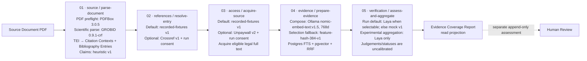
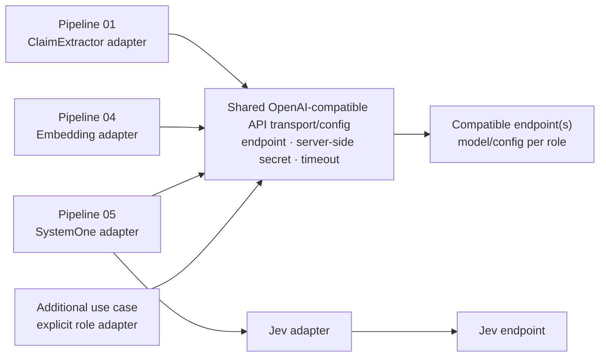

# Pipeline Implementation and Feature Traceability Matrix

**Snapshot:** 2026-10-03

**Scope:** current repository implementation compared with [`paper-t-rail-tech-design.md`](./paper-t-rail-tech-design.md), especially sections 3, 14–16, 30, 57–59, and the accepted ADRs. This is a source review; it does not prove that a deployed environment is configured or that a full-system run has passed.

## Current readout

The five persisted pipeline stages have corresponding code paths and progress records. The core V1 path is present, with run-level configuration determining whether the final assessment stage executes. The clearest feature gap is the planned LLM-based Atomic Claim extraction: the design names it as an optional provider, but only the heuristic provider is selectable and implemented. A Google Gemini claim-extraction catalog entry is disabled and has no matching runtime adapter.

“LLM integration” refers to different jobs in the design. Paper T-Rail has local Ollama embeddings in Stage 04 and a local Laya System One provider for narrow Evidence Judgements in Stage 05. Neither implements the generic text-generation port or LLM-based Atomic Claim extraction described in sections 14–15.

## Current five-stage flow and effective configuration

The diagram below separates the five persisted worker stages from the work inside each stage. Provider names in this diagram are the defaults for a new Analysis Run; an enabled option in the provider catalog is not automatically selected.

Stage 01 produces run-scoped parsed structure, claims, and inferred links from each claim to the Citation Targets in its own Citation Context. Stages 02–03 work per Bibliography Entry; Stages 04–05 work on eligible claim × cited-reference evidence. Human Review is outside these five worker stages and does not rewrite machine outcomes.

| Pipeline stage / persisted ID | Current behavior | Configuration in this checkout | Selection and limits |
|---|---|---|---|
| **01 — Read the PDF** `source / parse-document` | Validate the uploaded PDF, call GROBID, parse TEI into sections, Citation Occurrences, Citation Contexts, and Bibliography Entries (excluding uncited heading-only bibliography artifacts), then extract Atomic Claims. | Validation parser: PDFBox `3.0.5`; language detector: Optimaize `0.6`. Analysis parser: `grobid`, version `0.9.1-crf`; Compose URL `http://grobid:8070` (non-Compose fallback `http://127.0.0.1:8070`); response limit `64 MiB`. GROBID request explicitly sets `consolidateHeader=0` and `consolidateCitations=0`. Claim extractor is run-request default `heuristic`, version `v1`. | Heuristic splitting uses bounded coordination/verb patterns; it preserves source spans and leaves ambiguous coordination together. No generative LLM claim extractor is callable. GROBID is still responsible for structure and citation-marker target links; an LLM extractor would be an optional claim-extraction choice, not a GROBID replacement. |
| **02 — Resolve references** `references / resolve-entry` | Match Bibliography Entries to Canonical Papers and record unresolved outcomes under a run-pinned policy. | API fallback when omitted: `recorded-fixtures` `v1`. The web new-run form initially prefers Crossref when listed, with matching per-run consent required. Configured confidence threshold: `0.9`. Spring and local Compose defaults enable Crossref as optional `v1`, with a local test contact value unless overridden. | Crossref is used only if selected for the run and consented to; configuration enablement alone does not select it. `ProviderCatalog.safeDefaults` itself defaults external providers to disabled; Spring/Compose explicitly override this for local consent-flow testing. Provider terms and configured contact/disclosure values are informational, not an approval gate; per-run consent remains required. No Semantic Scholar adapter is present. |
| **03 — Acquire cited sources** `access / acquire-source` | Discover accessible locations, enforce acquisition policies, and bind each acquired Cited Paper Asset to an immutable source/hash and provenance. | API fallback when omitted: `recorded-fixtures` `v1`. The web new-run form initially prefers Unpaywall when listed, with matching per-run consent required. Spring and local Compose defaults enable Unpaywall as optional `v2`, with a local test contact value unless overridden. | Unpaywall is used only if selected for the run and consented to. Only eligible legal full text continues to semantic evidence work; abstract-only and unsupported-language sources are not semantically judged under V1. Configured contact/disclosure values are informational; provider-terms review is not an enablement gate. |
| **04 — Prepare evidence** `evidence / prepare-evidence` | Parse exact acquired assets, chunk them, embed chunks and claims, then retrieve ranked candidate Evidence Passages. | In Compose, Ollama is enabled and preferred when selectable/local: `nomic-embed-text:v1.5`, dimension `768`, endpoint `http://ollama:11434`, timeout `60,000 ms`. If Ollama is not selectable/local, new runs select local `feature-hash-384-v1`, dimension `384`. Retrieval profile: `postgres-hybrid-rrf-v1`; vector candidates `10`; lexical candidates `10`; final candidates `5`; RRF constant `60`. | Base `application.yml` leaves Ollama disabled with an empty URL/model, so its non-Compose effective default is feature-hash. The feature-hash vectorizer is lexical word/bigram hashing, not semantic embeddings. Ollama external to trusted hosts is classified `EXTERNAL`; configured endpoints are selectable without a terms-review gate, with known or unknown retention disclosed and per-run consent required. No OpenAI-compatible embedding adapter exists. |
| **05 — Assess evidence** `verification / assess-and-aggregate` | Ask the selected System One provider for a typed Evidence Judgement per eligible claim/passage pair, then optionally apply deterministic policy to aggregate Claim–Paper Verification. | The default provider preference is `laya`; Compose endpoint `http://laya:8000`, timeout `120,000 ms`, pinned model/runtime, and output mapping are recorded in provenance. Laya is selectable only with a valid API key and trusted local host. Configured Jev (`JEV_API_KEY`, default endpoint `https://api.typesafe.ai`) is an explicit external alternative, never a default. If Laya is unavailable, an omitted run selection falls back to `mock` `v1`; explicitly unavailable selections fail closed. Shared aggregation defaults on with direct support `0.80`, partial support `0.70`, contradiction `0.80`, and comparability margin `0.08` for eligible Laya and Jev runs. | Both providers map to the shared typed Evidence Judgement contract and deterministic aggregation policy. Judgements and aggregate statuses remain uncalibrated. Provider/runtime failure is not a silent switch to a different model. |

**Why Stage 05 is uncalibrated:** the pinned Laya checkpoint is documented as trained for unrelated synthetic workflows, and Jev's hosted judgments have not been calibrated for this evidence domain. The repository has no legally usable, human-reviewed in-domain calibration dataset; software smoke fixtures do not supply that evidence. The configured aggregation thresholds are deterministic policy values, not calibration. Issue #45 records calibration as not planned and not a release requirement, so all non-mock judgements and aggregate statuses must continue to be labeled uncalibrated.

**How to read the configuration:** `application.yml` supplies Spring defaults; `infra/docker-compose.yml` overrides several for the local stack; Analysis Run request defaults then choose providers and snapshot the selected configuration. Therefore, “Crossref enabled” or “Laya enabled” describes availability, while “selected provider” describes the actual run. The Crossref/Unpaywall contacts and disclosures in these defaults are informational local configuration; provider-terms review is not an availability gate. Every external call still requires matching per-run consent, and its exact disclosure is snapshotted server-side. Production deployments may override environment values; this source snapshot does not prove their live configuration.

## Component-level plugability plan

The target model is **pipeline → subpipeline/component → method/port → provider choice**. Each leaf should say whether it is already selectable, only has an implementation interface, or is currently a fixed internal method. That keeps provider selection scoped to the operation it performs.

| Pipeline | Component / subpipeline | Current method and provider slot | Plugability plan |
|---|---|---|---|
| **01 — Read the PDF** | PDF preflight | `PdfDocumentValidator` uses PDFBox `3.0.5`; source hash, type, size, page count, and text checks are deterministic. | Keep as a local validation method. It is not an LLM provider slot; add an alternative only if there is a concrete parser/validation requirement. |
| **01 — Read the PDF** | Language detection | `DocumentLanguageDetector` interface; current implementation is Optimaize `0.6`. | An interface exists, but it is not a run-selectable provider role. Add provider selection only if another detector is needed; pin detector/version if selected. |
| **01 — Read the PDF** | Scientific document parsing | `ScientificDocumentParser` interface; current runtime implementation is GROBID `0.9.1-crf`, selected through Spring configuration and pinned in the run. | An interface exists, but only GROBID is wired. A future parser can implement this boundary; it does not belong behind the OpenAI-compatible LLM transport. |
| **01 — Read the PDF** | TEI parsing and Citation Context segmentation | `GrobidTeiParser` and `CitationContextSegmenter` convert GROBID TEI/callouts into source-traceable contexts and targets. Uncited entries that contain only a known bibliography heading and no meaningful bibliographic fields are excluded from the structured bibliography; the original TEI remains preserved for audit. | Keep deterministic and local by default. GROBID remains responsible for document structure and citation-marker target identity. Do not filter all `UNSUPPORTED_REFERENCE_TYPE` entries: that resolution status also applies to valid books. |
| **01 — Read the PDF** | Atomic Claim extraction | `ClaimExtractorProvider`; `heuristic` `v1` is the selectable default. An external Google catalog record is disabled and has no runtime adapter; external extraction is rejected until a provider-call gate is configured. | Add `LlmClaimExtractor` as an optional peer to heuristic. Its LLM adapter can use the shared OpenAI-compatible transport while returning the same validated claim/span contract. |
| **01 — Read the PDF** | Claim-to-Citation-Target association | Current rule links each claim to every target in its Citation Context; links are inferred under [ADR 0004](./adr/0004-run-scoped-parsed-document-structure.md). | If the desired LLM use case selects a subset of bibliography targets per claim, make that a separate, explicit linker method/port or versioned extraction result. It changes current policy, so decide it in an ADR/issue and validate returned target IDs against the context. |
| **02 — Resolve references** | Scholarly metadata lookup | `ScholarlyMetadataLookupFactory`; API fallback when omitted is `recorded-fixtures`; the web new-run form initially prefers Crossref when listed and requires per-run consent. | This provider role is already selectable per run (`scholarlyMetadataProvider`). Add metadata services such as Semantic Scholar as adapters to this port. |
| **02 — Resolve references** | Reference matching policy | `ConservativeReferenceResolver` applies deterministic matching; confidence threshold defaults to `0.9` and is snapshotted. | Provider supplies metadata; matching policy decides whether the Bibliography Entry resolves. Keep these as separate slots. A future matching algorithm needs its own strategy/config version, not an LLM silently resolving identity. |
| **03 — Acquire cited sources** | Open-access discovery and fetch | `OpenAccessProvider` exposes `discover` and `fetch`; API fallback when omitted is `recorded-fixtures`; the web new-run form initially prefers Unpaywall when listed and requires per-run consent. | This provider role is already selectable per run (`openAccessProvider`). Add another OA adapter here; legal-location, host, and network checks remain enforced by application policy. |
| **03 — Acquire cited sources** | Eligibility and access policy | `CitedPaperAccessService` applies access, language, and acquisition rules; eligible downloads become hash-pinned Cited Paper Assets. | Keep legal and safety decisions deterministic. Do not use generated text as proof of rights or access eligibility. |
| **04 — Prepare evidence** | Cited Paper parsing | `DefaultCitedPaperParser`: PDF uses `ScientificDocumentParser`/GROBID; plain text uses `plain-text` `v1`. | A parser interface exists, but parser choice is not a run-selectable provider role. New parsers can implement the boundary; pin the exact parser/version per asset/run. |
| **04 — Prepare evidence** | Chunking | `SectionAwareEvidenceChunker`, section-aware with target `700` words and maximum `900`. | Current deterministic method, not a provider. Make the chunker a strategy only if an alternative chunking method is required; include its version/limits in retrieval provenance. |
| **04 — Prepare evidence** | Embedding | `EmbeddingProvider`; local `feature-hash-384-v1` and Ollama `nomic-embed-text:v1.5` (`768d`) are implemented. API requests without an embedding choice prefer trusted/local Ollama; the web new-run form defaults to feature-hash. | Already selectable per run (`embeddingProvider`). Add a role-specific OpenAI-compatible embeddings adapter. Require model and dimension for that endpoint; fingerprint provider/model/dimension because vector spaces cannot be mixed. |
| **04 — Prepare evidence** | Retrieval and ranking | `PostgresHybridEvidenceRetriever`: PostgreSQL FTS + pgvector, fused by RRF. Current profile `postgres-hybrid-rrf-v1`, candidates `10/10/5`, RRF constant `60`. | Parameters/profile are configurable and snapshotted; the retriever algorithm itself is currently concrete. A replacement retrieval method needs an `EvidenceRetriever` strategy boundary and its own profile/version. It is separate from the embeddings provider. |
| **05 — Assess evidence** | Evidence Judgement | `SystemOneProvider`; `mock` `v1`, local Laya, and hosted Jev are implemented. Jev is listed only when its valid server-side configuration is present. | Selectable per run through `systemOneProvider`. Laya remains the configured default; Jev is an explicit external alternative requiring exact per-run consent. Both adapters map to the same versioned contract; provider/model provenance is retained. |
| **05 — Assess evidence** | Claim–Paper aggregation | `EvidenceAggregationPolicy` applies deterministic thresholds to eligible Laya and Jev judgements when shared System One aggregation is enabled. | Aggregation stays separate from provider choice; changing its method requires a policy/version change, and aggregation is not another model call. `SYSTEM_ONE_AGGREGATION_ENABLED=false` keeps final statuses `NOT_RUN` while selected providers may still produce judgement-only results. |

### Example input → process → output per component

All examples below use a **fictional** Source Document sentence, `Program X reduced outcome Y [12, 13].`, and fictional bibliography entries `[12]` and `[13]`. They illustrate the shape of data at each boundary; they are not captured outputs from a live run. Offsets and hashes are abbreviated.

#### Pipeline 01 — Read the PDF

- **PDF preflight**
  - Input: uploaded `draft.pdf` bytes, content type, filename, and source SHA-256.
  - Process: verify PDF signature/type and configured size/page/text limits; PDFBox `3.0.5` parses the file and extracts text for validation.
  - Output: a `ValidatedPdf` with sanitized filename, source hash, page count, detected language, and extracted-character count; invalid input returns a validation error code.
- **Language detection**
  - Input: text extracted from the PDF.
  - Process: `OptimaizeDocumentLanguageDetector` estimates language and confidence.
  - Output: `LanguageDetection(language="en", confidence=c)`; the validator checks `c` against the configured minimum.
- **Scientific parsing — GROBID**
  - Input: original PDF bytes.
  - Process: POST to `/api/processFulltextDocument`, with `consolidateHeader=0` and `consolidateCitations=0`; the local adapter receives TEI XML.
  - Output: the GROBID service returns TEI XML to the adapter. `GrobidScientificDocumentParser` passes that response into the next parsing substep; its public `ScientificDocumentParser.parse` result is the combined parsed structure. Parser identity/version is pinned as `grobid` / `0.9.1-crf`.
- **TEI parsing and Citation Context segmentation**
  - Input: TEI containing body text, a callout such as `[12, 13]`, and its bibliography targets.
  - Process: `GrobidTeiParser` normalizes section text and offsets; `CitationContextSegmenter` finds the citation-bearing clause or sentence fallback.
  - Output: a `ParsedScientificDocument` containing normalized text, sections, a Citation Context for `Program X reduced outcome Y [12, 13].`, an occurrence targeting keys `ref-12` and `ref-13`, and both parsed Bibliography Entries. Offsets are zero-based, end-exclusive UTF-16 offsets.
- **Atomic Claim extraction**
  - Input: `ClaimExtractionRequest(contextText, contextStartOffset, occurrences)` for that Citation Context.
  - Process: selected `ClaimExtractorProvider` removes citation markers, identifies claim wording, and the service validates that returned spans stay within the context. Current choice is heuristic `v1`; the future LLM option must satisfy this same contract.
  - Output: `CitationContextClaims` containing an `AtomicClaimCandidate`, for example text `Program X reduced outcome Y` plus its source start/end offsets.
- **Claim-to-Citation-Target association**
  - Input: the extracted claim and target keys from its Citation Context (`ref-12`, `ref-13`).
  - Process: current rule links the claim to every Citation Target in that context and records the association as inferred.
  - Output today: inferred links from the claim to both Bibliography Entries. A future linker could propose only `ref-12`, for example, but selecting a subset needs an explicit policy/version decision under ADR 0004; that output does not exist today.

#### Pipeline 02 — Resolve references

- **Scholarly metadata lookup**
  - Input: DOI when present, otherwise parsed reference fields such as title, authors, and year.
  - Process: selected `ScholarlyMetadataLookup` calls `byDoi(doi)` or `search(reference)`. Current run default is `recorded-fixtures`; Crossref is an optional selected provider with consent.
  - Output: zero or more `ScholarlyWork` candidates containing DOI, title, authors, and year.
- **Reference matching policy**
  - Input: for example `BibliographyReference(doi="<doi-12>")` and `ScholarlyWork(doi="<doi-12>", title="Study of Program X", ...)` from lookup.
  - Process: `ConservativeReferenceResolver` confirms a normalized exact DOI when available; otherwise `ScholarlyMetadataMatcher` evaluates metadata candidates against the pinned policy and threshold `0.9`.
  - Output: `ReferenceResolutionDecision`, such as `RESOLVED / DOI_CONFIRMED / score=1.0`, or `UNRESOLVED` with a reason code. A lookup result alone does not resolve the entry.

#### Pipeline 03 — Acquire cited sources

- **Open-access discovery**
  - Input: resolved reference metadata, for example `title="Study of Program X"`, authors/year, and `doi="<doi-12>"`.
  - Process: selected `OpenAccessProvider.discover(reference)`; current default is `recorded-fixtures`, with Unpaywall as an optional provider.
  - Output: `OpenAccessDiscovery` with metadata/abstract availability and candidate `OpenAccessLocation` values (URL, license, version, host type).
- **Legal-location filtering**
  - Input: discovered `OpenAccessLocation` candidates, such as a repository URL with its declared license/version/host type.
  - Process: `LegalOpenAccessLocationPolicy` removes locations that do not meet the application's usable-location rules.
  - Output: the ordered permitted locations to try, or an empty list.
- **Full-text fetch**
  - Input: one permitted `OpenAccessLocation`.
  - Process: the selected `OpenAccessProvider.fetch(location)` retrieves bytes; the service extracts text and may try the next permitted location after a fetch/extraction failure.
  - Output: `AcquiredFullText(bytes, mediaType, location)` plus extracted text for language detection, or no acquired full text after permitted attempts fail.
- **Language eligibility and access decision**
  - Input: discovery availability flags, whether full text was acquired, extracted text, and its detected language/confidence.
  - Process: `CitedPaperAccessPolicy` applies the V1 access/supported-language rules; only a language result meeting the configured confidence threshold is passed as supported language.
  - Output: for the English example, `FULL_TEXT_AVAILABLE` with `FULL_TEXT` scope and a persisted exact-asset hash/location/language. Other paths record outcomes such as `ABSTRACT_ONLY`, `METADATA_ONLY`, `UNAVAILABLE`, or full text with unsupported language and `INSUFFICIENT_EVIDENCE`.

#### Pipeline 04 — Prepare evidence

- **Cited Paper parsing**
  - Input: bytes from the exact acquired Cited Paper Asset plus media type.
  - Process: `DefaultCitedPaperParser` sends PDFs through `ScientificDocumentParser`/GROBID and normalizes plain text with `plain-text v1`.
  - Output: `ParsedScientificDocument` with parser provenance and sections, for example a `Results` section; the surrounding evidence record remains associated with the run's exact asset/hash.
- **Chunking**
  - Input: parsed sections and paragraphs.
  - Process: `SectionAwareEvidenceChunker` groups text by section toward 700 words, splitting at a maximum of 900 words.
  - Output: ordered `EvidenceChunk` values, for example chunk `0` from `Results`, paragraph `1`, with its text and section/paragraph coordinates; these are candidate passages, not judgements.
- **Embedding**
  - Input: each chunk as `cited_paper_chunks` and each Atomic Claim as `atomic_claims`, with the run's pinned embedding configuration.
  - Process: selected `EmbeddingProvider` computes vectors. In local Compose this is normally Ollama `nomic-embed-text:v1.5`; the local feature-hash provider is the selection fallback.
  - Output: a `FloatArray` vector per input. The retrieval service checks finiteness and dimension; the run snapshot/profile records provider/model/version/dimension. Example vector length is `768` for the Compose Ollama profile or `384` for feature-hash; a future compatible model must use its own configured dimension/profile.
- **Retrieval and ranking**
  - Input: Analysis Run ID, Bibliography Entry ID, claim text/vector, exact asset chunks, and pinned retrieval configuration.
  - Process: `PostgresHybridEvidenceRetriever` finds vector and English FTS candidates within that run/reference/profile, then RRF fuses them (`10` vector, `10` lexical, final `5`, constant `60`).
  - Output: ranked Evidence Passage candidates, for example `chunk-0(vectorRank=1, lexicalRank=2, fusedRank=1, fusionScore=...)`. Ranking does not decide support or contradiction.

#### Pipeline 05 — Assess evidence

- **Evidence Judgement**
  - Input: `SemanticJudgementRequest` containing claim text `Program X reduced outcome Y` and one or more retrieved Evidence Passages from its resolved cited work.
  - Process: selected `SystemOneProvider` evaluates each claim/passage pair. Current options are `mock`, Laya, and configured Jev; each non-mock adapter maps to the shared domain result.
  - Output: `SemanticJudgementResult` with an `EvidenceJudgement` per candidate, for example `DIRECT_SUPPORT` with role `PRIMARY_FINDING` and rubric scores. Other allowed judgements are `PARTIAL_SUPPORT`, `CONTRADICTS`, `UNRELATED`, and `INSUFFICIENT`. All non-mock provider results remain uncalibrated.
- **Claim–Paper aggregation**
  - Input: judgements for one Atomic Claim × Cited Reference plus the run's aggregation thresholds.
  - Process: `EvidenceAggregationPolicy` compares rubric strength for support and contradiction; comparable conflict within margin `0.08` yields `INSUFFICIENT_EVIDENCE` with `evidenceConflict=true`.
  - Output: `EvidenceAggregationDecision` with final status, conflict flag, and strongest support/contradiction values; for example, direct support above `0.80` with no comparable contradiction can yield `SUPPORTED`. This is a deterministic policy result, not a model judgement or calibration result.

### Shared OpenAI-compatible service

- **Input:** a role adapter submits a typed operation and role-specific configuration, for example embeddings for `claim-1` using an explicitly configured embedding model; an approved outbound call carries only that role's consented data categories.
- **Process:** the shared transport applies the configured base URL, server-side secret, timeout, and HTTP behavior, then returns the provider response. Claim extraction, embeddings, and System One each need their own adapter to validate/map that response; the shared transport does not normalize all three into one domain contract.
- **Output:** a role adapter returns the application type expected by its pipeline—`AtomicClaimCandidate`(s), a dimension-checked vector, or typed `EvidenceJudgement`(s). An additional use case adds its own role contract and mapping.

Recommended initial service defaults: disabled until configured; no default endpoint, secret, or model ID. Require embedding dimension per selected model and fingerprint provider/model/dimension/retrieval profile in each Analysis Run. Keep current retrieval defaults (`postgres-hybrid-rrf-v1`, candidates `10/10/5`, RRF `60`) and local Compose embedding default (`nomic-embed-text:v1.5`, `768d`); these values do not automatically apply to other models. Start with `60,000 ms` timeout for extraction/embedding and `120,000 ms` for System One, matching current provider timeouts. Set adapter-level retries to `0`; use the pipeline retry policy for transient work failures and never silently switch provider/model. Declare and consent external payloads per role: Stage 01 `citation_context` and, only if sent, `bibliographic_metadata`; Stage 04 `cited_paper_chunks`, `atomic_claims`, `embedding_input`; Stage 05 `atomic_claims`, `evidence_passages`. Additional use cases need their own role and payload contract. These are recommendations, not settings currently implemented.

## Status vocabulary

| Status | Meaning |
|---|---|
| **Implemented** | A code path and its persisted or user-visible boundary exist in this checkout. This does not imply a successful deployed run. |
| **Implemented with limits** | The core path exists, but the row names a planned provider, scope, or operational condition that is absent or bounded. |
| **Design only** | The design describes the feature, but no matching runtime implementation was found. |
| **Verification gap** | The behavior exists at code level, but the identified system-level evidence is still open or has not been run in this review. |
| **Out of V1 scope** | The design explicitly defers or excludes the capability; do not count it as a V1 defect. |

## Five-stage feature matrix

| Stage and worker boundary | Current implementation evidence | Status and implementation review |
|---|---|---|
| **01 — Read the PDF**: verify the stored Source Document, parse structure, extract claims, and persist the parsed result. | [`AnalysisRunProcessingService`](../api/src/main/kotlin/com/papertrail/api/analysis/service/AnalysisRunProcessingService.kt), [`ScientificDocumentParser.kt`](../api/src/main/kotlin/com/papertrail/api/citation/parsing/ScientificDocumentParser.kt), [`ClaimExtractorProvider`](../api/src/main/kotlin/com/papertrail/api/citation/claims/provider/ClaimExtractorProvider.kt), [`HeuristicClaimExtractor`](../api/src/main/kotlin/com/papertrail/api/citation/claims/service/HeuristicClaimExtractor.kt), [`ProviderCatalog`](../api/src/main/kotlin/com/papertrail/api/infrastructure/providers/ProviderCatalog.kt). Run-scoped parsed structure, source spans, and inferred same-context links follow [ADR 0004](./adr/0004-run-scoped-parsed-document-structure.md). | **Implemented with limits.** PDF verification, GROBID parsing, Citation Contexts, and version-pinned heuristic Atomic Claim extraction are present. **LLM-based extraction is design only:** there is no `LlmClaimExtractor` or generic `LlmProvider` in the runtime; the configured claim extractor defaults to `heuristic`. The bounded heuristic may leave unfamiliar coordinated claims unsplit. |
| **02 — Resolve references**: resolve supported Bibliography Entries to Canonical Papers under the run-pinned policy. | [`ReferenceResolutionService`](../api/src/main/kotlin/com/papertrail/api/scholarly/references/service/ReferenceResolutionService.kt), [`ConservativeReferenceResolver`](../api/src/main/kotlin/com/papertrail/api/scholarly/references/resolver/ConservativeReferenceResolver.kt), Crossref and recorded-fixture metadata adapters under `api/src/main/kotlin/com/papertrail/api/scholarly/references/`. | **Implemented with limits.** Conservative resolution, unresolved outcomes, and run-pinned policy are present. The planned Semantic Scholar enrichment is not implemented. |
| **03 — Acquire cited sources**: discover legal locations, acquire eligible full text, and persist access/language outcomes. | [`CitedPaperAccessService`](../api/src/main/kotlin/com/papertrail/api/scholarly/acquisition/service/CitedPaperAccessService.kt), [`CitedPaperAcquisitionRequestedHandler`](../api/src/main/kotlin/com/papertrail/api/scholarly/acquisition/queue/CitedPaperAcquisitionRequestedHandler.kt), Unpaywall and recorded-fixture adapters under `api/src/main/kotlin/com/papertrail/api/scholarly/acquisition/`. | **Implemented with limits.** Access decisions enforce legal-location and network policies, and record outcomes. Acquisition is limited to legally accessible sources; abstract-only and unsupported-language access do not proceed to semantic verification under V1. |
| **04 — Prepare evidence**: parse eligible Cited Paper Assets, chunk, embed, and retrieve ranked Evidence Passages. | [`CitedPaperIndexingRequestedHandler`](../api/src/main/kotlin/com/papertrail/api/evidence/queue/CitedPaperIndexingRequestedHandler.kt), [`OllamaEmbeddingProvider`](../api/src/main/kotlin/com/papertrail/api/evidence/embedding/OllamaEmbeddingProvider.kt), [`FeatureHashEmbeddingProvider`](../api/src/main/kotlin/com/papertrail/api/evidence/embedding/FeatureHashEmbeddingProvider.kt), [`PostgresHybridEvidenceRetriever`](../api/src/main/kotlin/com/papertrail/api/evidence/retrieval/PostgresHybridEvidenceRetriever.kt), [ADR 0007](./adr/0007-deterministic-local-hybrid-evidence-retrieval.md), [ADR 0008](./adr/0008-prefer-ollama-embedding-selection.md). | **Implemented with limits.** Exact-asset hybrid retrieval, FTS + pgvector, rank fusion, and run-pinned retrieval provenance exist. Local Compose prefers Ollama when selectable; `feature-hash-384-v1` is the lexical fallback, not a trained semantic embedding. Google embeddings are not implemented. Retrieval produces candidate passages, not a semantic judgement. |
| **05 — Assess evidence**: persist System One Evidence Judgements and, when configured, aggregate Claim–Paper Verification outcomes. | [`EvidenceVerificationService`](../api/src/main/kotlin/com/papertrail/api/evidence/verification/service/EvidenceVerificationService.kt), [`LayaSystemOneProvider`](../api/src/main/kotlin/com/papertrail/api/evidence/verification/provider/LayaSystemOneProvider.kt), [`JevSystemOneProvider`](../api/src/main/kotlin/com/papertrail/api/evidence/verification/provider/JevSystemOneProvider.kt), [`EvidenceAggregationPolicy`](../api/src/main/kotlin/com/papertrail/api/evidence/verification/domain/EvidenceAggregationPolicy.kt), [`AnalysisRunStageCompletionService`](../api/src/main/kotlin/com/papertrail/api/analysis/service/AnalysisRunStageCompletionService.kt), [Laya evaluation status](./laya-evaluation.md). | **Implemented with limits.** Mock, Laya, and configured Jev System One paths, typed Evidence Judgements, shared deterministic aggregation, and incomplete-pair handling exist. Non-mock judgements and aggregated statuses remain explicitly **uncalibrated**; no accuracy claim follows from the implementation. Verification is conditional on run configuration. A run without final aggregation may still produce judgement-only results and remain `PARSED`; it must not be reported as a completed Evidence Coverage Report. |

Progress is persisted per stage and work item in [`AnalysisRunPipelineProgressRepository`](../api/src/main/kotlin/com/papertrail/api/analysis/service/AnalysisRunPipelineProgressRepository.kt) and displayed through the Analysis Run detail UI in [`pipeline.ts`](../web/features/analysis-runs/pipeline.ts) and [`analysis-run-stage-results.tsx`](../web/features/analysis-runs/components/analysis-run-stage-results.tsx). These five entries are worker stages; the Evidence Coverage Report is a read projection. Human Review is a separate, append-only assessment in [`HumanReviewService`](../api/src/main/kotlin/com/papertrail/api/review/service/HumanReviewService.kt) and does not rewrite machine outcomes ([ADR 0001](./adr/0001-conservative-evidence-triage.md)).

## Where the model integrations are

| Role | Stage | Present in this checkout? | What it does and does not mean |
|---|---:|---|---|
| Generic `LlmProvider` → `LlmClaimExtractor` | 01 | **No — design only** | The plan names claim extraction as its first consumer and permits it optionally. No runtime adapter or generic generation port exists. |
| Ollama `EmbeddingProvider` | 04 | **Yes** | Produces vectors for retrieval. It is an embedding integration, not claim rewriting or Evidence Judgement. |
| Laya `SystemOneProvider` | 05 | **Yes** | Produces narrow, structured passage-level judgements. Results are uncalibrated and separate from deterministic aggregation. |
| Jev `SystemOneProvider` | 05 | **Yes, when configured** | Hosted external adapter; explicit per-run selection and consent are required. It maps to the shared Evidence Judgement contract, and results are uncalibrated and separate from deterministic aggregation. |
| Google / other hosted LLM or embedding providers | 01 or 04, or future providers in 05 | **No callable adapter; Google catalog entries are disabled** | The provider catalog contains disabled Google claim-extraction and embedding options. Jev is a separate, implemented System One adapter. The [provider matrix](./agents/provider-matrix.md) records external boundaries, payload categories, and known or unknown terms; exact-product review is not required for availability, while per-run consent remains required. A catalog entry alone is not an executable adapter; an implemented adapter and required configuration are still necessary. |

The design locations are [Claim Extraction, section 14](./paper-t-rail-tech-design.md#14-claim-extraction), [Generic LLM Port, section 15](./paper-t-rail-tech-design.md#15-generic-llm-port), and [Implementation Plan, phases 4 and 11](./paper-t-rail-tech-design.md#58-implementation-plan). Phase 4 calls the LLM extractor optional; Phase 11 places it with provider exploration after the primary path is stable. It is therefore a planned extension, not a missing core V1 acceptance criterion.

## Planned capabilities not found in the five-stage runtime

| Capability | Design location | Current state | GitHub issue status | Classification |
|---|---|---|---|---|
| LLM-based Atomic Claim extraction | Sections 14–15, phases 4 and 11 | No generic LLM port or extraction adapter found; heuristic extraction is the runtime provider. | No dedicated implementation issue found; #6 implements the heuristic baseline. | **Optional planned extension** |
| Semantic Scholar enrichment | Phase 5 | Crossref and recorded fixtures are present; no Semantic Scholar adapter found. | #2 documents its provider boundary; no adapter implementation issue found. | **Optional planned extension** |
| Google embeddings | Phases 7 and 11 | Local Ollama and feature-hash implementations are present; no Google embedding adapter found. | No dedicated implementation issue found; provider catalog entry is disabled. | **Optional external-provider extension** |
| OpenAI-compatible provider support | Sections 14–16, 18; phases 4, 7, and 11 | No OpenAI-compatible client or adapter found. Google Gemini's disabled catalog records are provider options, not OpenAI-compatible support. | No matching issue found in the repository issue list or searches for “OpenAI” and “compatibility” on 2026-10-02. | **Proposed cross-stage provider capability; scope not yet specified** |
| Analysis Run comparison and comparison metrics | Phases 11 and sections 47–48 | Provider/runtime evaluation artifacts exist, but no user-facing run-comparison feature was found in this review. | No dedicated implementation issue found. | **Planned product extension** |
| OCR, Indonesian, authentication/multi-user, non-scholarly sources, cross-paper discovery, learned reranking | Section 62 | Not present as V1 capabilities. | Not tracked as V1 work; design explicitly defers these. | **Out of V1 scope** |

The absence of an optional provider is not by itself a defect. Before moving one into V1, capture its user outcome, trust boundary, payload categories, consent behavior, run snapshot/provenance, failure policy, and observable acceptance criteria in an issue and the provider matrix.

## What an OpenAI-compatible integration can cover

“OpenAI-compatible” describes an HTTP/API shape, not a universal Paper T-Rail provider. If the chosen endpoint exposes compatible operations, one shared transport/configuration module could support multiple role-specific adapters:

| Pipeline stage | Paper T-Rail port | Potential compatible operation | Boundary that still needs its own design |
|---|---|---|---|
| 01 Read the PDF | `ClaimExtractorProvider`, backed by a future `LlmProvider` | Chat/text generation for Atomic Claim candidates | Prompt/output schema, source-span mapping, claim behavior, consent for `citation_context`, and run-pinned model/version. This supplements GROBID parsing; it does not replace GROBID's TEI structure/citation links. |
| 02 Resolve references | `ScholarlyMetadataLookup` | No safe drop-in chat operation | Canonical identity should continue to depend on traceable metadata records and conservative matching. A model suggestion alone must not silently resolve a Bibliography Entry. |
| 03 Acquire cited sources | `OpenAccessProvider` | No safe drop-in chat operation | OA discovery, rights/location decisions, URL/network safety, and acquisition need provider-specific evidence; generated text cannot establish that a copy is legally accessible. |
| 04 Prepare evidence | `EmbeddingProvider` | Embeddings endpoint for cited-paper chunks and claim queries | Separate embedding adapter/profile, dimensions, model fingerprint, consent categories, and retrieval compatibility. This is the most direct use for Stage 04. |
| 05 Assess evidence | `SystemOneProvider` | Chat/text generation only if it can meet the typed judgement contract | A separate adapter must validate the judgement fields, scores, token/context limits, errors, data categories, and uncalibrated labeling. It is not interchangeable with `LlmClaimExtractor`. |

Thus Stage 04 can use an OpenAI-compatible **embeddings** endpoint, while generation may separately support Stage 01 or Stage 05. Stages 02–03 and GROBID parsing are specialized provider boundaries; making them “LLM-enabled” would be a separate, evidence-constrained product design. Split implementation issues by port/role, even if they share the same base URL and authentication configuration.

## Open verification and product-spec work

- [Issue #15 — Specify V1 Researcher-Facing Evidence Coverage](https://github.com/arrokh/paper-t-rail/issues/15) remains open as the parent V1 specification.
- [Issue #55 — Cover the full upload-to-report application path](https://github.com/arrokh/paper-t-rail/issues/55) is open. Its scope says current tests cover split seams but do not yet exercise the real web upload, queued processing, and report path together. This review did not run tests or launch the application.
- [Issue #56 — Verify PDF page-count limit behavior](https://github.com/arrokh/paper-t-rail/issues/56) is open for the configured page-limit boundary test. This is a verification gap, not evidence that the guard itself is absent.
- Issue [#45](https://github.com/arrokh/paper-t-rail/issues/45) closed calibration research as not planned. Calibration is not a product or release gate; keep current outputs labeled uncalibrated.

## Standard for future process and feature tracing

Keep the plan, implementation, and evidence distinct. Use the tech design and ADRs for intended product/architecture behavior; GitHub Issues for actionable acceptance criteria and decisions; code, schema, configuration, API, and UI as implementation evidence; and executed behavioral/system checks as verification evidence. An existing test file is evidence of test coverage in source, not proof that the test passed in the current environment.

Add or update one row for each independently observable feature outcome. Use this record:

| Field | What to record |
|---|---|
| Feature / user outcome | The domain result the user should observe; avoid implementation-only labels. |
| Pipeline stage | One of the five persisted worker stages, or explicitly mark it cross-stage/outside the worker pipeline. |
| Plan and decision | Tech design section, ADR, and issue that establish scope and acceptance. |
| Implementation evidence | Entry point → service/policy/provider → persistence → API/UI paths; include relevant configuration and migration when material. |
| Provider and data boundary | Provider identity, local/external trust boundary, payload categories, consent, retention/deletion constraints. |
| Provenance and failure behavior | Run-pinned versions/configuration, stable outcome/reason codes, retries/abstention, and how incomplete work differs from domain outcomes. |
| Verification evidence | Behavioral or system test path, last executed result/date if actually run, plus known coverage gaps. |
| Status and gap | One status from the vocabulary above, with the specific missing behavior or evidence named. |

On each implementation change, update the issue acceptance status and affected matrix row in the same review. Do not promote a row to **Implemented** because an interface, design sketch, or test fixture exists alone; require the user-visible/persisted behavior and its relevant boundaries to be present. Do not call an item **Verified** unless the relevant check was executed and its result recorded.
