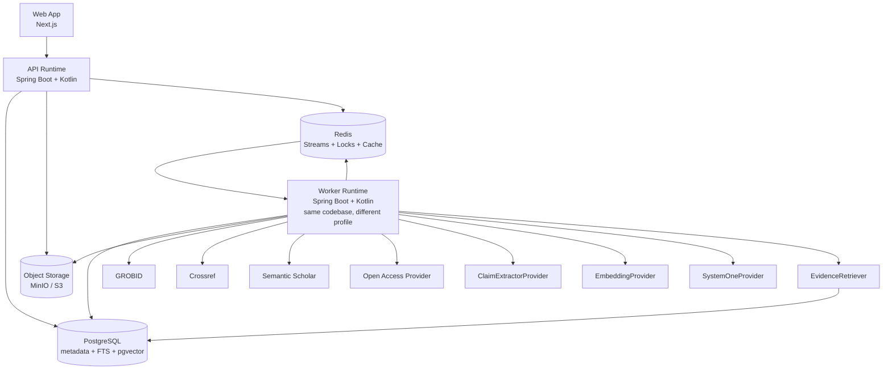
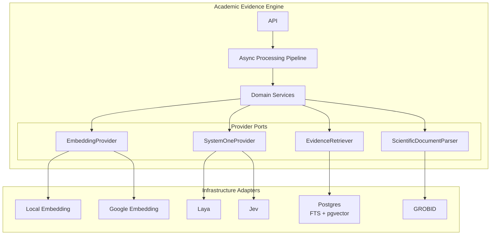
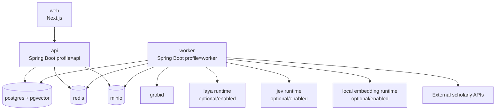
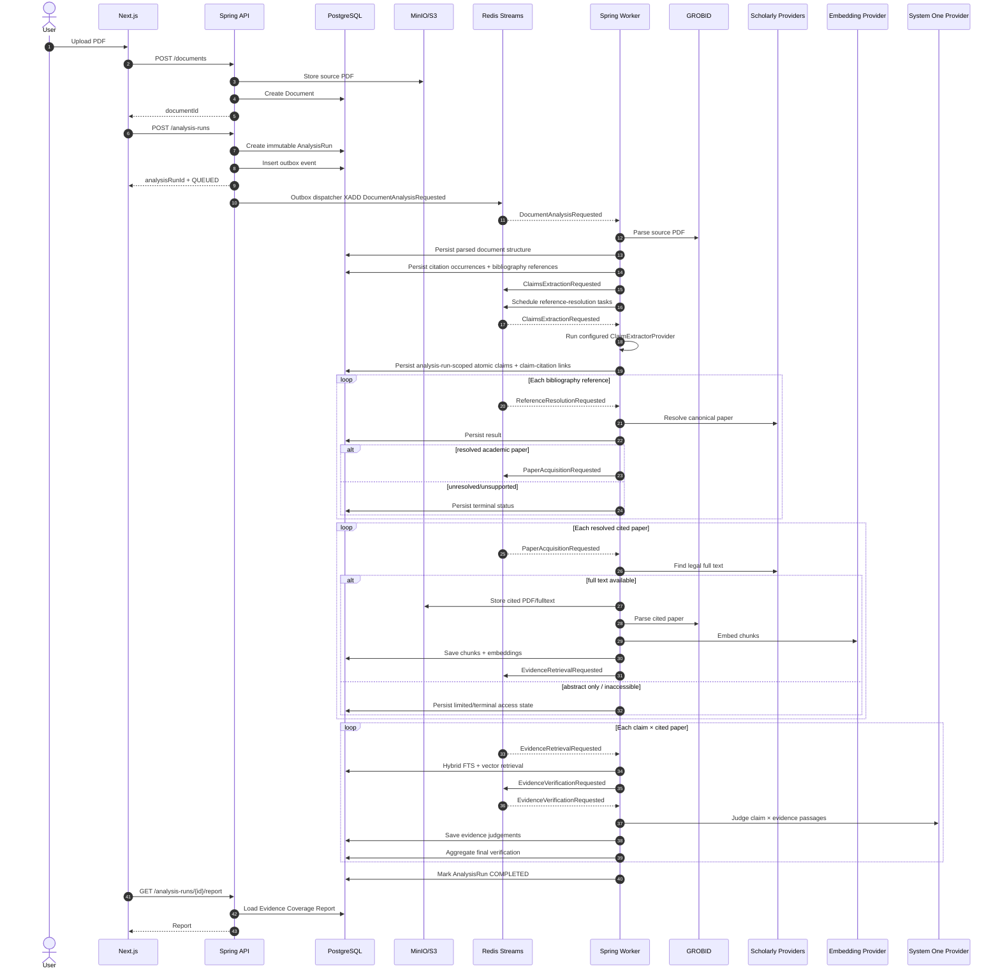
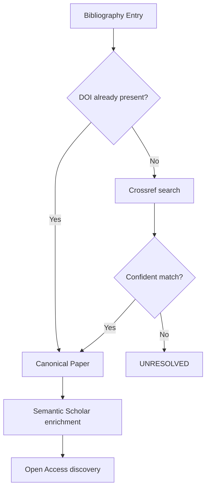
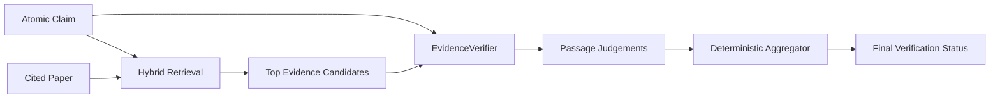
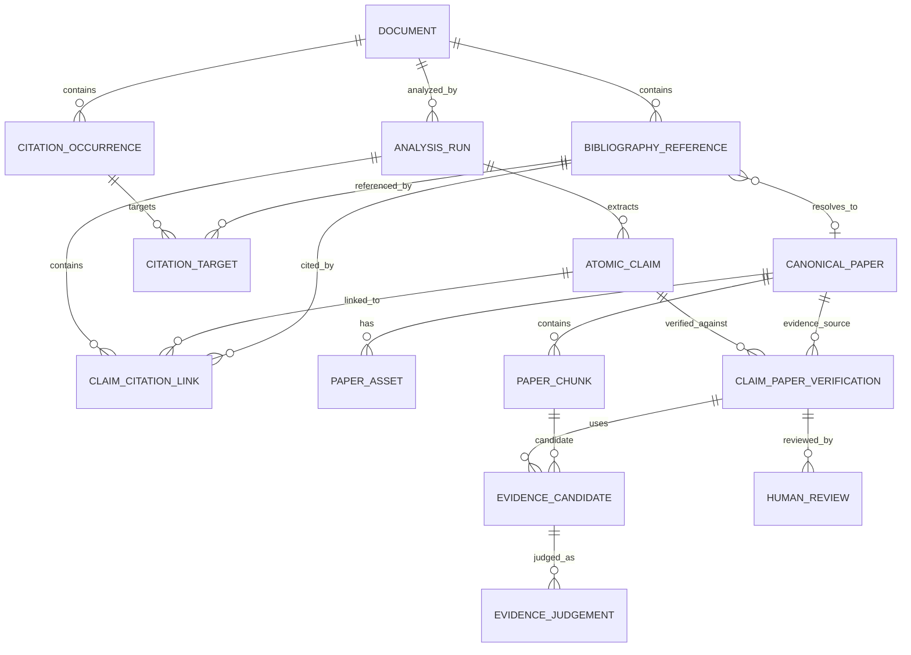
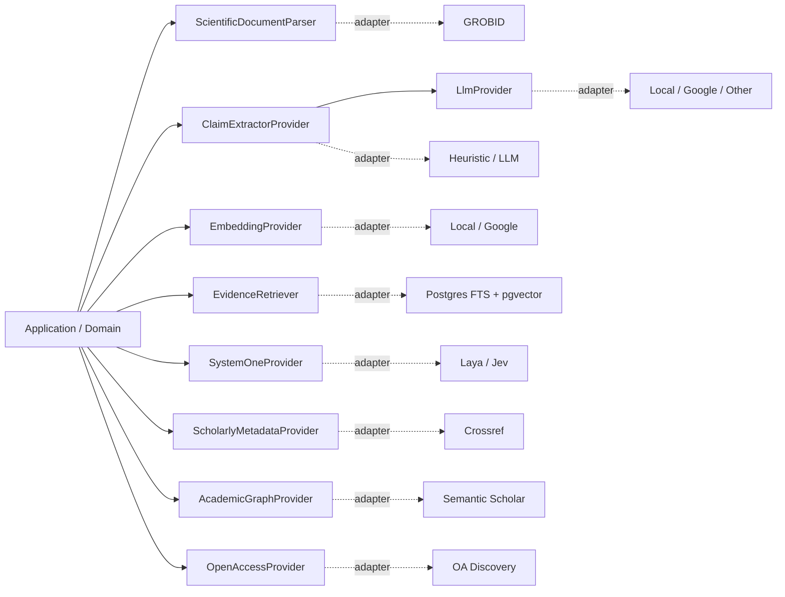

# Paper T-Rail
## Academic Evidence Engine — Technical Design & Coding-Agent Handoff

> **Paper T-Rail — Keeping research on a traceable evidence track.**

### Project philosophy

Research moves forward like a train: each paper carries ideas toward the next station. **Paper T-Rail** helps ensure that journey runs on solid tracks by tracing claims through citations to the source evidence they rely on.

The name intentionally combines two meanings:

- **Paper trail** — the traceable chain from a claim to its citation, source, and evidence.
- **T-Rail / Traceable Rail** — a reliable track that keeps research moving forward on a solid evidence foundation.

```text
Claim
  ═══════════════════════════════════╗
                                     ║
Citation ━━━━━ Source ━━━━━ Evidence ╬━━━► Next Station
                                     ║
  ═══════════════════════════════════╝
```

The system is described technically as an **Academic Evidence Engine**; **Paper T-Rail** is the project/product name.

**Status:** V1 design baseline  
**Primary goal:** Build an asynchronous, traceable academic citation-evidence verification system that audits citation-backed claims in an uploaded English, text-based academic PDF.  
**Architecture style:** Modular monolith backend + separate web app, event-driven async workers, pluggable AI/provider ports.  
**Primary backend stack:** Spring Boot + Kotlin  
**Web stack:** Next.js  
**Async backbone:** Redis Streams  
**Primary data store:** PostgreSQL + pgvector  
**Database migrations:** Sqitch  
**Object storage:** MinIO locally, S3-compatible in production  
**Scientific PDF parsing:** GROBID  

---

# 1. Executive Summary

**Paper T-Rail** accepts an English, text-based academic PDF and produces an **Evidence Coverage Report** answering:

- Which citation-backed atomic claims are supported by their cited sources?
- Which are only partially supported?
- Which are contradicted?
- Which cannot be verified because evidence is insufficient or inaccessible?
- Which references cannot be resolved?
- Which reference types are outside V1 support?

The key verification unit is:

```text
Atomic Claim
×
Cited Paper
×
Candidate Evidence Passage
```

The system is intentionally **not** a generic LLM reviewer. It is an evidence-processing pipeline with explicit provenance:

```text
claim
  ↓
citation occurrence
  ↓
bibliography reference
  ↓
canonical cited paper
  ↓
retrieved evidence passage
  ↓
semantic judgement
  ↓
aggregated verification status
```

The architecture intentionally uses:

- **Redis Streams** for asynchronous pipeline work.
- **Redis distributed locks** only to avoid duplicate expensive work.
- **PostgreSQL constraints + idempotency** for correctness.
- **PostgreSQL FTS + pgvector** for simple hybrid RAG.
- **GROBID** for scientific PDF structure extraction.
- **Provider interfaces** for:
  - claim extraction,
  - generic LLM access,
  - embeddings,
  - System One inference,
  - scholarly metadata,
  - academic graph enrichment,
  - open-access discovery,
  - evidence retrieval.
- **Immutable Analysis Runs** so the same document can be re-analyzed with different providers/models.
- **Human reviews** stored separately from model results to preserve ground truth.

The system should be simple enough for one developer to understand end-to-end, but modular enough to replace Laya with Jev, local embeddings with Google embeddings, heuristic claim extraction with LLM extraction, or PostgreSQL retrieval with a different implementation later.

---

# 2. V1 Scope

## 2.1 Supported

V1 supports:

- One uploaded document at a time.
- Text-based PDF only.
- English only.
- Academic source documents such as:
  - journal papers,
  - conference papers,
  - theses/dissertations,
  - academic manuscripts.
- Verification only for claims that have citations.
- Cited reference types:
  - journal papers,
  - conference papers,
  - preprints,
  - similar resolvable scholarly papers.
- Open/full-text evidence retrieval where legally accessible.
- Conservative abstract-only assessment.
- Human review of machine verification.
- Multiple immutable analysis runs for the same source document.
- Pluggable providers selected through configuration.
- Single workspace.
- No authentication.

## 2.2 Explicit Non-Goals for V1

Do **not** implement the following unless the core V1 is already complete:

- OCR or scanned PDFs.
- Non-English source documents.
- Multi-user or multi-tenant support.
- Authentication/authorization.
- Books, websites, legal documents, standards, news articles, etc. as verifiable cited sources.
- Paywall bypassing or unauthorized publisher scraping.
- Generic web crawling.
- Dedicated vector database.
- Elasticsearch.
- Neo4j.
- Complex workflow engine.
- Kafka.
- Exactly-once messaging.
- Automated rewriting of the source paper.
- Automated academic grading.
- Large autonomous agents.
- Complex multi-model routing.
- Automatic training/fine-tuning.

---

# 3. Core Product Flow

```text
1. User uploads English text-based PDF
2. Source PDF is stored
3. GROBID parses the academic structure
4. Citation occurrences and bibliography entries are extracted
5. Citation contexts are converted into atomic claims
6. Bibliography entries are resolved to canonical academic papers
7. Accessible cited full text is discovered and fetched
8. Cited papers are parsed and chunked
9. Chunks are embedded and indexed
10. Each atomic claim retrieves candidate evidence only from its cited paper
11. System One evaluates claim × evidence
12. Deterministic aggregation produces a final verification status
13. Evidence graph/provenance is persisted
14. User receives an Evidence Coverage Report
15. User may agree, disagree, or override a machine result
```

---

# 4. Core Domain Vocabulary

## 4.1 Source Document

The uploaded PDF being audited.

Example:

```text
thesis.pdf
```

The source document contains claims and citations.

## 4.2 Citation Marker

The visible citation in the body:

```text
"... improves student engagement [17]."
```

`[17]` is the citation marker.

Other styles may look like:

```text
(Smith et al., 2024)
```

## 4.3 Citation Context

The surrounding sentence or local text around a citation marker.

Example:

```text
Generative feedback improves student engagement and reduces dropout [17].
```

## 4.4 Bibliography Entry

The reference entry at the end of the source document:

```text
[17] Smith, J. et al. (2024). Effects of Generative Feedback...
```

This is not yet a guaranteed canonical identity.

## 4.5 Reference Resolution

The process of mapping bibliography text to a canonical scholarly work.

Example:

```text
"Smith et al., Effects..., 2024"
        ↓
DOI: 10.1234/example.2024.391
```

## 4.6 Canonical Paper

The internal normalized identity of one scholarly work.

It may have:

- DOI,
- title,
- authors,
- publication year,
- Semantic Scholar ID,
- arXiv ID,
- other external identifiers.

Multiple representations or URLs may still correspond to one canonical paper.

## 4.7 Atomic Claim

A single proposition that can be independently verified.

Input:

```text
Generative feedback improves student engagement and reduces dropout [17].
```

Decomposed:

```text
Claim A:
Generative feedback improves student engagement.

Claim B:
Generative feedback reduces dropout.
```

## 4.8 Evidence Passage

A retrieved passage from the cited paper that may support, partially support, contradict, or be unrelated to the claim.

## 4.9 Analysis Run

An immutable execution of the analysis pipeline for one source document using a fixed provider/configuration snapshot.

Example:

```text
Analysis Run A
- claim extractor: heuristic
- embedding: local/e5-small
- system one: laya

Analysis Run B
- claim extractor: llm/google
- embedding: google/embedding-x
- system one: jev
```

Old results are never overwritten by a new run.

---

# 5. Verification Taxonomy

## 5.1 Final Verification Status

Use exactly these seven final statuses:

```text
SUPPORTED
PARTIALLY_SUPPORTED
CONTRADICTED
INSUFFICIENT_EVIDENCE
INACCESSIBLE
UNRESOLVED
UNSUPPORTED_REFERENCE_TYPE
```

### Meaning

**SUPPORTED**  
Accessible full-text evidence directly supports the atomic claim.

**PARTIALLY_SUPPORTED**  
Evidence supports only part of the atomic claim or supports it with materially narrower scope/conditions.

**CONTRADICTED**  
Accessible full-text evidence materially conflicts with the atomic claim.

**INSUFFICIENT_EVIDENCE**  
The cited paper is accessible enough to inspect, but no sufficiently strong full-text evidence was found; also used conservatively when only abstract-level evidence is available.

**INACCESSIBLE**  
The reference is resolved, but usable full text cannot legally be obtained.

**UNRESOLVED**  
The bibliography entry cannot be confidently mapped to a canonical academic paper.

**UNSUPPORTED_REFERENCE_TYPE**  
The citation resolves to a type outside V1 scope, such as a book, website, standard, etc.

## 5.2 Evidence-Passage Judgement

Evidence passages use a separate taxonomy:

```text
DIRECT_SUPPORT
PARTIAL_SUPPORT
CONTRADICTS
UNRELATED
INSUFFICIENT
```

`UNRELATED` is intentionally **not** a final claim status.

## 5.3 Abstract-Only Policy

V1 is conservative.

If only an abstract is accessible:

- the system may calculate and persist a **limited abstract assessment**,
- but it must **not** promote the final status to `SUPPORTED` or `PARTIALLY_SUPPORTED`,
- final status should remain `INSUFFICIENT_EVIDENCE`,
- UI must clearly show:

```text
Verification scope: ABSTRACT_ONLY
```

This avoids overstating verification confidence.

---

# 6. Primary Verification Unit

The primary machine-verification record should be:

```text
Atomic Claim × Cited Paper
```

supported by one or more evidence-passage judgements.

This matters because one citation occurrence may reference multiple papers:

```text
"... improves performance [12, 13, 14]."
```

Each cited paper should be verified independently.

Likewise, one sentence may contain multiple atomic claims.

Therefore:

```text
Citation Context
    ↓
Atomic Claims
    ↓
Claim ↔ Citation Reference links
    ↓
Claim × Canonical Paper verification
```

The Evidence Coverage Report may later show a claim-level rollup, but the underlying auditable record remains the claim-cited-paper pair.

---

# 7. High-Level Architecture



---


## 7.1 Provider Ports and Infrastructure Adapters

The core application owns stable provider contracts. Infrastructure adapters implement those contracts. Provider-specific DTOs, runtime APIs, HTTP clients, and model quirks must stay behind the adapter boundary.



Extension rule:

```text
domain/application logic
        ↓
stable provider port
        ↓
replaceable infrastructure adapter
```

# 8. Deployment Philosophy

Logical responsibilities are separated, but V1 should **not** become many microservices.

Use one backend codebase:

```text
api/
└── Spring Boot + Kotlin
```

Build one container image, run it twice:

```text
api runtime
worker runtime
```

Example Docker Compose topology:



Benefits:

- API can scale separately from background processing.
- Worker can later have multiple replicas.
- No microservice explosion.
- Provider implementations remain swappable.

---

# 9. End-to-End Async Sequence



---

# 10. Async Architecture: Redis Streams

## 10.1 V1 Design

Keep Redis messaging simple:

```text
one primary stream:
ae:pipeline
```

Use typed messages.

Consumer group:

```text
ae-workers
```

All worker replicas run the same handler registry and can process any event type.

This is intentionally a **work-queue style event stream**, not a sophisticated event-broadcast platform.

If later independent subscribers are needed, create additional streams or projections.

## 10.2 Event Envelope

Every message should have a stable envelope:

```json
{
  "eventId": "01J...",
  "eventType": "EvidenceVerificationRequested",
  "schemaVersion": 1,
  "analysisRunId": "uuid",
  "correlationId": "uuid",
  "causationId": "01J...",
  "occurredAt": "2026-09-23T08:00:00Z",
  "attempt": 0,
  "payload": {}
}
```

Required fields:

- `eventId`: unique event identity.
- `eventType`: typed handler name.
- `schemaVersion`: future compatibility.
- `analysisRunId`: traceability.
- `correlationId`: one end-to-end run trace.
- `causationId`: event that caused this event.
- `occurredAt`.
- `attempt`.
- `payload`.

## 10.3 Core Event Types

Use domain-oriented names, not implementation-specific names.

Recommended V1 events:

```text
DocumentAnalysisRequested
DocumentParsed

ClaimsExtractionRequested
ClaimsExtracted

ReferenceResolutionRequested
ReferenceResolved
ReferenceResolutionFailed

PaperAcquisitionRequested
PaperFullTextAvailable
PaperAbstractOnly
PaperInaccessible

PaperIndexingRequested
PaperIndexed

EvidenceRetrievalRequested
EvidenceCandidatesFound

EvidenceVerificationRequested
EvidenceVerificationCompleted

AnalysisAggregationRequested
AnalysisCompleted
AnalysisFailed
```

Avoid event names like:

```text
GrobidFinished
PgvectorInserted
CrossrefCalled
```

Those leak implementation details into event contracts.

---

# 11. Reliability Model

## 11.1 Delivery Semantics

Use:

```text
AT-LEAST-ONCE
```

Do not attempt exactly-once delivery.

Therefore every handler must be idempotent.

## 11.2 Inbox Pattern

Create:

```text
inbox_events
```

Example:

```sql
event_id        varchar primary key
processed_at    timestamptz not null
handler_name    varchar not null
```

Handler transaction:

```text
BEGIN

1. Check event_id in inbox_events
2. If already present:
      COMMIT
      XACK
      return

3. Apply domain changes
4. Insert next events into outbox_events
5. Insert event_id into inbox_events

COMMIT

XACK
```

## 11.3 Outbox Pattern

Never rely on:

```text
save DB
then
publish Redis
```

because DB commit may succeed while Redis publishing fails.

Use:

```text
BEGIN

update domain tables
insert outbox_events

COMMIT
```

A small dispatcher publishes unsent outbox records to Redis Streams.

Suggested table:

```text
outbox_events
```

Columns:

```text
id
event_type
schema_version
analysis_run_id
correlation_id
causation_id
payload_json
created_at
published_at nullable
```

## 11.4 Worker Crash Recovery

Redis Streams pending entries must be reclaimed.

Worker behavior:

- `XREADGROUP` for new work.
- periodically inspect/claim stale pending messages,
- use `XAUTOCLAIM`-style recovery semantics,
- rely on inbox idempotency when work is reprocessed.

## 11.5 Retry Policy

Keep V1 simple.

For transient external calls:

```text
max attempts: 3
backoff: exponential
```

Example:

```text
250 ms
1 s
4 s
```

After final failure:

- persist failure reason,
- add message to:

```text
ae:dlq
```

- ACK original message.

Do not build a complex delayed-retry scheduler in V1.

Provide a manual replay action later.

---

# 12. Distributed Locks

Redis locks are an **optimization**, not the source of correctness.

Use PostgreSQL uniqueness/idempotency for correctness.

Good lock candidates:

```text
paper:{canonicalPaperId}:acquire
paper:{canonicalPaperId}:parse
paper:{canonicalPaperId}:index:{embeddingProfile}
```

Example use case:

Two analyses cite the same DOI at the same time.

Without a lock:

```text
Worker A downloads paper
Worker B downloads same paper
```

With a lock:

```text
Worker A acquires lock → downloads/parses/indexes
Worker B fails lock → waits/rechecks DB → reuses result
```

The DB must still have constraints such as:

```text
UNIQUE(doi)
```

Recommended JVM helper:

```text
Redisson
```

but keep lock usage behind a small infrastructure abstraction.

---

# 13. Provider Architecture

Use ports-and-adapters / hexagonal principles.

The domain/application layer must not depend directly on:

- Laya,
- Jev,
- Google,
- OpenAI,
- local embedding runtime,
- Crossref HTTP DTOs,
- Semantic Scholar DTOs.

---

# 14. Claim Extraction

## 14.1 ClaimExtractorProvider

```kotlin
interface ClaimExtractorProvider {
    val providerId: String

    suspend fun extract(
        request: ClaimExtractionRequest
    ): ClaimExtractionResult
}
```

Suggested request:

```kotlin
data class ClaimExtractionRequest(
    val contextText: String,
    val citationMarkers: List<CitationMarkerInput>,
    val language: String = "en"
)
```

Suggested output:

```kotlin
data class AtomicClaimCandidate(
    val text: String,
    val sourceStartOffset: Int?,
    val sourceEndOffset: Int?,
    val citedReferenceIds: Set<String>,
    val confidence: Double?
)
```

## 14.2 V1 Implementations

```text
ClaimExtractorProvider
├── HeuristicClaimExtractor
└── LlmClaimExtractor
```

### Heuristic provider

Useful for experimentation and zero-LLM mode.

Possible building blocks:

- sentence segmentation,
- dependency parsing,
- clause splitting,
- conjunction detection,
- simple scientific-claim heuristics.

Do not overbuild this initially.

### LLM provider

`LlmClaimExtractor` should depend on a generic `LlmProvider`.

```text
LlmClaimExtractor
      ↓
LlmProvider
├── LocalLlmProvider
├── GoogleLlmProvider
└── Other provider
```

The domain never receives provider-native response objects.

## 14.3 Why Claim Extraction Is Separate from System One

Responsibilities:

```text
ClaimExtractor
→ generate/normalize atomic propositions

EmbeddingProvider
→ semantic representation for retrieval

SystemOneProvider
→ narrow probabilistic semantic judgement
```

Do not make Laya/Jev responsible for generative claim rewriting.

---

# 15. Generic LLM Port

Optional in V1; enabled only if configured.

```kotlin
interface LlmProvider {
    val providerId: String

    suspend fun generate(
        request: LlmRequest
    ): LlmResponse
}
```

Keep the API intentionally small.

The first consumer is:

```text
LlmClaimExtractor
```

Do not use LLMs in parts of the system that can remain deterministic.

---

# 16. Embedding Provider

```kotlin
interface EmbeddingProvider {
    val providerId: String
    val modelId: String

    suspend fun embed(text: String): Embedding

    suspend fun embedBatch(texts: List<String>): List<Embedding>
}
```

Domain-owned result:

```kotlin
data class Embedding(
    val values: FloatArray,
    val dimensions: Int,
    val providerId: String,
    val modelId: String
)
```

Possible implementations:

```text
EmbeddingProvider
├── LocalEmbeddingProvider
└── GoogleEmbeddingProvider
```

Provider-native DTOs must remain inside adapters.

---

# 17. Embedding Versioning & pgvector

Embedding metadata must always be stored with the vector:

```text
provider
model
dimension
version/config hash
```

Important:

Different models may return different dimensions.

For V1:

- each Analysis Run selects one embedding profile,
- retrieval only compares vectors produced by the same embedding profile,
- use an unconstrained `vector` column if needed for variable dimensions,
- prefer exact vector search for small V1 corpora,
- do not introduce complex ANN indexing until real scale requires it.

If later ANN indexes are added, use model/dimension-specific partitions or indexes.

---

# 18. System One Provider

The domain must not know Laya/Jev-native APIs.

```kotlin
interface SystemOneProvider {
    val providerId: String

    suspend fun evaluate(
        request: SemanticJudgementRequest
    ): SemanticJudgementResult
}
```

Suggested question model:

```kotlin
sealed interface JudgementQuestion {

    data class BooleanJudgement(
        val id: String,
        val question: String
    ) : JudgementQuestion

    data class ChoiceJudgement(
        val id: String,
        val question: String,
        val choices: List<String>
    ) : JudgementQuestion

    data class ScoreJudgement(
        val id: String,
        val question: String,
        val min: Double,
        val max: Double
    ) : JudgementQuestion
}
```

Implementations:

```text
SystemOneProvider
├── LayaSystemOneProvider
├── JevSystemOneProvider
└── MockSystemOneProvider
```

The adapter is responsible for translating generic questions into provider-specific primitives.

Example conceptual mapping:

```text
Boolean judgement → provider boolean/noul-like primitive
Choice judgement  → provider choice primitive
Score judgement   → provider score primitive
```

---

# 19. Evidence Verifier

The verification domain should depend on a higher-level interface, not directly on System One.

```kotlin
interface EvidenceVerifier {
    suspend fun verify(
        claim: AtomicClaim,
        citedPaper: CanonicalPaper,
        candidates: List<EvidencePassage>
    ): EvidenceVerificationResult
}
```

Default implementation:

```text
SystemOneEvidenceVerifier
      ↓
SystemOneProvider
```

Future implementations can include:

```text
LlmEvidenceVerifier
RuleBasedEvidenceVerifier
HumanOnlyVerifier
```

This makes benchmarking straightforward.

---

# 20. Scientific Document Parser

Create a port:

```kotlin
interface ScientificDocumentParser {
    suspend fun parse(
        objectKey: String
    ): ParsedAcademicDocument
}
```

V1 implementation:

```text
GrobidScientificDocumentParser
```

GROBID responsibility:

```text
PDF
  ↓
structured academic document
```

Expected extracted structure:

- metadata,
- title,
- authors,
- sections,
- paragraphs,
- bibliography,
- in-text citation markers,
- links between citation markers and bibliography targets.

Do not ask GROBID to decide scientific claims.

---

# 21. Reference Resolution

## 21.1 Provider Responsibilities

Use separate ports:

```kotlin
interface ScholarlyMetadataProvider
interface AcademicGraphProvider
interface OpenAccessProvider
```

V1 defaults:

```text
ScholarlyMetadataProvider
→ Crossref

AcademicGraphProvider
→ Semantic Scholar

OpenAccessProvider
→ legal OA discovery implementation
```

## 21.2 Resolution Flow



Crossref is the primary identity-resolution mechanism.

Semantic Scholar is enrichment/graph context, not a competing canonical-identity authority in V1.

---

# 22. Reference Type Handling

When a bibliography entry is parsed, classify its type.

Supported V1 types:

```text
JOURNAL_ARTICLE
CONFERENCE_PAPER
PREPRINT
ACADEMIC_MANUSCRIPT
```

Unsupported examples:

```text
BOOK
BOOK_CHAPTER
WEBSITE
STANDARD
NEWS
LEGAL_DOCUMENT
UNKNOWN_NON_ACADEMIC
```

Unsupported sources become:

```text
UNSUPPORTED_REFERENCE_TYPE
```

No verification attempt should continue.

---

# 23. Full-Text Acquisition

Only fetch legally accessible resources.

Never bypass a paywall.

Suggested access statuses:

```text
FULL_TEXT_AVAILABLE
ABSTRACT_ONLY
METADATA_ONLY
UNAVAILABLE
```

Acquisition flow:

```text
Canonical paper
    ↓
OpenAccessProvider
    ↓
legal full text location?
    ├── yes → fetch/store/parse/index
    └── no
        ├── abstract exists → ABSTRACT_ONLY
        └── otherwise → INACCESSIBLE
```

Persist:

- source URL,
- access status,
- discovered-at timestamp,
- license/provenance metadata if available,
- object-storage key if downloaded.

---

# 24. Source & Cited Paper Parsing

The source PDF and each acquired cited PDF are both parsed.

Keep them conceptually distinct:

```text
SourceDocument
→ document being audited

CanonicalPaper / CitedPaperAsset
→ evidence source
```

Do not overload one entity with both meanings.

---

# 25. RAG / Evidence Retrieval

## 25.1 Retrieval Goal

Given:

```text
atomic claim
+
one cited paper
```

return:

```text
top candidate passages from that cited paper only
```

Do not search the entire corpus.

## 25.2 Chunking

Keep V1 chunking simple and provenance-preserving.

Recommended strategy:

- use GROBID section/paragraph structure,
- combine adjacent short paragraphs,
- target approximately 500–900 tokens,
- small overlap if needed,
- persist:
  - paper ID,
  - section title,
  - paragraph range,
  - page if available,
  - raw text,
  - stable chunk ID.

Avoid sophisticated semantic chunking initially.

## 25.3 Hybrid Retrieval

Use:

```text
PostgreSQL FTS
+
pgvector cosine similarity
```

Per claim:

```text
1. vector top K = 10
2. lexical top K = 10
3. merge results
4. keep final K = 5
```

Use a simple merge strategy such as reciprocal-rank fusion.

This avoids normalization problems between lexical and vector scores.

## 25.4 EvidenceRetriever Port

```kotlin
interface EvidenceRetriever {
    suspend fun retrieve(
        claim: AtomicClaim,
        citedPaperId: UUID,
        embeddingProfile: EmbeddingProfile,
        limit: Int
    ): List<EvidenceCandidate>
}
```

V1 implementation:

```text
PostgresHybridEvidenceRetriever
```

Future:

```text
QdrantEvidenceRetriever
ElasticsearchEvidenceRetriever
```

No domain changes should be needed.

---

# 26. Verification Flow



System One should judge narrow questions, for example:

```text
Does this passage directly support the claim?
Does this passage support only part of the claim?
Does this passage materially contradict the claim?
Is this passage relevant to the claim?
```

Do not send the entire paper to System One.

---

# 27. Deterministic Aggregation

System One provides probabilistic judgements.

Code decides the final status.

Example conceptual policy:

```text
IF reference unresolved
    → UNRESOLVED

ELSE IF unsupported reference type
    → UNSUPPORTED_REFERENCE_TYPE

ELSE IF no legal full text
    → INACCESSIBLE

ELSE IF verification scope == ABSTRACT_ONLY
    → INSUFFICIENT_EVIDENCE
      + persist limited abstract assessment

ELSE IF strong direct support exists
    AND no stronger contradiction exists
    → SUPPORTED

ELSE IF partial support exists
    → PARTIALLY_SUPPORTED

ELSE IF strong contradiction exists
    AND no credible support exists
    → CONTRADICTED

ELSE
    → INSUFFICIENT_EVIDENCE
```

Thresholds must be configuration values, not magic numbers.

Example:

```yaml
verification:
  direct-support-threshold: 0.80
  partial-support-threshold: 0.70
  contradiction-threshold: 0.80
```

Keep thresholds versioned in the Analysis Run configuration snapshot.

---

# 28. Analysis Run Immutability

`AnalysisRun` is append-only/immutable after processing begins.

It captures a full configuration snapshot:

```json
{
  "claimExtractor": {
    "provider": "heuristic",
    "version": "v1"
  },
  "embedding": {
    "provider": "local",
    "model": "e5-small-v2"
  },
  "systemOne": {
    "provider": "laya",
    "model": "default"
  },
  "retrieval": {
    "provider": "postgres-hybrid",
    "vectorK": 10,
    "lexicalK": 10,
    "finalK": 5
  },
  "verificationPolicyVersion": "v1"
}
```

Never rerun by mutating the old run.

Create a new Analysis Run.

---

# 29. Provider Enablement Configuration

Keep configuration simple.

Example:

```yaml
providers:
  claim-extractor:
    default: heuristic

    heuristic:
      enabled: true

    llm:
      enabled: false
      llm-provider: google

  llm:
    google:
      enabled: false
      model: example-model

    local:
      enabled: false

  embedding:
    default: local

    local:
      enabled: true
      model: e5-small-v2

    google:
      enabled: false
      model: example-embedding-model

  system-one:
    default: laya

    laya:
      enabled: true

    jev:
      enabled: false
```

Rules:

- disabled providers cannot be selected,
- provider list endpoint exposes only enabled providers,
- Analysis Run stores selected provider/model snapshot,
- application logic never branches on vendor names outside adapter/configuration code.

---

# 30. Analysis Run Status

Recommended top-level lifecycle:

```text
QUEUED
PROCESSING
COMPLETED
COMPLETED_WITH_WARNINGS
FAILED
```

Optional progress counters:

```text
totalReferences
resolvedReferences
terminalReferences

totalClaimCitationPairs
verifiedClaimCitationPairs
terminalClaimCitationPairs
```

Do not derive completion only from Redis.

Persist progress in PostgreSQL.

---

# 31. Human Review

Machine output must remain unchanged.

Never overwrite model results with human feedback.

Example:

```text
Machine:
PARTIALLY_SUPPORTED
confidence: 0.76

Human:
SUPPORTED
```

Persist separately.

Suggested actions:

```text
AGREE
DISAGREE
OVERRIDE
```

Suggested model:

```text
HumanReview
- id
- verification_id
- action
- override_status nullable
- note nullable
- created_at
```

Even in a single-user workspace, keep reviews append-only for provenance.

This creates future ground-truth data.

---

# 32. Evidence Coverage Report

Example summary:

```text
Evidence Coverage Report

Claim-citation verifications: 82

SUPPORTED                    51
PARTIALLY_SUPPORTED          11
CONTRADICTED                  4
INSUFFICIENT_EVIDENCE         6
INACCESSIBLE                  7
UNRESOLVED                    2
UNSUPPORTED_REFERENCE_TYPE    1
```

Drilldown:

```text
Atomic Claim
"Generative feedback improves student engagement."

Citation
Smith et al. (2024)

Final status
SUPPORTED

Verification scope
FULL_TEXT

Evidence
Results §4.2, paragraph 3

Machine confidence
0.94

Human review
not reviewed
```

Traceability path:

```text
claim
→ citation occurrence
→ bibliography entry
→ canonical paper
→ exact evidence passage
→ passage judgement
→ final aggregation
→ optional human review
```

---

# 33. Suggested Domain Model



---

# 34. Database Migrations with Sqitch

Paper T-Rail uses **Sqitch** as the owner of PostgreSQL schema migrations.

Application startup must not silently create or mutate the production schema. Spring Data/JPA may be used for persistence, but ORM schema generation should be validation-only, for example:

```text
ddl-auto=validate
```

Recommended lifecycle:

```text
Local development
    ↓
sqitch deploy

CI
    ↓
create clean PostgreSQL
    ↓
sqitch deploy
    ↓
sqitch verify
    ↓
integration tests

Production
    ↓
explicit migration step
    ↓
sqitch deploy
    ↓
start/roll application
```

## 34.1 Why Sqitch

Sqitch is a good fit because this project intentionally uses PostgreSQL-native capabilities that should be managed explicitly:

- `pgvector`;
- `TSVECTOR` and full-text indexes;
- uniqueness and partial indexes;
- constraints used for idempotency;
- inbox/outbox tables;
- future database functions or triggers only when justified.

## 34.2 Suggested Layout

```text
api/
└── db/
    ├── sqitch.conf
    ├── sqitch.plan
    ├── deploy/
    ├── revert/
    └── verify/
```

Every meaningful change should have:

```text
deploy/<change>.sql
revert/<change>.sql
verify/<change>.sql
```

## 34.3 Initial Migration Plan

A reasonable starting plan is:

```text
extensions
core_documents
analysis_runs
citations_and_references
canonical_papers
paper_assets
claims
paper_chunks
paper_chunk_embeddings
verifications
human_reviews
messaging_inbox_outbox
search_indexes
```

The extension change should enable at minimum:

```sql
CREATE EXTENSION IF NOT EXISTS vector;
```

Add other PostgreSQL extensions only when actually used.

`verify` scripts should assert important objects and invariants, such as:

```text
pgvector extension exists
documents table exists
DOI uniqueness constraint exists
inbox_events.event_id is the primary key
embedding profile uniqueness exists
```

---

# 35. Suggested PostgreSQL Tables

The coding agent may adjust naming, but preserve responsibilities.

## 34.1 documents

```text
id UUID PK
filename
content_type
object_key
sha256
language
parser_status
created_at
```

Use SHA-256 for duplicate upload detection.

## 34.2 analysis_runs

```text
id UUID PK
document_id FK
status
config_snapshot JSONB
started_at
completed_at
failure_reason nullable
created_at
```

## 34.3 parsed_document_sections

```text
id UUID PK
document_id FK
section_order
heading
text
source_metadata JSONB
```

## 34.4 citation_occurrences

```text
id UUID PK
document_id FK
section_id FK nullable
marker_text
context_text
start_offset nullable
end_offset nullable
created_at
```

## 34.5 bibliography_references

```text
id UUID PK
document_id FK
local_reference_key
raw_text
parsed_title nullable
parsed_authors JSONB
parsed_year nullable
parsed_doi nullable
reference_type
resolution_status
canonical_paper_id nullable
created_at
```

Unique:

```text
(document_id, local_reference_key)
```

## 34.6 citation_targets

Maps one citation occurrence to one or multiple bibliography references.

```text
citation_occurrence_id
bibliography_reference_id
PRIMARY KEY (...)
```

## 34.7 atomic_claims

```text
id UUID PK
analysis_run_id FK
citation_occurrence_id FK
text
source_start_offset nullable
source_end_offset nullable
extractor_provider
extractor_version
extractor_confidence nullable
created_at
```

## 34.8 claim_citation_links

Maps claims to the references believed to support them.

```text
claim_id
bibliography_reference_id
link_confidence nullable
PRIMARY KEY (...)
```

## 34.9 canonical_papers

```text
id UUID PK
doi nullable
title
authors JSONB
publication_year nullable
semantic_scholar_id nullable
arxiv_id nullable
metadata JSONB
created_at
updated_at
```

Important unique constraints where values exist:

```text
UNIQUE(doi)
UNIQUE(semantic_scholar_id)
```

Use normalized DOI.

## 34.10 paper_assets

```text
id UUID PK
canonical_paper_id FK
asset_type
access_status
source_url nullable
object_key nullable
license_info JSONB nullable
discovered_at
created_at
```

Possible `asset_type`:

```text
PDF
HTML_FULLTEXT
ABSTRACT
```

## 34.11 paper_chunks

```text
id UUID PK
canonical_paper_id FK
asset_id FK
section_heading nullable
chunk_order
page_number nullable
text
text_search TSVECTOR
created_at
```

## 34.12 paper_chunk_embeddings

```text
id UUID PK
paper_chunk_id FK
provider_id
model_id
dimension
profile_hash
embedding VECTOR
created_at
```

Unique:

```text
(paper_chunk_id, profile_hash)
```

For V1, exact vector search is acceptable.

## 34.13 claim_paper_verifications

One row per:

```text
analysis_run
× atomic claim
× cited canonical paper/reference
```

Suggested:

```text
id UUID PK
analysis_run_id FK
claim_id FK
bibliography_reference_id FK
canonical_paper_id nullable
verification_scope
final_status
aggregator_version
machine_confidence nullable
created_at
updated_at
```

Unique:

```text
(analysis_run_id, claim_id, bibliography_reference_id)
```

## 34.14 evidence_candidates

```text
id UUID PK
verification_id FK
paper_chunk_id FK
vector_rank nullable
lexical_rank nullable
fused_rank
created_at
```

## 34.15 evidence_judgements

```text
id UUID PK
evidence_candidate_id FK
system_one_provider
system_one_model
judgement
confidence
raw_scores JSONB
created_at
```

## 34.16 human_reviews

```text
id UUID PK
verification_id FK
action
override_status nullable
note nullable
created_at
```

## 34.17 inbox_events

```text
event_id VARCHAR PK
handler_name
processed_at
```

## 34.18 outbox_events

```text
id UUID PK
event_type
schema_version
analysis_run_id nullable
correlation_id
causation_id nullable
payload JSONB
created_at
published_at nullable
```

---

# 36. Pipeline Coordination

Do not build a giant external workflow engine.

Use persisted DB state plus event handlers.

A lightweight application module:

```text
PipelineCoordinator
```

may decide when prerequisites are complete.

Example:

```text
EvidenceRetrievalRequested
```

can be scheduled only when:

```text
claim exists
AND
reference resolved
AND
canonical paper has usable indexed full text
```

If reference or access is terminal:

```text
UNRESOLVED
UNSUPPORTED_REFERENCE_TYPE
INACCESSIBLE
```

create the final verification directly without retrieval.

This hybrid approach is easier to reason about than pure choreography.

---

# 37. Suggested Backend Package Structure

Keep one Spring Boot project initially.

```text
api/
├── build.gradle.kts
└── src/main/kotlin/com/example/academic/
    │
    ├── bootstrap/
    │   ├── ApiApplication.kt
    │   └── WorkerApplication.kt
    │
    ├── document/
    │   ├── domain/
    │   ├── application/
    │   └── infrastructure/
    │
    ├── analysis/
    │   ├── domain/
    │   ├── application/
    │   └── infrastructure/
    │
    ├── citation/
    │   ├── domain/
    │   ├── application/
    │   └── infrastructure/
    │
    ├── scholarly/
    │   ├── domain/
    │   ├── application/
    │   └── infrastructure/
    │
    ├── evidence/
    │   ├── domain/
    │   ├── application/
    │   └── infrastructure/
    │
    ├── review/
    │   ├── domain/
    │   ├── application/
    │   └── infrastructure/
    │
    ├── providers/
    │   ├── claim/
    │   ├── llm/
    │   ├── embedding/
    │   ├── systemone/
    │   ├── parser/
    │   ├── scholarly/
    │   └── retrieval/
    │
    ├── messaging/
    │   ├── inbox/
    │   ├── outbox/
    │   ├── redis/
    │   └── events/
    │
    └── shared/
        ├── ids/
        ├── errors/
        ├── json/
        └── observability/
```

Prefer package-by-feature over giant technical packages such as:

```text
controllers/
services/
repositories/
```

---

# 38. Repository Layout

```text
paper-t-rail/
│
├── web/
│   ├── package.json
│   ├── src/
│   └── ...
│
├── api/
│   ├── build.gradle.kts
│   ├── src/
│   ├── db/
│   │   ├── sqitch.conf
│   │   ├── sqitch.plan
│   │   ├── deploy/
│   │   ├── revert/
│   │   └── verify/
│   └── ...
│
├── infra/
│   ├── docker-compose.yml
│   ├── postgres/
│   ├── redis/
│   ├── minio/
│   └── grobid/
│
├── docs/
│   ├── architecture.md
│   ├── events.md
│   ├── provider-contracts.md
│   └── adr/
│
├── scripts/
│
├── .env.example
├── README.md
└── Makefile
```

Do not create many repositories.

---

# 39. Spring Runtime Profiles

Use the same backend artifact.

Example:

```text
SPRING_PROFILES_ACTIVE=api
```

enables:

- HTTP controllers,
- upload API,
- analysis query API,
- review API,
- provider listing API,
- outbox dispatcher if desired.

Example:

```text
SPRING_PROFILES_ACTIVE=worker
```

enables:

- Redis consumer,
- event handler registry,
- stale-pending recovery,
- background pipeline processing,
- outbox dispatcher if centralized here.

Avoid running heavy background consumers in the API runtime.

---

# 40. Suggested HTTP API

## 39.1 Documents

### Upload

```http
POST /api/v1/documents
Content-Type: multipart/form-data
```

Returns:

```json
{
  "documentId": "uuid",
  "filename": "paper.pdf",
  "language": "en"
}
```

Validation:

- PDF only.
- Reject obvious scanned/non-text PDF if detectable.
- English-only.
- configurable size limit.

## 39.2 Analysis Runs

### Create run

```http
POST /api/v1/analysis-runs
```

Request:

```json
{
  "documentId": "uuid",
  "providers": {
    "claimExtractor": "heuristic",
    "embedding": "local",
    "systemOne": "laya"
  }
}
```

Returns:

```json
{
  "analysisRunId": "uuid",
  "status": "QUEUED"
}
```

### Run status

```http
GET /api/v1/analysis-runs/{id}
```

### Coverage report

```http
GET /api/v1/analysis-runs/{id}/report
```

### Claims/verifications

```http
GET /api/v1/analysis-runs/{id}/verifications
```

Filters:

```text
status
referenceStatus
humanReviewed
```

## 39.3 Human Review

```http
POST /api/v1/verifications/{verificationId}/reviews
```

Request:

```json
{
  "action": "OVERRIDE",
  "overrideStatus": "SUPPORTED",
  "note": "The Results section directly reports the claimed outcome."
}
```

## 39.4 Providers

```http
GET /api/v1/providers
```

Returns enabled providers only.

---

# 41. Web UI V1

Minimum screens:

## 40.1 Upload

- PDF picker.
- validation errors.
- create analysis run using default providers.

## 40.2 Analysis Progress

Show persisted progress:

```text
Parsing document
Resolving references
Acquiring sources
Indexing evidence
Verifying claims
Aggregating report
```

V1 may poll:

```text
GET /analysis-runs/{id}
```

every few seconds.

SSE can be added later.

## 40.3 Coverage Report

Summary counts by final status.

## 40.4 Verification Detail

Display:

- atomic claim,
- source citation context,
- citation marker,
- bibliography entry,
- canonical paper metadata,
- access status,
- exact evidence passages,
- machine judgement/confidence,
- final aggregated status,
- human review history.

Traceability is more important than visual complexity.

---

# 42. GROBID Data Handling

Store raw parser output in object storage for debugging:

```text
source/{documentId}/grobid.xml
papers/{paperId}/grobid.xml
```

Persist normalized domain records in PostgreSQL.

Do not make application code query TEI XML repeatedly.

Parsing pipeline:

```text
PDF
  ↓
GROBID TEI XML
  ↓
adapter normalization
  ↓
domain DTOs/entities
```

---

# 43. Multiple Citations in One Context

Example:

```text
Several studies report improved engagement [12, 13, 14].
```

GROBID may identify multiple targets.

Claim extraction output should ideally include:

```text
claim text
+
linked bibliography IDs
```

For heuristic extraction, a simple V1 fallback is:

```text
all atomic claims in the sentence
→ all citation targets in that sentence
```

Then verify each independently.

This may over-associate claims and citations, but verification will expose unrelated citations and the implementation remains understandable.

LLM-based extraction may later infer narrower claim-to-citation scope.

---

# 44. Duplicate Canonical Papers Across Runs

Canonical papers are global to the workspace, not copied per Analysis Run.

Example:

```text
Document A cites DOI X
Document B cites DOI X
```

Both should reuse:

```text
canonical_papers row for DOI X
paper asset
parsed chunks
embedding index where compatible
```

Use:

- DOI normalization,
- unique constraints,
- distributed locks for acquisition/indexing,
- profile hashes for embedding reuse.

---

# 45. Embedding Profile Hash

Create a deterministic profile key from:

```text
provider
model
relevant configuration
```

Example:

```text
sha256("local|e5-small-v2|normalize=true")
```

Persist as:

```text
profile_hash
```

This allows:

```text
same paper
+
same embedding configuration
→ reuse existing chunk embeddings
```

A different model creates a different embedding profile.

---

# 46. System One Verification Prompt/State Shape

Keep provider input narrow.

Example semantic state:

```json
{
  "claim": "Generative feedback improves student engagement.",
  "evidence": "Students in the intervention group showed significantly higher engagement scores...",
  "paperContext": {
    "section": "Results"
  }
}
```

Questions:

```text
1. Is this evidence directly relevant to the claim?
2. Does it directly support the claim?
3. Does it support only part of the claim?
4. Does it materially contradict the claim?
```

Avoid unnecessary metadata.

Do not send:

- entire source paper,
- entire cited paper,
- unrelated citations,
- huge conversation history.

---

# 47. Benchmark / Exploration Support

V1 implementation remains simple, but store enough metadata to compare providers.

Persist:

- provider ID,
- model ID,
- configuration version,
- latency,
- confidence/scores,
- retrieval ranks,
- final machine result,
- human review.

This enables later analyses:

```text
Laya vs Jev
Heuristic vs LLM claim extraction
Local vs Google embeddings
Vector-only vs hybrid retrieval
System One vs LLM verifier
```

Do not build a sophisticated experiment framework initially.

The immutable Analysis Run model is sufficient.

---

# 48. Comparison Metrics

Possible later metrics:

## Claim extraction

```text
missed claims
over-splitting
under-splitting
claim-to-citation mapping accuracy
human agreement
latency
cost
```

## Retrieval

```text
Recall@K
MRR
human evidence-found rate
latency
```

## Verification

```text
accuracy
precision/recall by class
human agreement
confidence calibration
latency
cost
```

## End-to-end

```text
coverage rate
inaccessible rate
unresolved reference rate
human override rate
processing time per document
```

---

# 49. Observability

Use structured logs from the start.

Every log line should include where relevant:

```text
analysisRunId
documentId
eventId
correlationId
claimId
paperId
verificationId
providerId
```

Recommended metrics:

```text
pipeline.events.processed
pipeline.events.failed
pipeline.dlq.size

analysis.duration
reference.resolution.duration
paper.acquisition.duration
embedding.duration
retrieval.duration
system_one.duration

references.resolved.count
references.unresolved.count
papers.inaccessible.count

verification.status.count
human.override.count
```

Optional later:

```text
OpenTelemetry
Prometheus
Grafana
```

Do not block V1 delivery on a full observability stack.

---

# 50. Error Handling

Errors should distinguish:

```text
VALIDATION
TRANSIENT_EXTERNAL
PERMANENT_EXTERNAL
PARSING
PROVIDER_DISABLED
PROVIDER_FAILURE
REFERENCE_UNRESOLVED
ACCESS_UNAVAILABLE
INTERNAL
```

Do not classify expected domain terminal states as infrastructure failures.

For example:

```text
no legal full text
```

is normally:

```text
INACCESSIBLE
```

not:

```text
AnalysisFailed
```

An Analysis Run can complete with warnings even if many references are inaccessible.

---

# 51. Analysis Completion Rules

An analysis is complete when every expected claim-citation pair has reached a terminal verification state.

Terminal states:

```text
SUPPORTED
PARTIALLY_SUPPORTED
CONTRADICTED
INSUFFICIENT_EVIDENCE
INACCESSIBLE
UNRESOLVED
UNSUPPORTED_REFERENCE_TYPE
```

Suggested run status:

```text
COMPLETED
```

if processing infrastructure succeeded.

Use:

```text
COMPLETED_WITH_WARNINGS
```

for recoverable/provider failures that left some work incomplete for non-domain reasons.

Use:

```text
FAILED
```

only when the run cannot meaningfully produce a report.

---

# 52. Security & Content Handling

V1 is single-user/no-auth, but still:

- validate uploaded MIME/type,
- sanitize filenames,
- never trust PDF paths,
- store generated object keys instead of using user filenames as paths,
- limit upload size,
- limit parsed document size,
- set timeouts for GROBID and external APIs,
- limit downloaded cited-paper size,
- block non-HTTP(S) external locations,
- do not bypass publisher authentication/paywalls,
- store provenance for acquired full text,
- avoid exposing provider secrets to the web app,
- use environment variables/secrets for API keys.

---

# 53. Caching

Redis may cache:

```text
Crossref lookup result
Semantic Scholar metadata
OA lookup result
provider capability metadata
```

But PostgreSQL remains the durable source for analysis results.

Cache keys should be versioned.

Example:

```text
crossref:doi:{normalizedDoi}:v1
```

Use TTLs.

Do not depend on cache persistence for correctness.

---

# 54. Suggested Docker Compose Services

```text
web
api
worker
postgres
redis
minio
grobid
```

Optional based on enabled providers:

```text
laya-runtime
jev-runtime
local-embedding-runtime
local-llm-runtime
```

The system should boot even when optional disabled provider containers are absent.

Provider initialization must respect:

```text
enabled: false
```

---

# 55. Local Development Defaults

Recommended simplest local configuration:

```text
claim extractor:
heuristic

embedding:
local

system one:
laya

retrieval:
postgres hybrid

metadata:
crossref

graph enrichment:
semantic scholar

storage:
minio
```

If Laya is unavailable during early implementation, start with:

```text
MockSystemOneProvider
```

to complete the vertical pipeline before integrating the real runtime.

---

# 56. Testing Strategy

## 55.1 Unit Tests

Focus on:

- claim decomposition helpers,
- DOI normalization,
- reference type classification,
- aggregation policy,
- provider config selection,
- status transitions,
- event serialization,
- idempotency checks,
- hybrid-rank merge.

## 55.2 Contract Tests

For each provider adapter:

```text
GROBID adapter
Crossref adapter
Semantic Scholar adapter
OA adapter
Laya adapter
Jev adapter
Embedding adapters
```

Use recorded/mock responses.

## 55.3 Integration Tests

Use Testcontainers where practical:

```text
PostgreSQL + pgvector
Redis
MinIO
```

Important scenarios:

- duplicate Redis delivery,
- worker crash/reprocessing,
- outbox publish after restart,
- duplicate DOI resolution,
- two analysis runs sharing one cited paper,
- disabled provider rejection.

## 55.4 End-to-End Fixture

Keep one small English paper fixture with:

- resolvable citations,
- at least one OA paper,
- one inaccessible paper,
- one unresolved reference,
- one unsupported reference type if possible,
- several multi-claim citation sentences.

Expected output should be asserted at a structural level, not exact AI confidence values.

---

# 57. Acceptance Criteria for V1

A coding agent should consider V1 usable when all of the following work:

1. User can upload an English text-based PDF.
2. PDF is stored in MinIO/S3.
3. Document metadata is stored in PostgreSQL.
4. User can create an immutable Analysis Run.
5. Worker receives work asynchronously through Redis Streams.
6. GROBID parses source structure.
7. Citation occurrences and bibliography references are persisted.
8. Citation contexts produce atomic claims through a configurable claim extractor.
9. Academic references are resolved through Crossref-first logic.
10. Unsupported references terminate cleanly.
11. Legal full-text availability is checked.
12. Accessible cited papers are stored and parsed.
13. Cited-paper chunks are indexed with FTS + embeddings.
14. Claims retrieve evidence only from the corresponding cited paper.
15. System One verification runs through the generic provider interface.
16. Deterministic aggregation produces one of the seven final statuses.
17. Analysis completes even when some references are inaccessible/unresolved.
18. Coverage report shows summary and drilldown.
19. Human review is stored separately from machine result.
20. Re-running the same document with another enabled provider creates a new Analysis Run.
21. Duplicate events do not corrupt data.
22. Worker restart can reclaim pending Redis work.
23. Outbox prevents DB-success/message-loss inconsistency.
24. Redis locks reduce duplicate expensive paper acquisition/indexing.
25. API and worker run as separate processes from the same backend codebase.
26. Web and backend are separate applications.
27. Database schema is created and verified through Sqitch; ORM schema generation is disabled or validation-only.

---

# 58. Implementation Plan

Build vertically, not by creating every abstraction first.

## Phase 0 — Scaffold

Create:

```text
web/
api/
infra/docker-compose.yml
```

Bring up:

```text
Postgres + pgvector
Redis
MinIO
GROBID
```

Initialize Sqitch under `api/db/`, create the first migration for PostgreSQL extensions and core tables, and configure Spring/JPA to validate rather than own the schema.

Add health checks.

## Phase 1 — Document Ingestion

Implement:

```text
POST /documents
object storage
document table
PDF validation
```

Then:

```text
POST /analysis-runs
```

Publish `DocumentAnalysisRequested`.

## Phase 2 — Redis Reliability Skeleton

Implement before complex business logic:

```text
Redis stream consumer
typed event envelope
inbox table
outbox table
outbox publisher
pending-message reclaim
DLQ
```

Use a trivial test event first.

## Phase 3 — Source PDF Parsing

Implement:

```text
ScientificDocumentParser
GROBID adapter
citation occurrences
bibliography references
```

UI can already display parsed citations.

## Phase 4 — Claim Extraction

Implement:

```text
ClaimExtractorProvider
HeuristicClaimExtractor
```

Then optionally:

```text
LlmClaimExtractor
LlmProvider
```

Persist atomic claims and claim-citation links.

## Phase 5 — Reference Resolution

Implement:

```text
ScholarlyMetadataProvider
Crossref adapter
canonical_papers
reference resolution
reference type terminal states
```

Then add Semantic Scholar enrichment.

## Phase 6 — Open Access Acquisition

Implement:

```text
OpenAccessProvider
paper_assets
distributed acquisition lock
object storage
access states
```

No paywall bypass.

## Phase 7 — Cited Paper Indexing

Implement:

```text
parse cited PDF
chunking
EmbeddingProvider
local embedding adapter
paper_chunk_embeddings
```

## Phase 8 — Hybrid Retrieval

Implement:

```text
PostgreSQL FTS
pgvector exact similarity
reciprocal-rank fusion
EvidenceRetriever
```

Verify retrieval manually before adding semantic judgement.

## Phase 9 — System One Verification

Implement:

```text
SystemOneProvider
MockSystemOneProvider
LayaSystemOneProvider
EvidenceVerifier
evidence judgements
deterministic aggregator
```

Jev can be added after Laya works.

## Phase 10 — Report & Human Review

Implement:

```text
coverage report
verification drilldown
human reviews
```

## Phase 11 — Provider Exploration

Add:

```text
Jev
Google embeddings
LLM claim extractor
analysis-run comparison
metrics
```

Only after the primary path is stable.

---

# 59. Suggested First Vertical Slice

The first meaningful demonstration should be:

```text
Upload PDF
   ↓
GROBID
   ↓
show citation contexts + bibliography entries
   ↓
heuristic atomic claims
   ↓
resolve one cited paper
   ↓
retrieve legal full text
   ↓
index with local embedding
   ↓
retrieve evidence
   ↓
Mock/Laya judgement
   ↓
display one traceable verification
```

Do not start by implementing every status and every provider.

Prove one full trace first.

---

# 60. Architecture Principles

The coding agent should preserve these rules.

## 59.1 Domain First

Vendor-specific DTOs must not leak into domain/application logic.

Bad:

```text
GoogleEmbeddingResponse used by EvidenceService
```

Good:

```text
Google adapter
→ domain Embedding
→ EvidenceService
```

## 59.2 Deterministic Code Owns Control Flow

Models provide:

```text
extraction
representation
semantic judgement
```

Code owns:

```text
workflow
permissions
status transitions
aggregation
retries
terminal-state decisions
```

## 59.3 Evidence Must Be Traceable

Every final status must be explainable through stored provenance.

## 59.4 Async by Default for Heavy Work

HTTP requests should not wait for:

```text
GROBID
Crossref
full-text download
embedding
verification
```

## 59.5 Correctness Does Not Depend on Redis Locks

Locks save duplicate compute.

PostgreSQL constraints + idempotency protect correctness.

## 59.6 Immutable Analyses

Re-analysis creates a new run.

## 59.7 Human Feedback Never Rewrites Machine History

Store both.

## 59.8 Keep V1 Understandable

Prefer:

```text
Postgres
Redis
MinIO
GROBID
one backend codebase
```

over adding infrastructure without demonstrated need.

---

# 61. Important Design Decisions / ADR Candidates

Create ADRs for:

```text
ADR-001 Redis Streams instead of Kafka for V1
ADR-002 PostgreSQL + pgvector instead of dedicated vector DB
ADR-003 API and worker use same Spring Boot codebase
ADR-004 AnalysisRun is immutable
ADR-005 System One exposed through generic provider port
ADR-006 Human review does not overwrite machine result
ADR-007 Redis locks are optimization only
ADR-008 Full-text-only final positive verification
ADR-009 Single workspace, no auth in V1
ADR-010 Claim-cited-paper pair is primary verification unit
ADR-011 Sqitch owns PostgreSQL schema migrations
```

---

# 62. Future Extensions

Do not implement now, but preserve extensibility for:

- OCR.
- Indonesian language.
- Books/web resources.
- institutional access integrations.
- smarter citation-scope detection.
- cross-paper evidence discovery beyond cited sources.
- contradiction graph across papers.
- Neo4j/graph DB if graph traversal becomes core.
- dedicated vector DB.
- Kafka migration.
- multi-user workspaces.
- authentication.
- shared annotations.
- dataset export.
- provider benchmark dashboard.
- learned reranking.
- evidence-quality scoring.
- systematic-review mode.
- curriculum/evidence mapping.

---

# 63. Product Identity

**Project name:** Paper T-Rail  
**Technical category:** Academic Evidence Engine  
**Tagline:** *Keeping research on a traceable evidence track.*

The railway metaphor belongs to product storytelling and UI/README copy, not to software-domain abstractions.

Prefer descriptive code names:

```text
EvidenceVerifier
CitationOccurrence
CanonicalPaper
AnalysisRun
EvidenceCoverageReport
```

Avoid railway-themed implementation names such as:

```text
TrainService
StationWorker
RailEvent
```

This keeps the architecture understandable even without knowing the project-name metaphor.

---

# 64. Final Mental Model

The system is not:

```text
upload PDF
→ ask AI whether citations are good
```

It is:

```text
academic document ingestion
        +
citation/reference resolution
        +
legal source acquisition
        +
claim decomposition
        +
paper-scoped RAG
        +
atomic semantic verification
        +
deterministic aggregation
        +
provenance graph
        +
human review
```

The strongest architectural boundary is:



This boundary must remain stable even as providers change.

---

# 65. Handoff Instruction for the Coding Agent

Implement incrementally.

Priorities:

```text
correctness
→ traceability
→ simple async reliability
→ modular provider boundaries
→ end-to-end vertical slice
→ experimentation
```

Avoid premature complexity.

When a choice is not explicitly defined in this document:

1. prefer the simplest implementation that preserves the stated interfaces,
2. avoid new infrastructure,
3. keep domain logic vendor-neutral,
4. persist enough provenance to debug and benchmark,
5. create a small ADR when making an architectural choice that affects future extensibility.

The first milestone is not "all services exist".

The first milestone is:

> One uploaded English academic PDF can produce one fully traceable claim → citation → cited paper → evidence passage → machine judgement → final verification result through the asynchronous pipeline.
